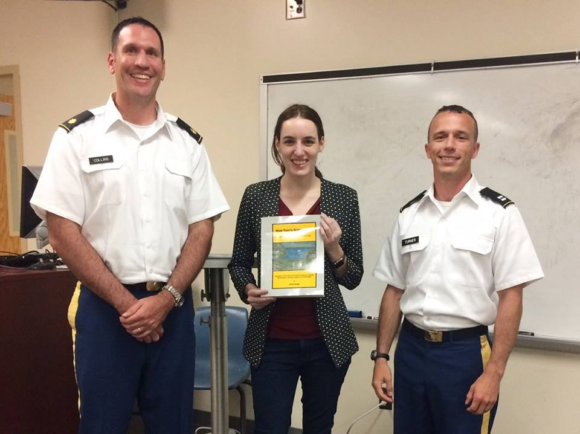

## Inspiration

At the [2019 New York R Conference](https://www.rstats.nyc/), [Emily Robinson](https://twitter.com/robinson_es) gave a great talk called ["Everything You Wanted to Know About Making R Packages but Were Afraid to Ask"](https://www.rstats.nyc/2019/nyr/) (*Note: This link will be live once the video is published*).  

Emily Robinson is one of my 'heros of R.'  I was honored to host her several years back a the United States Military Academy when she came to present her work on A/B Testing during her time at Esty.   

```{r echo=FALSE, fig.width=1}

```

I dabbled with creating a [package](https://github.com/dusty-turner/puertoRicoR) before, but her talk made creating a package so much more tangible (and scale-able), and it pushed me over the edge to try again.  

During her talk, she also made reference to a new book to help package writing newbies like me.

<center>

<blockquote class="twitter-tweet" data-lang="en"><p lang="en" dir="ltr">My favorite discovery of this week: there’s a new <a href="https://twitter.com/hashtag/rstats?src=hash&amp;ref_src=twsrc%5Etfw">#rstats</a> packages book in the works! Now from <a href="https://twitter.com/JennyBryan?ref_src=twsrc%5Etfw">@JennyBryan</a> as well as <a href="https://twitter.com/hadleywickham?ref_src=twsrc%5Etfw">@hadleywickham</a>. Read it as it develops at <a href="https://t.co/bQIVwWPME4">https://t.co/bQIVwWPME4</a>. Especially excited about new chapter 2 showing full package development cycle (w/ usethis 📦)!</p>&mdash; Emily Robinson (@robinson_es) <a href="https://twitter.com/robinson_es/status/1126869271160795137?ref_src=twsrc%5Etfw">May 10, 2019</a></blockquote>
<script async src="https://platform.twitter.com/widgets.js" charset="utf-8"></script>

</center>

I now had all the encouragement I needed to give this a wholehearted, harty hack.

I will spare all the frustrating details, but the appropriately named book, ["R Packages"](https://r-pkgs.org/index.html) by [Hadley Wickham]("https://twitter.com/hadleywickham") and [Jenny Bryan](https://twitter.com/JennyBryan) tells you all you need to know to get you started.  [Chapter 2](https://r-pkgs.org/whole-game.html) is the one-stop-shop I used to get my package off the ground.  There is, of course, more to do to get this fully developed.  

One of Emily's biggest pieces of advice that I took away from her talk was to come up with a good package name.  It needed to be 'googleable' and memorable and there were several other important considerations for naming the package.  Well, I don't know how well I met all the criteria, but I am happy with the appropriatness of how much this package name reflects that I made it :).

## turnR

To download the `turnR` package, run the uncommented code below.  Then call the package.

```{r}
# devtools::install_github("dusty-turner/turnR", force = TRUE)
library(turnR)
```

### Available Functions

#### My Cat 

To get the package off the ground, I created a simple function inspired by my 4 year old daughter.

```{r}
mycat(CatName = "Garfield")
```

#### ggplot themes

I also find myself making some of the same adjustments over and over again to my ggplots.  In particular, I like to center the title and remove the legend for certain plots.  Here is a look.

```{r message=FALSE, warning=FALSE, paged.print=FALSE}
library(tidyverse)
set.seed(256)
data("diamonds") 

diamonds %>%
  sample_frac(.1) %>%
  ggplot(aes(x=color,y=price,fill = color)) +
  geom_violin() +
  labs(x="Color",y="Price",title="Distribution of Diamond Price by Color", subtitle = "Colored by Color") +
  theme_turnR()

```

Sometimes, when my 'x' axis is a factor, the labels run over.  This fixes that issue.

```{r}

diamonds %>%
  ggplot(aes(x=cut,y=price,fill = cut)) +
  geom_violin() +
  labs(x="Cut",y="Price",title="Distribution of Diamond Price by Color", subtitle = "Colored by Cut; Faceted by Color") +
  theme_turnR_f() +
  facet_wrap(~color)

```

#### Randomization Test

Lastly, as an alternative to `t.test`, I often run a randomization test.  It gets frustrating finding my old code over and over. So `turnR` package to the rescue!

This test returns the probability that each null hypothesis is true along with the difference in means of each samples. It will also return all data under index 1: [1] (not shown).

P Values (index 2)

```{r}
x=rnorm(100,5,2)
y=rnorm(100,5.1,1)
randtest(x=x,y=y,fun = mean, reps = 1000)[2]
```

Average Difference in Means (index 3)

```{r}
randtest(x=x,y=y,fun = mean, reps = 1000)[3]
```

And of course, it always helps to visualize the difference.

```{r message=FALSE, warning=FALSE, paged.print=FALSE}
randtestviz(x=x,y=y,fun=mean,reps=1000)
```

I expect more to follow in the future!