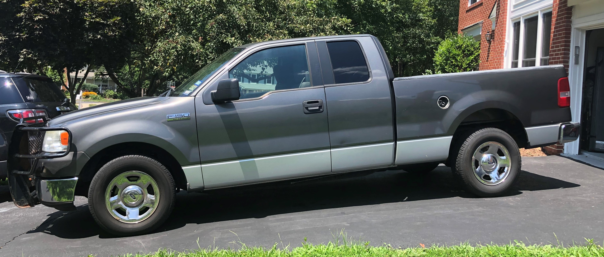

```{r setup, include=FALSE}
knitr::opts_chunk$set(echo = TRUE, warning = FALSE, message = FALSE, eval = TRUE)
```

## A Tribute!

Since the dawn of time, people have been developing human-like attachments to their transportation.  I imagine Moses naming his chariot, Noah his ark, and maybe even Jesus naming his borrowed donkey.

Well, maybe I'm taking too much historical license, but man's affinity for their transportation remains.  

At the age of 21, my dad and I split the cost of a 2005 Ford F150.  The odometer read ~24,000 miles and it set us back ~$20,000.  
 
<center>


<!--  -->
</center> 


I've been with this truck for 14 years - longer than I've known my wife.  Its been with me from Texas to New York to Georgia to Missouri to Hawaii to Missouri to New Mexico to Ohio to New York to Virginia.  Tragically, on the drive from New York to Virginia, the engine developed a tremendous rattling noise and a violent shake.  Unbeknownst to me, it developed an oil leak sometime in the summer of '19 and the 70 mph roads were too much for it to handle.  Just short of its 200,000th mile, I laid it to rests in Fairfax Station, Virginia.  It lived long enough to meet its successor, Old Grey Truck II.  

<center>

<!--  -->
<!--  -->
</center>
The following is a (tongue-in-cheek) R style ode to my old friend.  Long live Old Grey!

<!-- [imageofoldtruck.png] -->

## Data

I'll explore the following [data](www.github.com/dusty-turner).   I made an earlier version of this blog post [here](www.dusty-turner/netlify.com/oldpost) where I looked at some similar, but incomplete, analysis on this data.

I'll use the following packages to load, manipulate, and view the data.

```{r}
library(tidyverse)
library(lubridate)
library(skimr)
library(kableExtra)
```

```{r include=FALSE}
truck = read_csv("data/FordF150ode.csv") %>% select(-Notes)
```

Below, you'll notice that the observational unit is each time I filled up the pick-up.  The column headers are pretty self explanatory.  

To be explicit, here is a description of the data:

- `FillUpDate`: Date I filled up the pick up with gasoline. 
- `TotalMiles`: Odometer reading when I filled up the tank.
- `TankMiles`: Trip odometer reading for the most recent tank of gas.  Reset every 'fill up.'
- `Gallons`: Gallons of gasoline put in the tank at time of fill up.
- `MPG`: Calculated miles per gallon on the previous tank of gas.  `TankMikes/Gallons`
- `FinishTankDate`: Date of previous fill up.
- `Location`: is the location that I lived at the time of filling up the tank.  


```{r}
head(truck)
```

Thanks to `readr`, most of the columns read in appropriately.  However, it looks like we'll need to make an adjustment so that the dates are the correct class.  Thanks `lubridate`!

```{r}
truck = 
truck %>%
  mutate(FillUpDate = dmy(FillUpDate),
         FinishTankDate = dmy(FinishTankDate))
head(truck)
```

<!-- Using the nifty `skim` function we can glean some other information about my history with ol grey. -->

<!-- ```{r, results='asis'} -->
<!-- skim(truck) %>% -->
<!--   skimr::kable(format = "latex") -->
<!-- # skimr:: (truck) -->
<!-- ``` -->

## Fun Descriptive Stats

There are a handful of 'fun' descriptive statistics from the data.

```{r}
summary(truck)
```


- We see that I more or less owned the truck from Feb of 06 through July of 2019.  I filled it up 433 times and drove it until it his 193,497 miles.... so close!

- The average miles per gallon was 15.6 and I even attained 25ish one time.  The least was 8.4.  I likely was pulling my wife's car on a trailer on that tank.  

- Looks like I usually drove about 333 miles on a tank.  I put as few at ~80 and as much as 799.  Must have been the time a buddy filled it up and didn't tell me :).

- While it only has a 34 gallon tank, the max gallons added to the truck was 39.4.  This is likely due to times when friends borrowed the truck and put in a few gallons for me and didn't note it in my log.  I compensated for it by adding it to the next fill up.  

How many times did this happen?

```{r}
truck %>%
  select(Gallons) %>%
  filter(Gallons>34) 
```

Lets look at the spread of the data a little closer to get a feel for the distribution of gallons per fill up, miles per gallon, and miles per tank of gas.

```{r, fig.align='center'}
truck %>%
  gather(Measurement, Value, -FillUpDate, -FinishTankDate, -Location) %>%
  filter(Measurement != "TotalMiles") %>%
  ggplot(aes(x=Value)) +
  geom_histogram() +
  facet_wrap(~Measurement, scales = "free_x") +
  labs(x="", y = "Number of Occurances (Fill Ups)", title = "Frequency of Occurrence for Each Fill Up")
```

It looks like gallons and miles per tank of gas (unsurprisingly) are right skewed as factors have a cap on the upper end (with a few exceptions when friends fill up and don't tell me).  Miles per gallon looks more normally distributed with a few more occurrences of fewer miles per gallon.  

### Fun Stratified Stats

Lets see how well my truck performed in each location.

```{r}
library(formattable)
truck %>% 
  select(TankMiles,Gallons,MPG,Location) %>%
  group_by(Location) %>%
  summarise_all(.funs = mean, na.rm = TRUE) %>%
  mutate_if(is.numeric, round, 2) %>%
  mutate(MPG = cell_spec(MPG, "html", color = ifelse(MPG == max(MPG), "red", ifelse(MPG== min(MPG), "blue", "black")))) %>%
  mutate(TankMiles = cell_spec(TankMiles, "html", color = ifelse(TankMiles == max(TankMiles), "red", ifelse(TankMiles== min(TankMiles), "blue", "black")))) %>%
  mutate(Gallons = cell_spec(Gallons, "html", color = ifelse(Gallons == max(Gallons), "red", ifelse(Gallons== min(Gallons), "blue", "black")))) %>%
   kable(format = "html", escape = F, align = "l") %>%
  kable_styling("striped", full_width = F)
```

This chart shows highlights some interesting points.  

- First, I did a ton of highway driving while I lived in Georgia to attain the best miles per gallon.  

- My top average miles per tank and average gallons per fill up were from Ohio. I would drive my truck till it was almost empty because I could get free 30 gallons of gasoline based off of money spent at our local grocery store.  

- The worse miles per gallon is Virginia.  Well, since I only had two fill ups and they were both after I essentially killed the truck, this is no surprise.  

- The worse miles per tank and gallons per fill up were in Texas when my dad still possessed the truck (and doesn't live as close to the edge as I do).

### Time Spent in Each Location I've Lived

How much time did I spend in each location?  How many miles did I drive at each place?

```{r}
truck %>% 
  group_by(Location) %>%
  summarise(Arrive_Location = min(FillUpDate),
            Leave_Location = max(FillUpDate),
            MilesDriven = round(max(TotalMiles)-min(TotalMiles))) %>%
  arrange(Arrive_Location) %>%
  mutate(DaysInLocation = Leave_Location-Arrive_Location,
         MilesPerDay = round(MilesDriven/as.numeric(DaysInLocation))) %>%
  DT::datatable(options = list(paging = FALSE))
```

Interesting Notes:

- It appears, unsurprisingly, I spent the most time and drove the most miles in Hawaii.  That's lots of miles going around in circles.  
- What is surprising about Hawaii? I somehow managed 42 miles per day on the island.  I put about 32 miles a day going to work and back, so I must have been doing some good weekend sightseeing.  This even spans a 4 month deployment.  
- The most miles per day was spent in Georgia.  I think I drove to Texas 3 times during my almost 2 months living there.    
- I clearly didn't drive that much either time I was in NY.  The first time was when I was a cadet.  Those 21 miles per day even includes the transit to Georgia (with a pit stop in Texas), so I was doing a good job of studying instead of traveling.The second time was when I was a faculty member.  Since my wife had the primary family vehicle, I'm still wondering how I achieved 12 miles per day.  

Lets look at this visually.

```{r, fig.align='center'}
truck %>% 
  group_by(Location) %>%
  summarise(Arrive_Location = min(FillUpDate),
            Leave_Location = max(FillUpDate),
            MilesDriven = round(max(TotalMiles)-min(TotalMiles))) %>%
  arrange(Arrive_Location) %>%
  mutate(DaysInLocation = Leave_Location-Arrive_Location,
         MilesPerDay = round(MilesDriven/as.numeric(DaysInLocation)),
         DaysInLocation = as.numeric(DaysInLocation)) %>%
  gather(Attribute, Measurement, -Location, -Arrive_Location, -Leave_Location) %>% 
  group_by(Attribute) %>%
  mutate(order = rank(Measurement)) %>% 
  # ggplot(aes(x=Location,y=Measurement)) +
  ggplot(aes(x=drlib::reorder_within(Location,-order,Measurement),y=Measurement)) +
  geom_col(aes(fill = Location)) +
  drlib::scale_x_reordered() +
  facet_wrap(~Attribute, scales = "free") +
  labs(title = "Miles Driven in Each Location", x = "Location", y = "Miles Driven") +
  coord_flip() +
  theme(legend.position = "none", axis.text.x = element_text(angle = 45, hjust = 1))
```

A picture (graph) is worth 1000 words.

### Rate of Miles Over Time

```{r, fig.align='center'}
truck %>%
  ggplot(aes(x=FillUpDate,y=TotalMiles,color = Location) ) +
  geom_point() +
  geom_line() +
  scale_x_date(breaks = "year",labels = scales::date_format("%Y")) +
  scale_y_continuous(labels = scales::comma) +
  labs(title = "Miles Added Over Time", x = "Fill Up Date", y = "Total Miles")

```

From this plot, you can see several take-aways:
  
- There was a time when I was really racking up the miles. Hawaii through Ohio was a prosperous time for the old truck.  But if you notice, there's a clear inflection point in Ohio where things start dropping off after we bought a new family car.
- There is also a clear drop off in the rate of fill ups in NY.  
- There are also 4 periods of times with no fill ups.  Two of them were on either side of Hawaii while my truck was getting shipped.  The other two are both my deployments; with one fill up mid deployment while in New Mexico.  Thanks Jill!
  
### Time Between Fill-ups

How often did a tank of gas last?

```{r}
truck %>%
  select(FillUpDate,FinishTankDate) %>%
  mutate(DaysBetweenFillUps = FinishTankDate-FillUpDate) %>%
  group_by(DaysBetweenFillUps)%>%
  count() -> FillUps

FillUps %>%
  arrange(desc(n)) %>%
  ungroup() %>%
  top_n(5,n) %>%
  kable() %>%
  kable_styling("striped", full_width = F)
```

It appears the most often days between fill ups was a tie for both 1 day and 8 days.

Lets Visualize it:

```{r, fig.align='center'}
FillUps %>%
  ggplot(aes(x=DaysBetweenFillUps,y=n)) +
  geom_col() +
  labs(x="Days Between Fill Ups", y="Number of Fill Ups", title = "How Many Days Did a Tank of Gas Last?")
```


```{r}
FillUps %>%
  arrange(desc(DaysBetweenFillUps)) %>%
  ungroup() %>%
  top_n(5,DaysBetweenFillUps) %>%
  kable() %>%
  kable_styling("striped", full_width = F)
```

Also of note, the longest time between fill ups was 120 days.  This must have been during one of my deployments.  

### More Gas on Certain Days?

I also wonder if I happen to have filled up the tank more often on one day than another.

```{r, fig.align='center'}
truck %>%
  mutate(Weekday = weekdays(FillUpDate)) %>%
  select(TankMiles,Location,Weekday,FillUpDate) %>%
  # select(-FillUpDate,-FinishTankDate) %>%
  # gather(Measurement, Value, -Weekday, -Location) %>%
  ggplot(aes(x=fct_relevel(Weekday, c("Sunday","Monday","Tuesday","Wednesday","Thursday")))) +
  geom_bar() +
  labs(x="Day of Week", y = "Number of Fill-ups", title = "What Day Did I Fill Up The Most?") +
  theme(legend.position = "none", axis.text.x = element_text(angle = 90, hjust = 1, vjust = .5))
```


The bar chart indicates that I might fill up more on Friday than any other day.  

Lets look at a few statistical tests to see if `Weekday` impacts fill-ups.

```{r}
fisher =
  truck %>%
  mutate(Weekday = weekdays(FillUpDate)) %>%
  select(Weekday) %>%
  count(Weekday, name = "DaysFilledUp") %>%
  left_join(
    tibble(
      date = seq(ymd(min(truck$FillUpDate)), ymd(max(truck$FillUpDate)), by = '1 day')) %>%
      mutate(Weekday = weekdays(date))  %>%
      count(Weekday, name = "Total")) %>%
  mutate(DaysNotFilledUp = Total-DaysFilledUp) %>%
  select(-Total)

fisher 
```

The table above shows how many times I filled up with gas on each day of the week and how many days I had the opportunity to fill up and did not.  Essentially the question we are asking is: Is there something about Day of the Week which would impact whether or not I filled up with gas?  Equivalently, is there something about filling up (or not) that impacts the day of the week?  AKA: Are day of the week and fill ups independent?
  
Lets turn to several statistical tests.

If you are old school: The $\chi^2$ test.

```{r}
fisher %>%
  select(-Weekday) %>%
  chisq.test()
```

Since the null hypothesis is that there is no difference between day of week and fill up or not (also known as independence), the P Value is high so we 'fail to reject' this.  We conclude that there's no difference between day of week and decision to fill up or not.  We could also say that the probability that they came from the same distribution is fairly high (.5134) therefore we do not have much evidence to say that they are different.

If you are new school, you turn to Fisher's Exact Test.  Essentially, if we lock in the amount of 'fill ups' over the time I owned the pick up and were to calculate every possible combination of days of which I could fill up with gas (eg., all on Monday, all but one on Monday and one on Tuesday, and so on), how extreme is what we saw.  Fisher figured out that we could calculate that exact probability - and hence we have Fisher's Exact Test.

```{r}
fisher %>%
  select(-Weekday) %>%
  fisher.test(workspace = 1000000)
```

It turns out that there is a 53.11% chance that we'd see what happened or see something more extreme by chance.  I dare say that there is no relationship between day of week and the decision to fill up with gas.  

### Heat-map of Fill Ups

The map below shows dates in which I filled up my truck with gasoline.  The darker green indicates more gallons -- the lighter indicates fewer gallons.  The dark dates mean I did not fill up with gasoline on that date.  

```{r, fig.width=10, fig.align='center'}
truck %>%
  complete(FillUpDate = seq.Date(min(FillUpDate), max(FillUpDate), by="day")) %>%
  mutate(monthweek = week(FillUpDate)) %>%
  mutate(Weekday = weekdays(FillUpDate)) %>%
  mutate(year = year(FillUpDate)) %>%
  mutate(month = month(FillUpDate)) %>% 
  group_by(month) %>%
  mutate(monthweek = monthweek - min(monthweek)) %>%
  ggplot(aes(y=monthweek,x=fct_relevel(Weekday, c("Sunday","Monday","Tuesday","Wednesday","Thursday")), fill = Gallons)) +
  geom_tile(color = "white") +
  facet_grid(year~month, scales = "free") +
  scale_fill_gradient(low="white", high="green", na.value = "black") +  
  labs(x = "Weekday", y = "Week of Month", title = "Time-Series Calendar Heat-map: Amount of Gas Pumped on Each Day", caption = "Days with no gas are denoted in White") +
  theme(axis.text.x = element_text(angle = 90, hjust = 1, vjust = -0), axis.text.y = element_blank(), axis.ticks.y = element_blank()) 
```

I'll admit, its hard to glean anything from this heat-map.... But I spent a lot of work creating it so I'm going to leave it.  

# Feedback welcome

As always, I do this blog to learn new things, hopefully teach others from my experience, and hopefully receive (respectful and helpful) feedback.  

Here's a picture of old and new meeting!

<center>

</center>

Please leave your thoughts below!!