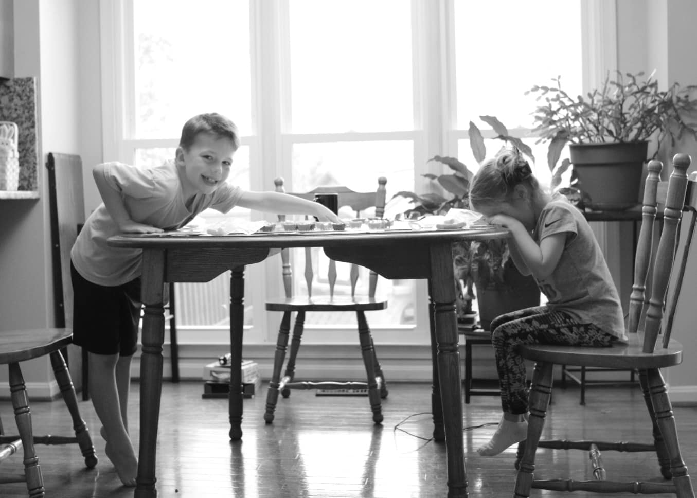
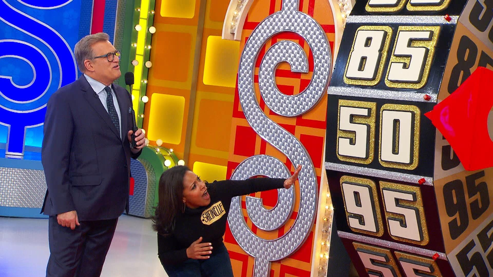
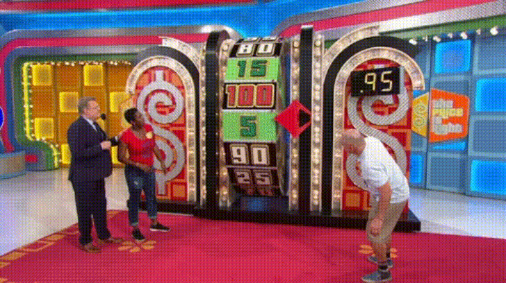

## Motivation

Like many, COVID-19 completely altered our lives as the virus spread across the country and became a mainstay in our society.  Though my family and I have been spared of tragedy, we've had to find ways to replace kid's activities, work routines, and social interactions with other (hopefully) enriching activities... Like family games.

<center>

<figcaption>Ticket to Ride caused a lot of strife between my kids :)</figcaption>
</center> 


One thing that we've added to our new normal is watching ["The Price is Right"](https://twitter.com/PriceIsRight?s=20) after dinner.  We find it to be a great chance to open up talk of numbers and strategy with our kids.

If executed properly, a contestant can improve their chances of getting on stage, winning games, and making it to the showcase showdown by making shrewd decisions.  

In this blog, we look at spinning the big wheel.  

## Spinning the Wheel

In the price is right, the first three contestants (and second three) go head-to-head-to-head in spinning the big wheel.  The player with the highest sum of two spins without going over a dollar wins and moves on to the showcase showdown.

The decision each player makes is whether or not to spin a second time after their first spin. 

<center>

<figcaption>[Photo Credit: The Today Show](https://www.today.com/video/go-behind-the-scenes-of-the-price-is-right-with-sheinelle-jones-1151260739671)</figcaption>
</center> 


The strategy is pretty simple for players two and three.

#### 3rd Player  
 - After first spin, if you aren't winning, spin again.  
 - If you are tied after the first spin, spin again if you are less than .5 as your chances of not busting yet being over the previous player is better than .5 (which is the probability of winning on a spin off).  
 - If you are tied after the first spin, do not spin again if you are greater than .5 as your chances of busting are greater than .5 (which is the probability of winning on a spin off).  
  
#### 2nd Player  
  - After first spin, if you aren't winning, spin again.  
  - If you are winning after the first spin, spin again if you are less than .5 - as the probability of the next player getting a higher spin than you is pretty high (1-current spin value).    
  - If you are winning after the first spin, don't spin again if you are greater than .5 - as the probability of the next player getting a higher spin than you is less than .5 (1 - current spin value).  

#### 1st Player

This is a different story.  While we could work out the math, it is a little more complicated.  While I've never been afraid of a little math, I'd much rather simulate.  

I'll talk though my logic below and show my code.  I do this so the reader can see my thought process and learn something or, more preferably, point out any flaws in logic or propose cleaner or more succinct ways of coding.

## Simulation

In this analysis, I will play out 100,000 games where the first player only spins once.  Then I will play out 100,000 games where the first player spins twice.  Then I will summarize the results to see how often player 1 wins if they chose to spin a second time at each value of their first spin.  

As a quick aside, lets hope you are never as unlucky as this player.

<center>

<figcaption>[What bad luck!](https://giphy.com/explore/price-is-right)
</center> 


### Simulate One Game

To support the simulation, I...

- ...create a function that will create the result of a single showcase showdown.  This function has an option for the first player to spin only once or twice.  
- ... summarize the results of the spins.  We'll determine the probability of player 1 winning whether they spin once or twice at each initial spin value.  

I will place comments in code to explain what is happening.
 
```{r echo=TRUE, message=FALSE, warning=FALSE}
library(tidyverse)

## Define function
wheel_iterations <- function(iteration = 1, num_spins = 1, spins = seq(.05,1,.05)){  

## Begin simulate player spin ##
player_1_first <- sample(spins, 1, replace = TRUE)
player_1_second <- sample(spins, 1, replace = TRUE)

player_2_first <- sample(spins, 1, replace = TRUE)
player_2_second <- sample(spins, 1, replace = TRUE)

player_3_first <- sample(spins, 1, replace = TRUE)
player_3_second <- sample(spins, 1, replace = TRUE)
## End simulate player spin ##

## Find result of player 1 if they spin once vs twice
if(num_spins == 2){
player_1 <- player_1_first + player_1_second
} else {
  player_1 <- player_1_first
}

## force player 1 to lose if they bust
player_1 <- if_else(player_1 > 1, 0, player_1)

## set player 2's logic for spinning again
if(player_2_first == player_1 & player_2_first < .5){ ## what happens if tied but spin below .5
  player_2 <- player_2_first + player_2_second
} else if(player_2_first == player_1 & player_2_first >= .5){ ## what happens if tied but spin above .5
  player_2 <- player_2_first
} else if(player_2_first > player_1) { ## what happens if 2 is higher than 1
  player_2 <- player_2_first
} else if(player_2_first < player_1) { ## what happens if 3 is less than 1
  player_2 <- player_2_first + player_2_second
} else {
  player_2 <- 10000  ## I put this here to catch spin 1 outcomes I missed
}

## Note: I only compare player 3's outcome to player 1 since this simulation is not concerned about the outcome between player 2 and 3 -- only if player 1 gets beat or not.

## set player 3's logic for spinning again
if(player_3_first == player_1 & player_3_first < .5){ ## what happens if tied but spin below .5
  player_3 <- player_3_first + player_3_second
} else if(player_3_first == player_1 & player_3_first >= .5){ ## what happens if tied but spin above .5
  player_3 <- player_3_first
} else if(player_3_first > player_1) { ## what happens if 3 is higher than 1
  player_3 <- player_3_first
} else if(player_3_first < player_1) { ## what happens if 3 is higher than 1
  player_3 <- player_3_first + player_3_second
} else {
  player_3 <- 10000 ## I put this here to catch spin 1 outcomes I missed
}

## accumulate output
output <-
  tibble(iteration, player_1, player_2, player_3, player_1_first, player_1_second, player_2_first, player_2_second, player_3_first, player_3_second, num_spins)

return(output)
}
```

I'll display one iteration below.

```{r}
options(tibble.width = Inf)
set.seed(42)
wheel_iterations(iteration = 1, num_spins = 1)
```

You can see from this example, player 1 wins because player 2 and player 3 busted.  Along with this we maintain the information about the value of each individual spin.

### Simulate 200,000 Games

Next, I'll simulation 100,000 iterations of player 1 spinning once and 100,000 iterations of player 1 spinning twice and bind the rows together.  You can see how long it took my computer with 8 threads to complete this task.

```{r echo=TRUE, message=FALSE, warning=FALSE, cache=TRUE}
library(furrr)
multiprocess(multiprocess)

tictoc::tic()
games <-
  1:100000 %>%
  furrr::future_map_dfr(~wheel_iterations(iteration = .x, num_spins = 1),.progress = TRUE) %>%
  bind_rows(
    1:100000 %>% furrr::future_map_dfr(~wheel_iterations(iteration = .x, num_spins = 2),.progress = TRUE)
  )
tictoc::toc()
```

To give an example of the output, I show a sample of 5 outcomes of each number of selected spins.  To keep the output clean, I'll only display the player's final scores and whether it was one vs two spins.

```{r echo=TRUE, message=FALSE, warning=FALSE, cache=TRUE}
games %>% 
  group_by(num_spins) %>%
  slice_sample(n = 5) %>% 
  select(player_1,player_2,player_3,num_spins)
```

### Results

In this next step, I'll prepare the data for visualization.

1. For every spin result, we'll force all 'busts' down to 0 so they will automatically lose.
2. We'll break all ties with a coin flip as we explained before the probability of winning a head to head battle is .5.  
3. We'll determine a winner.

```{r echo=TRUE, message=FALSE, warning=FALSE}
plot_data <-
games %>%
  mutate(across(.cols = c(player_1,player_2,player_3),.fns = ~if_else(.>1,0,.))) %>% 
  ## force busts to zero
  mutate(rand_support = rbinom(n = n(),size = 1,prob = .5)) %>% 
  ## create random number to support breaking ties
  mutate(high_number = pmax(player_1,player_2,player_3)) %>%  
  ## find max score
  mutate(winner = as.integer(if_else(player_1 == high_number,1,0))) %>% 
  ## if high score is player 1 give win otherwise loss
  mutate(winner = if_else(winner == 1 & player_1 == player_2 | winner == 1 & player_1 == player_3, rand_support, winner)) %>% 
  ## If player one wins, yet they tied another player, flip a coin for a win
  group_by(player_1_first, num_spins) %>% 
  ## group together all player 1 first spin and 1 vs 2 total spin combinations
  summarise(win_if_percent = mean(winner), .groups = "drop_last")
  ## determine the percentage of wins for each group
```

Lets take a look.

```{r echo=TRUE, message=FALSE, warning=FALSE}
plot_data %>% 
  pivot_wider(names_from = "num_spins", values_from = "win_if_percent") %>% 
  janitor::clean_names()
```

We can start to get a feel for the break point for when the first player should spin again.  

### Visualize

Lets look at it visually.

```{r echo=TRUE, message=FALSE, warning=FALSE}

plot_data %>%
  ggplot(aes(x = player_1_first, y = win_if_percent, color = as.factor(num_spins))) +
  geom_line() +
  geom_point() +
  labs(x = "Value of First Spin", y = "Win Percentage of Spin Philosophy",
       title = "Probability of winning if you spin once (red) or twice (blue)",
       subtitle = "Given first spin value",
       color = "Number of Spins") +
  theme(legend.position = "bottom") +
  ylim(0,1) +
  scale_x_continuous(labels = scales::dollar_format(), breaks = seq(0,1,.1))
```

As you can see from the plot, the simulation shows that the first spin value at which you should hold vs spin again is .7.  This is a rather surprising and unsettling realization.  There is a little noise in the data and it appears it is about a wash at .65.

Taking a second look at this, we can reach the same conclusion via a heat map showing how the probability of winning on the big wheel balances out at about the .65 mark.

```{r echo=TRUE, message=FALSE, warning=FALSE}
plot_data %>%
  ggplot(aes(x=player_1_first,y=as.factor(num_spins),fill = win_if_percent)) +
  geom_tile(color = "black") +
  labs(x = "Spin Value After 1st Spin", y = "Number of Spins",
       title = "The probility of winning if Player 1 spins once vs twice",
       subtitle = "Given first spin value",
       fill = "Probability of Winning") +
  theme(legend.position = "bottom", line = element_blank(),
        rect = element_blank(), axis.text.y = element_text(size = 20),
        axis.text.x = element_text(angle = 90, vjust = .5)) +
  scale_x_continuous(labels = scales::dollar_format(), breaks = seq(.05,1,.05)) +
  scale_fill_gradientn(limits = c(0,1), colors = c("blue", "red"))
```

## Conclusion

Final thoughts:

- If you are the first player, spin again if your first spin is ~.65 or less.

- If any readers win the big wheel using this strategy then I expect a similar reaction as Barney Stinson gave below:

<center>

<figcaption>[Barney Stinson from HIMYM Celebrates](https://giphy.com/explore/price-is-right)
</center> 

Please send me your thoughts of how to improve the analysis or code at <a href="mailto:dusty.s.turner@gmail.com">dusty.s.turner@gmail.com</a>.