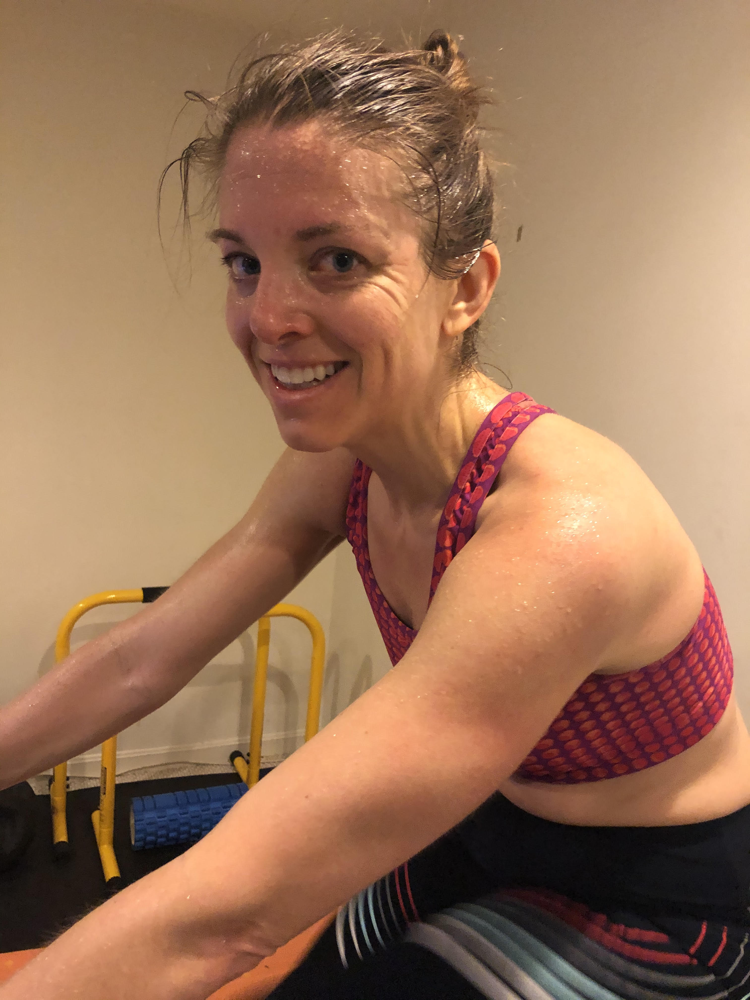
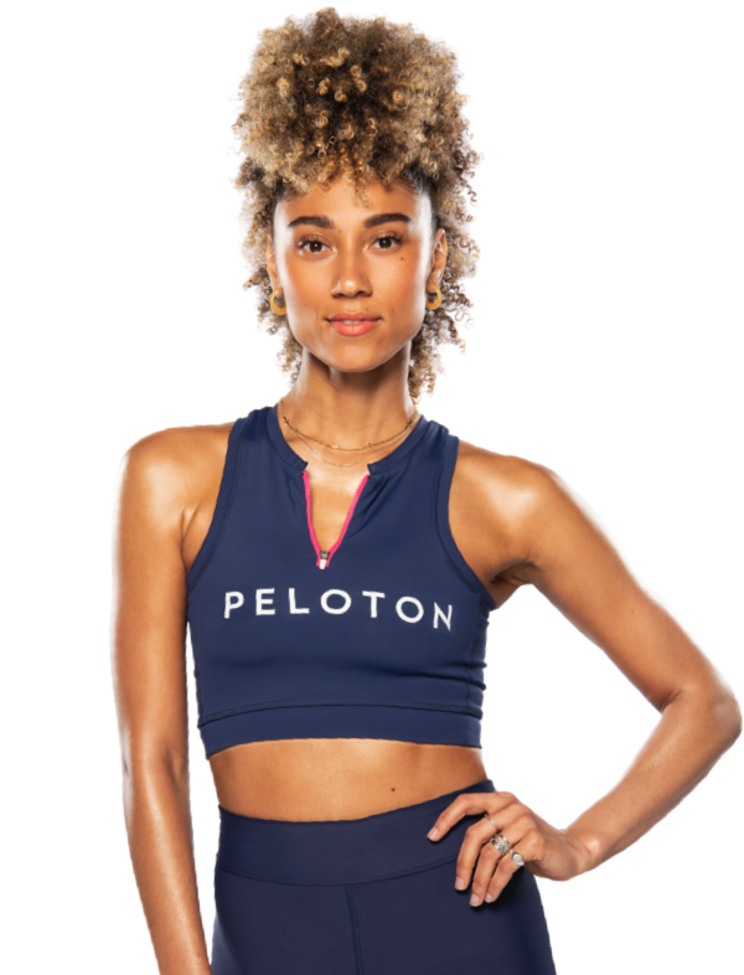
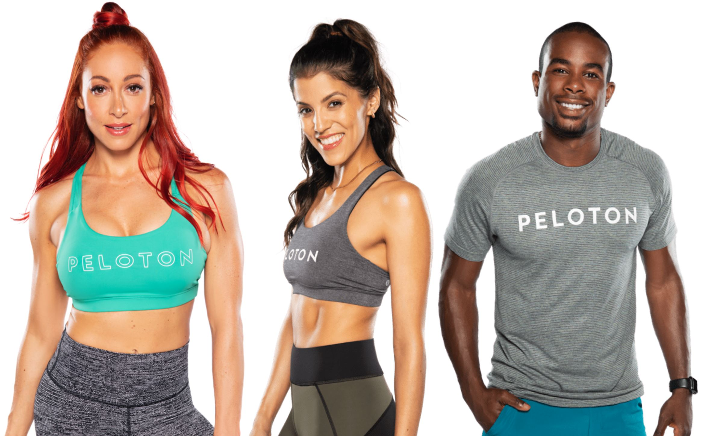

```{r setup, include=FALSE}
knitr::opts_chunk$set(echo = TRUE,warning = F,message = F)
# devtools::install_github("bweiher/pelotonR")
```

In 2018, my wife and I were fortunate enough to find a deeply discounted Peloton on an online garage sale.  Since then, she's been going hard and I have been trying to keep up when the weather is bad or injuries keep me from running.  
 
<center>

<figcaption>Jill Smiling After Her 600th Ride (and new record)! </figcaption>
</center> 

Over the last few months, a few works projects have taught me a lot about `purrr`, functional programming, collaborative projects, and APIs.  

In the next few Peloton blog posts, I hope to show a few things:

1. How to access the Peloton API.
2. The power of `purrr` and functional programming.
3. That I am the superior Peloton rider... or maybe not.

This first post will focus on accessing the Peloton API.

# The Peloton API

Thanks [Ben Weiher](https://github.com/bweiher/) for creating the [`pelotonR` package](https://github.com/bweiher/pelotonR). I was able to submit a couple pull requests that (I think) improved its capabilities.  Thanks Ben for being a gracious repo owner and accepting these pull requests.

Oh, and while you are here, follow me on Peloton.  My user name is [DTDusty](https://members.onepeloton.com/members/DTDusty/overview)

## Install `pelotonR`

First, to install the package, you can run the following code to download/install it from Ben's repo.

```{r eval=FALSE, include=TRUE}
devtools::install_github("bweiher/pelotonR")
```

## Load Libraries

Let's fire up `pelotonR` and, as always, the `tidyverse` and take them for a spin.  

```{r message=FALSE, warning=FALSE}
library(pelotonR)
library(tidyverse)
library(lubridate)
```

## Connect To API

Use your Peloton email address and password.  

```{r eval=FALSE, include=TRUE}
peloton_auth(login = "your.email@domain.com", password = "cl3v3r_pa$$w0rd")
```


```{r include=FALSE, eval=TRUE, message=TRUE,warning=TRUE}
# peloton_auth(login = "turner.jill.e@gmail.com", password = get_peloton_passwords(who = "Jill"))
peloton_auth(login = "dusty.s.turner@gmail.com", password = Sys.getenv("my_passowrd"))
```

After connecting to the API, you can get your info with the following function.  

```{r}
me <- get_my_info() 
```


```{r include=FALSE}
show_me <- me %>% names %>% sort %>% str_c(collapse = ", ")
```

For our own edification, here is a list of all the output columns alphabetized.

> `r show_me`

## Explore API

Currently, the pelotonR package has a nice function for exploring your information.  As with most APIs the data is stored in JSON format  The function below extracts the data and unpacks some of the nested lists.

Here it is below: 

```{r include=FALSE}
get_all_workouts <- function (userid = me$id, num_workouts = me$total_workouts, 
  joins = "ride,ride.instructor", dictionary = list(numeric = c("v2_total_video_buffering_seconds", "ride_distance",
    "v2_total_video_watch_time_seconds")), parse_dates = TRUE) 
{
  if (userid == "") 
    stop("Provide a userid or set an environmental variable `PELOTON_USERID`", 
      call. = FALSE)
  if (length(joins) > 1 || !is.character(joins)) 
    stop("Provide joins as a length one character vector", 
      call. = FALSE)
  if (joins != "") 
        # message("test0")
    joins <- glue::glue("joins={joins}")
  workouts <- peloton_api(glue::glue("/api/user/{userid}/workouts?{joins}&limit={num_workouts}&page=0"))
  n_workouts <- length(workouts$content$data)
  if (n_workouts > 0) {
    # message("test1")
    workouts <- purrr::map_df(1:n_workouts, ~pelotonR::parse_list_to_df(workouts$content$data[[.]], 
      dictionary = dictionary, parse_dates = TRUE))
    if (joins != "") {
      rides <- purrr::map_df(1:n_workouts, function(x) {
        pelotonR::parse_list_to_df(stats::setNames(workouts$ride[[x]], 
          paste0("ride_", names(workouts$ride[[x]]))), 
          dictionary = dictionary, parse_dates = TRUE)
      })
      dplyr::left_join(dplyr::mutate(workouts, rn = dplyr::row_number()), 
        dplyr::mutate(rides, rn = dplyr::row_number()), 
        by = "rn") %>% dplyr::select(-.data$rn)
    }
    else {
      workouts
    }
  }
}
```


```{r}
my_workout_df <- get_all_workouts(userid = me$id, num_workouts = me$total_workouts, joins = "ride,ride.instructor", parse_dates = T)
my_workout_df 

```

You can see the function returns quite a bit of information - one row per workout.  

<!--  -->

<center>
<figcaption>And here's Jill on one of those workouts!</figcaption>

</center> 

## Dig in deeper into the API

The Peloton API has a lot more information that you cannot yet access in the library.  As I get more familiar with the API / library, I may do a few more pull requests.  In the meantime, lets see what else we can find.

What we see in the `my_workout` dataframe above list element that contains the instructor ID.  

```{r}
my_workout_df %>%
  select(ride_instructor) %>% 
  group_by(ride_instructor) %>%
  group_split() %>% 
  purrr::map(~unnest(.x)) %>% 
  purrr::map(~slice(.x, 1)) %>% 
  purrr::map_dfr(~unnest(.x))
```

While I was selective in what I extracted from this JSON, I do not see instructor name.  Lets see what we can find if we dig into the API.

### Access API

To find the instructor information, we need to use the correct instructor endpoint.  Some API's are not documented very well, so you have to get lucky sometimes to find these.

```{r, cache=T}
pull <- httr::GET(url = str_c("https://api.onepeloton.com/api/instructor?limit=1000&page=0"))
parsed <- jsonlite::fromJSON(httr::content(pull, "text", encoding = "UTF-8"), simplifyVector = FALSE)
pull
```

Status 200 means success!

This function below will pull out one instructor's information.  There is a LOT more information for each instructor -- but I will only extract a few interesting headings.


```{r, cache=T}

instructor_function <- function(num = 2) {
  tibble(
    instructor_name = pluck(parsed$data, num, c("name")),
    ride_instructor_id = pluck(parsed$data, num, c("id")),
    ride_instructor_bio = pluck(parsed$data, num, c("bio")),
    ride_instructor_background = list(pluck(parsed$data, num, c("fitness_disciplines")))
  )
}

instructor_function(5)
```

<center> 
[Ally Love](https://www.instagram.com/allymisslove/?hl=en), my wife's favorite!
</center> 

<center>

<figcaption>[Photo Credit: Peloton Website](https://www.onepeloton.com/instructors/bike/AllyMissLove)</figcaption>
</center> 

Lets get a look at how we can access the data of all the Peloton instructors. 

```{r, cache=T}
instructor_df <-
1:parse_list_to_df(parsed, 
                   parse_dates = T, 
                   dictionary = list(numeric = c("v2_total_video_buffering_seconds", "ride_distance",
    "v2_total_video_watch_time_seconds")))$total %>%
  purrr::map_dfr(~ instructor_function(num = .x))
instructor_df
```

There's all the instructors.  Now lets join them to our workout dataframe.  You can see the additional columns of instructor information at the end of the dataframe. 

```{r, message=F,warning=F,cache=T}
my_workout_df <-
  my_workout_df %>%
  left_join(instructor_df)

my_workout_df %>% 
  select(created_at ,name, instructor_name) %>% 
  filter(!is.na(instructor_name)) %>% 
  slice_head(n = 5)
```

## Visualize

In my next plot post, I'll do more to explore the data in the API.  In the meantime, lets take a look at which instructors I seem to prefer!

```{r, message=F,warning=F,cache=T, fig.align="center"}
my_workout_df %>% 
  filter(created_at <= ymd(20200809)) %>% 
  filter(fitness_discipline == "cycling") %>%
  count(instructor_name,fitness_discipline) %>% 
  filter(!is.na(instructor_name)) %>% 
  mutate(instructor_name = fct_lump_min(instructor_name,5,w = n)) %>% 
  group_by(instructor_name) %>% summarise(n = sum(n),.groups = "drop_last") %>% arrange(-n) %>% 
  ggplot(aes(x=fct_reorder(instructor_name,n),y=n,fill = instructor_name)) +
  geom_col(position = "dodge") +
  scale_fill_manual(values = wesanderson::wes_palette("Rushmore1", n = 8,type = "continuous")) +
  coord_flip() +
  labs(title = "My Favorite Instructors", x = "", y = "Rides") +
  theme(legend.position = "none")
  
```

<center>
[Jess King](https://www.instagram.com/jesskingnyc/?hl=en), [Hannah Corbin](https://www.instagram.com/hannahcorbinnyc/?hl=en), [Alex Toussaint](https://www.instagram.com/alextoussaint25/?hl=en): My three favorite instructors!
</center>

<center>

<figcaption>[Photo Credit: Peloton Website](https://www.onepeloton.com/instructors/bike/)</figcaption>
</center>

