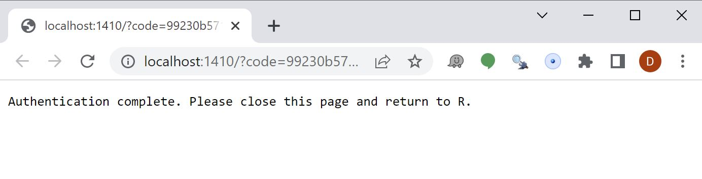

## Introduction

In part 1 of this series, I will demonstrate how to interact with the [Fitbit](https://www.fitbit.com/) API in R.

Huge credit to [Matt Kaye](https://github.com/mrkaye97) for creating the [fitbitr package](https://github.com/mrkaye97/fitbitr) that provides an interface between R and the [Fitbit API](https://dev.fitbit.com/build/reference/web-api/). If you are familiar with R and you have a Fitbit, you should have success following what I have laid out below.

### Install the `fitbitr` package

From CRAN:

```{r echo=TRUE, eval=FALSE}
install.packages("fitbitr")
```

Or the development version from github:

```{r echo=TRUE, eval=FALSE}
devtools::install_github("mrkaye97/fitbitr")
```

```{r include=FALSE}
library(tidyverse)
library(fitbitr)
```

### Register for a Fitbit API Key

While this information is also provided on the repo's [Github page](https://github.com/mrkaye97/fitbitr), I provide similar instructions here for ease of access.

You'll need to request an API key from the [Fitbit developers webpage](https://dev.fitbit.com/apps/new). At this page, you should find a form similar to this.

Fill out the form as accurately as possible, but I recommend the following 3 inputs I specify in the red box.

{width="20%"}

If you want to copy and paste the Redirect URL, here you go: http://localhost:1410/

After you agree to Fitbit's terms, you receive your client ID and API key. I censored mine, but you can see below where yours will be located.

{width="50%"}

Now, the fun part...

## Access Your Fitbit Data

### Authenticate Your Session

I've saved both my Client ID and Client Secret in my `.Revniron` file in the root of my repo. I saved them as `FITBIT_KEY` and `FITBIT_SECRET` respectively. Access them using the `Sys.getenv()` function.

To find out more information about how to do this, look [here](https://support.rstudio.com/hc/en-us/articles/360047157094-Managing-R-with-Rprofile-Renviron-Rprofile-site-Renviron-site-rsession-conf-and-repos-conf).

You'll need to generate a token using the function below.

```{r echo=TRUE, eval=FALSE}
library(tidyverse)
library(fitbitr)

generate_token(
  client_id = Sys.getenv("FITBIT_KEY"),
  client_secret = Sys.getenv("FITBIT_SECRET"),
  callback = "http://localhost:1410/", 
  cache = TRUE
)

```

When you execute this function, you should get a window that looks like this.
 
{width="50%"}

As long as you set the `cache` argument to `TRUE`, you will have a token saved in a file named `.httr-oauth` in the root of your repo. For future authentications, you can simply use the function below. Should you want to create a new token every time, you can leave the `cashe` argument equal to `FALSE`.

```{r echo=TRUE}
load_cached_token(path = ".httr-oauth")
```

## Download Data 

There are several functions for accessing all your data tracked on Fitbit. For the purposes of this post, I'll highlight a few. I will do deeper analysis in subsequent posts.

### Lifetime Performance: Personal Bests

```{r, cache=T}
lifetime_bests()
```

I've had two Fitbits. One I wore for part of 2014 and one I've worn since the beginning of 2021.

It appears I ran a marathon on 23 March 2021. (*Checks Old Facebook Photos*) Yep, The Bataan Death March in White Sands Missile Range, NM. And I apparently went on quite a hilly hike with my wife and kids in March of 2021. March is clearly an active month for me....

### Lifetime Performance: Totals

```{r, cache=T}
lifetime_totals()
```

12K floors. Makes me feel tired just thinking about it. :) 

### Daily Performance: Elevation, Distance, Steps, Floors

To save some space, I display the following four daily performance outputs in one dataframe.

```{r, cache=T}
start_date <- lubridate::ymd("20220501")
end_date <- lubridate::ymd("20220507")

elevation <- elevation(start_date = start_date, end_date = end_date)
distance  <- distance(start_date = start_date, end_date = end_date)
steps     <- steps(start_date = start_date, end_date = end_date)
floors    <- floors(start_date = start_date, end_date = end_date)

reduce(.x = list(distance, steps, floors), .f = left_join, by = "date", .init = elevation)

```

#### Special Note About Request Dates

Thought the `fitbitr` library will not stop you, the Fitbit API will only allow you to request up to 100 days of data at at time. You can read more about it in the [documentation](https://dev.fitbit.com/build/reference/web-api/sleep/get-sleep-log-by-date-range/).

### Sleep Details

There are three different functions for displaying sleep data.  I display one for simplicity. 

```{r, cache=T}
# sleep_stage_granular(start_date = start_date,end_date =  end_date) ## not shown
# sleep_summary(start_date = start_date, end_date = end_date) ## not shown
sleep_stage_summary(start_date = start_date, end_date = end_date)
```

Maybe I should sleep more....

### Heart Rate By Minute

```{r, cache=T}
heart_rate_intraday(date = start_date, minutes = TRUE) ## FALSE = By Second
```

### Heart Rate Zones

```{r, cache=T}
heart_rate_zones(start_date = start_date, end_date = end_date)
```

### Activity

```{r, cache=T}
active_fairly    <- minutes_fairly_active(start_date = start_date,end_date = end_date)
active_lighty    <- minutes_lightly_active(start_date = start_date,end_date = end_date)
active_sedentary <- minutes_sedentary(start_date = start_date,end_date = end_date)

reduce(.x = list(active_lighty, active_sedentary), .f = left_join, by = "date", .init = active_fairly)
```

In future posts, I'll do some visualizations and statistical analysis of this data!

<!-- [Matt Kaye's blog post](https://mrkaye97.medium.com/working-with-your-fitbit-data-in-r-3de95b5678c1) -->
