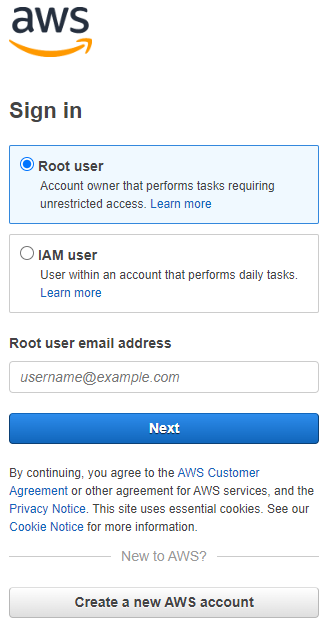
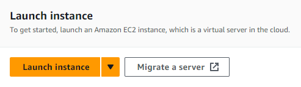
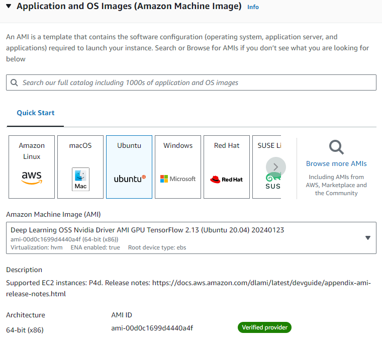
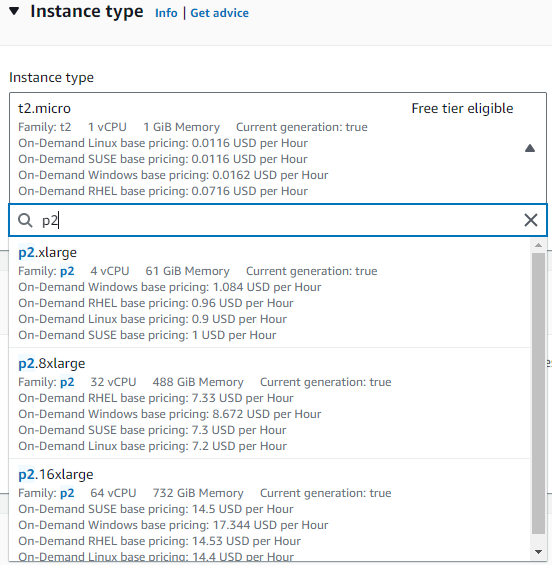
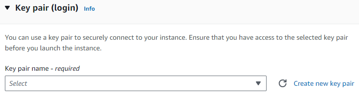
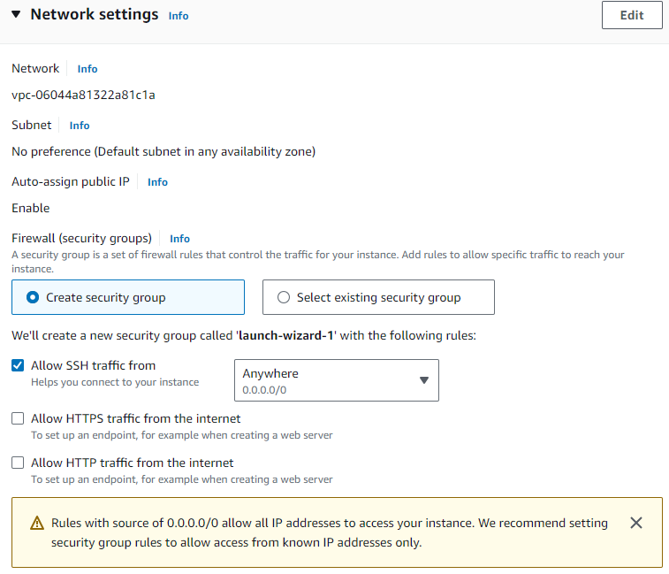
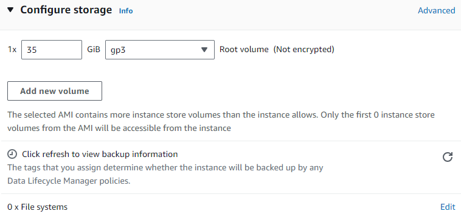
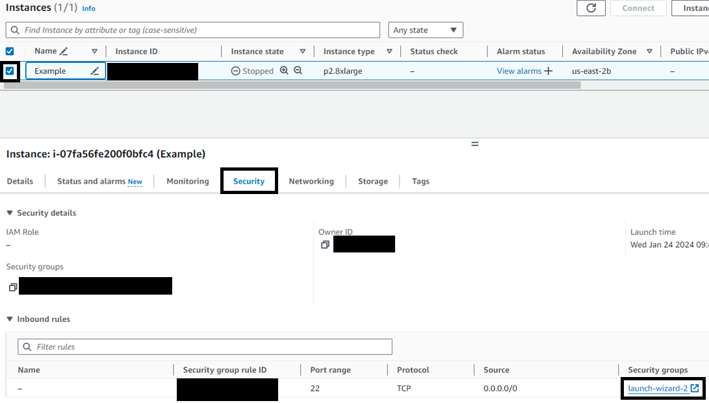
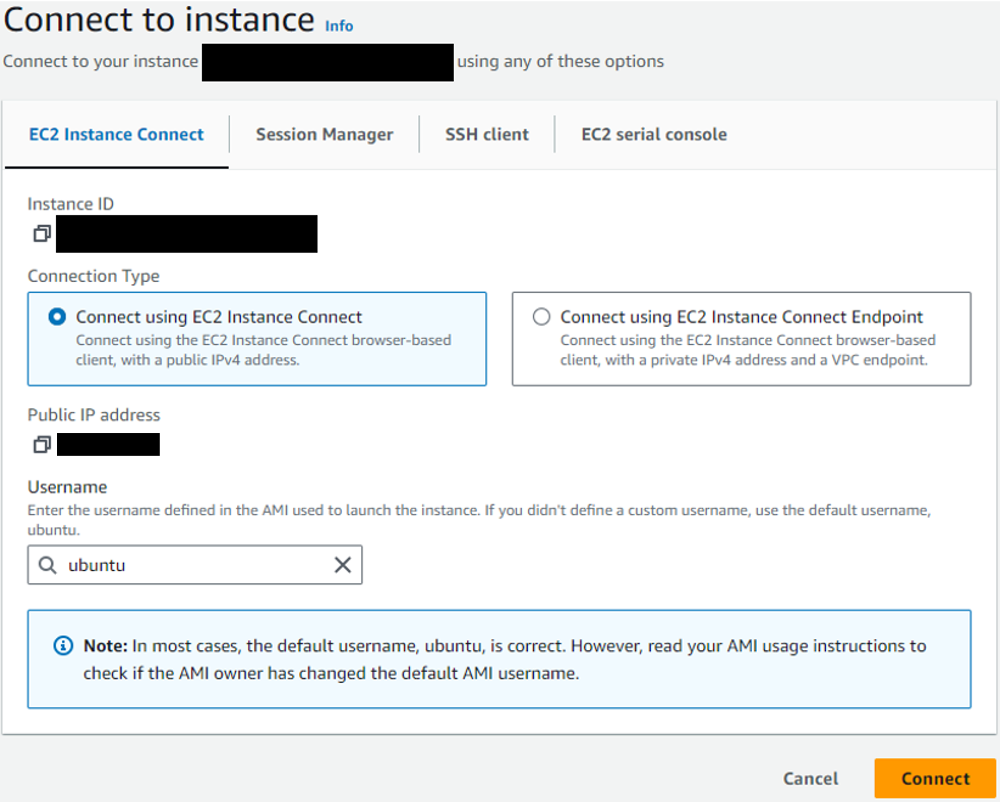
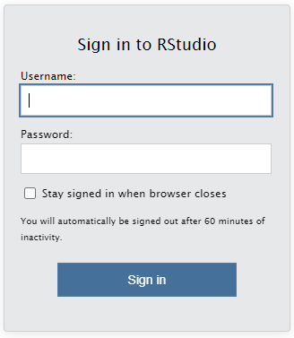

---
title: Getting Started with GPU-Accelerated Machine Learning on AWS EC2 using R and
  TensorFlow
author: Dusty Turner
date: '2024-02-01'
slug: []
categories:
  - Neural Networks
  - TensorFlow
  - Keras
  - AWS
  - Data Science
  - R
  - Python
tags:
  - Neural Networks
  - TensorFlow
  - Keras
  - AWS
  - Data Science
  - R
  - Python
cover: /media/aws_icon.PNG 
--- 

## Introduction 
  
I've  been looking for an all-in-one place to explain how to start from nothing to having a GPU-accelerated machine learning platform that runs RStudio Server with TensorFlow through reticulate.  

In this post, I will explain how to...

1) Set up an EC2 instance in AWS with GPU capabilities
2) Install RStudio Server with the latest versions of R
3) Install the correct versions of Python with Recitulate
4) Install TensorFlow and Keras to run deep learning models

## Set up an EC2 instance

### Log in to AWS

For a new account, select "Root User".  
 


### Navigate to EC2 then "Launch Instance"

Do not worry about the default region but do make note of which region you are in.



### Fill Out Instance Information

**Name**: Does not matter at all

**Application and OS Images (Amazon Machine Image)**: 

An Amazon Machine Image (AMI) is a pre-configured setup for your instance that includes an operating system and any additional software required for specific needs. We will select a basic AMI that has the building blocks to meet our deep learning needs.  There are some AMIs that will do have everything you may want (and more) for deep learning, but they often come at a cost.

Under quick start, select Ubuntu.  

Then under the Amazon Machine Image (AMI) drop down menu, select the Deep Learning OSS Nvidia Driver AMI GPU TensorFlow 2.13 (Ubuntu 20.04) selection shown below.



I recommend this AMI because it comes pre-installed with necessary drivers and TensorFlow, streamlining the process of setting up a deep learning environment. This AMI is tailored for machine learning applications, ensuring compatibility and ease of use for projects involving TensorFlow and R.

**Instance Type**

Here's where cost comes in to play.  Instances that support GPUs are the 'p' instances.  The cheapest instance is the p2 which supports 1 GPU and 4 CPUs. 

If you want more than 4 CPUs, you'll have to request those through the AWS Support. 

If you want ANY GPUs, you'll have to request through AWS Support.  From my experience, the request can take a few days and the fewer the GPUs you request the quicker the approval time. 

| Instance Type | GPUs                                | vCPUs | Memory   | Cost (Per Hour, Ohio Region)|
|---------------|-------------------------------------|-------|----------|-----------------------------|
| p2.xlarge     | 1 NVIDIA K80 GPU                    | 4     | 61 GiB   | $0.96                       |
| p2.8xlarge    | 8 NVIDIA K80 GPUs                   | 32    | 488 GiB  | $7.20                       |
| p2.16xlarge   | 16 NVIDIA K80 GPUs                  | 64    | 732 GiB  | $14.40                      |
| p3.2xlarge    | 1 NVIDIA Tesla V100 GPU             | 8     | 61 GiB   | $3.00                       |
| p3.8xlarge    | 4 NVIDIA Tesla V100 GPUs            | 32    | 244 GiB  | $12.24                      |
| p3.16xlarge   | 8 NVIDIA Tesla V100 GPUs            | 64    | 488 GiB  | $24.48                      |
  
**Note**: Costs are specific to the Ohio region and are subject to change. Additional costs for data transfer and storage apply. For the most current pricing, refer to the [AWS Pricing page](https://aws.amazon.com/ec2/pricing/).



**Key Pair**
  
Click "Create new key pair" and select options according to your preferences.  



**Network Settings**
  
You will likely need to create a security group. I recommend defaults, but you can make alterations here if you like. 



**Configure Storage**
  
You can go with the default settings.  If you think you need more storage you can up this value. 



**Launch Instance**
  
At this point, you can launch the instance.  AWS will create a virtual computer according to your specifications and take you to your Instances Dashboard.

### Edit Security Group

Now we'll take a step that will allow us to access our RStudio server in a subsequent step.  

The image below shows the instances page with a few locations highlighted with a black box (and a few places redacted).  Click the box next to your instance.  That should bring up information about your instance below.

Click the "security" tab below that.  The click the security group.  Mine is called "launch-wizard-2". 



I will not show the subsequent images because there is too much information to redact but here are the instructions.

1. Click the blue box next to your security group id. 
2. Below, select the "Inbound rules" header. 
3. In the top right of that tab, click "Edit inbound rules".  This will take you to another page.
4. Here, you should have a SSH rule for port 22.  We want to add another rule by clicking "Add rule" at the bottom.
5. For type, select "Custom TCP".  
6. Make the Port range 8787.  

### Launch Instance

1. Navigate back to your instances page.
2. Check the box next to your instance. 
3. Click the instance state drop down from the top right of the page.
4. Click start instance.

If you have the approvals for GPUs, this instance should start. 

## Install RStudio Server

Now that we've started our instance, lets open up a terminal.

1. In the instances page, click the box next to your instance.
2. In the top right of the page, click "connect".
3. You should see the image below.  Use the default setting (to include the Username Ubuntu), and click connect. 



### Installing RStudio Server with Latest Version of R

To set up RStudio Server on an AWS EC2 instance, follow these steps in the terminal:
  
1. Update Your System

```{bash, eval = FALSE}
sudo apt-get update
sudo apt-get upgrade
```

2. Install R

Add the CRAN repository to get the latest version of R:
  
```{bash, eval = FALSE}
sudo apt-key adv --keyserver keyserver.ubuntu.com --recv-keys E084DAB9
sudo add-apt-repository 'deb https://cloud.r-project.org/bin/linux/ubuntu focal-cran40/'
```

Install R

```{bash, eval = FALSE}
sudo apt-get update
sudo apt-get install r-base
```

3. Install RStudio Server

Download the latest version of RStudio Server:
  
```{bash, eval = FALSE}
sudo apt-get install gdebi-core
wget https://download2.RStudio.org/server/focal/amd64/RStudio-server-2023.12.0-369-amd64.deb
sudo gdebi RStudio-server-2023.12.0-369-amd64.deb
```

This includes the latest as of the publication date of this blog.  Check the POSIT webpage [https://posit.co/download/RStudio-server/](https://posit.co/download/RStudio-server/). 

4. Verify Installation

Verify that RStudio Server is running

```{bash, eval = FALSE}
sudo RStudio-server verify-installation
```

5. Set Password

You'll want to set the password for your RSudio Server instance that we'll access in a minute.  To do this, run the code below.  You'll be required to enter your password twice. 

```{bash, eval = FALSE}
sudo passwd ubuntu
```

### Access RStudio Server

Navigate back to your instances page and click the box next to your instance. 

Look below and find your "Public IPv4 address".  Copy this address.

Open your web browser and navigate to http://<Your-EC2-Instance-Public-IP>:8787.  Replace <Your-EC2-Instance-Public-IP> with your actual EC2 instance's public IP address. 

Ensure you use "http" and not "https".



Now you should have access to RStudio!
  
## Install Tools for Deeplearning in RStudio
  
Now that you have a working RStudio Instance, you will need to have installed Reticulate, Python, and TensorFlow.  There are multiple ways to do this to include installing Python from the command line.  However, I've found doing this often creates versioning issues between TensorFlow, Reticulate, and Python.  The simplest way to avoid these issues is to install everything in the following order.

1. Install Reticulate

Reticulate is the package in R that allows you to execute Python code within an R environment, bridging the gap between R and Python and enabling seamless integration of the two.

```{r, eval=FALSE}
install.packages("reticulate)
```

2. Install the TensorFlow R Package

This installs the tools that allows you to install the TensorFlow Python Tools

```{r, eval=FALSE}
install.packages("TensorFlow)
```

3. Install the TensorFlow Python Package

The code below installs TensorFlow within a Python environment managed by Reticulate. This also manages the installation of Python by ensuring proper versioning.  This helps ensure that the Python environment is set up in a way that is compatible with the Reticulate package.


```{r, eval=FALSE}
TensorFlow::install_TensorFlow()
```

## Run Neural Network Over Multiple GPUs

While not the point of this post, I want to provide a short example of how to execute a neural network over multiple GPUs.

Assuming you have data and other desired projects, this code will work for multiple GPUs. 

```{r, eval = FALSE}
# Load the necessary libraries
library(tensorflow)
library(keras)

# Define a strategy for multi-GPU training
strategy <- tf$distribute$MirroredStrategy()

# Wrap the model building and compilation within the strategy scope
with(strategy$scope(), {
  model <- keras_model_sequential() %>%
    layer_conv_2d(filters = 32, kernel_size = c(3,3), activation = 'relu', input_shape = c(28, 28, 1)) %>%
    layer_max_pooling_2d(pool_size = c(2, 2)) %>%
    layer_conv_2d(filters = 64, kernel_size = c(3,3), activation = 'relu') %>%
    layer_max_pooling_2d(pool_size = c(2, 2)) %>%
    layer_conv_2d(filters = 64, kernel_size = c(3,3), activation = 'relu') %>%
    layer_flatten() %>%
    layer_dense(units = 64, activation = 'relu') %>%
    layer_dense(units = 10, activation = 'softmax')

  model %>% compile(
    optimizer = 'adam',
    loss = 'sparse_categorical_crossentropy',
    metrics = c('accuracy')
  )
})

# Train the model
model %>% fit(train_images, train_labels, epochs = 5, batch_size = 64)

# Evaluate the model
model %>% evaluate(test_images, test_labels)

```

