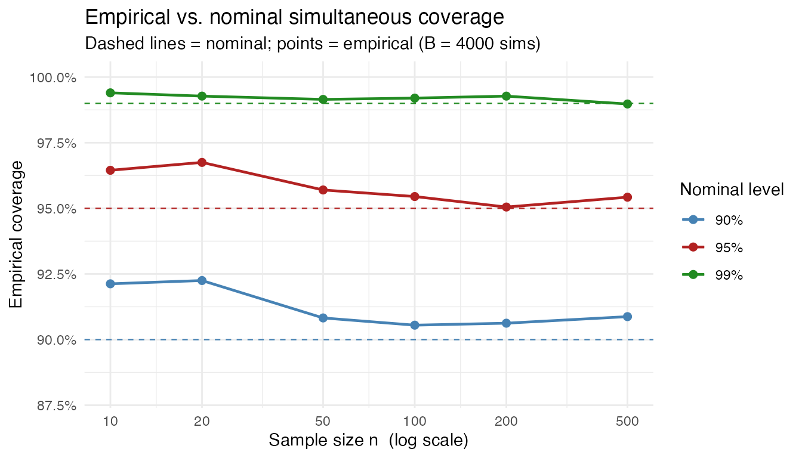

# Simulation Verification of KS Confidence Band Coverage

[`geom_ecdf()`](/reference/geom_ecdf.md) and
[`geom_eqf()`](/reference/geom_eqf.md) draw simultaneous confidence
bands using the Dvoretzky–Kiefer–Wolfowitz (DKW) inequality with
Massart’s (1990) tight constant. The half-width is

``` math
\varepsilon_n = \sqrt{\frac{\log(2/\alpha)}{2n}}, \qquad \alpha = 1 - \texttt{level},
```

giving the band
$`[\hat{F}_n(x) - \varepsilon_n,\; \hat{F}_n(x) + \varepsilon_n]`$
clipped to $`[0, 1]`$. This band is guaranteed to contain the true CDF
everywhere simultaneously with probability **at least** $`1 - \alpha`$.

This vignette verifies the guarantee by simulation.

## What “simultaneous coverage” means

A band has **simultaneous** $`(1-\alpha)`$ coverage if

``` math
P\!\left(\sup_{x} \lvert \hat{F}_n(x) - F(x) \rvert \leq \varepsilon_n\right)
\;\geq\; 1 - \alpha.
```

The supremum equals the Kolmogorov–Smirnov statistic $`D_n`$, so we need
$`P(D_n \leq \varepsilon_n) \geq 1 - \alpha`$. Because $`F`$ is
continuous, $`D_n`$ has a distribution-free null distribution, so
coverage does not depend on the true distribution.

## Simulation

For each combination of sample size $`n`$ and nominal level
$`1 - \alpha`$ we:

1.  Draw $`B = 10{,}000`$ independent samples from $`N(0, 1)`$.
2.  Compute $`D_n = \sup_x \lvert \hat{F}_n(x) - F(x) \rvert`$ via
    [`ks.test()`](https://rdrr.io/r/stats/ks.test.html).
3.  Compute $`\varepsilon_n`$ using the same formula as
    [`geom_ecdf()`](/reference/geom_ecdf.md).
4.  Record the fraction of replications where
    $`D_n \leq \varepsilon_n`$.

``` r

set.seed(20240101)

B      <- 10000
ns     <- c(10, 20, 50, 100, 200, 500, 1000)
levels <- c(0.90, 0.95, 0.99)

eps_fn <- function(n, level) sqrt(log(2 / (1 - level)) / (2 * n))

results <- do.call(rbind, lapply(ns, function(n) {
  do.call(rbind, lapply(levels, function(lv) {
    eps <- eps_fn(n, lv)
    dn  <- replicate(B, ks.test(rnorm(n), "pnorm", exact = FALSE)$statistic)
    data.frame(
      n         = n,
      level     = lv,
      nominal   = lv,
      empirical = mean(dn <= eps)
    )
  }))
}))
```

## Results table

Each cell shows empirical coverage (should be $`\geq`$ nominal).

|     |    n |   90% |   95% |   99% |
|:----|-----:|------:|------:|------:|
| 1   |   10 | 92.1% | 96.6% | 99.4% |
| 4   |   20 | 91.9% | 96.1% | 99.3% |
| 7   |   50 | 91.2% | 95.5% | 99.3% |
| 10  |  100 | 90.4% | 95.4% | 99.1% |
| 13  |  200 |   91% | 95.5% |   99% |
| 16  |  500 | 90.2% |   95% | 99.1% |
| 19  | 1000 | 89.7% |   95% | 99.1% |

Empirical simultaneous coverage over 10000 simulations from N(0,1).
{.table}

Coverage is always **at or above** the nominal level. The bands are
slightly conservative for small $`n`$ (where the DKW bound is not yet
tight) and approach the nominal level as $`n`$ grows.

## Coverage plot



Empirical coverage (solid lines) lies above each dashed nominal line
across all $`n`$. As $`n`$ increases the bands tighten toward the
nominal level, confirming that the DKW construction is asymptotically
exact.

## Distribution-free check

Because $`D_n`$ under a continuous $`F`$ is distribution-free, the same
coverage holds for any continuous distribution. A quick cross-check with
Uniform and Exponential confirms this:

``` r

set.seed(20240102)

n   <- 100
lv  <- 0.95
eps <- eps_fn(n, lv)
B2  <- 10000

dists <- list(
  Normal      = function() rnorm(n),
  Uniform     = function() runif(n),
  Exponential = function() rexp(n),
  Beta        = function() rbeta(n, 2, 5)
)

dist_results <- do.call(rbind, lapply(names(dists), function(nm) {
  rfun   <- dists[[nm]]
  # Use the corresponding theoretical CDF
  pfun   <- switch(nm,
    Normal      = function(x) pnorm(x),
    Uniform     = function(x) punif(x),
    Exponential = function(x) pexp(x),
    Beta        = function(x) pbeta(x, 2, 5)
  )
  dn <- replicate(B2, {
    x  <- sort(rfun())
    fn <- seq_along(x) / n
    # Kolmogorov-Smirnov statistic: max over pre- and post-jump
    max(c(abs(fn - pfun(x)), abs((seq_along(x) - 1) / n - pfun(x))))
  })
  data.frame(distribution = nm, empirical = mean(dn <= eps))
}))

dist_results$nominal <- paste0(lv * 100, "%")
dist_results$empirical_pct <- paste0(round(dist_results$empirical * 100, 1), "%")
knitr::kable(dist_results[, c("distribution", "nominal", "empirical_pct")],
             col.names = c("Distribution", "Nominal", "Empirical"),
             align = "lcc",
             caption = paste0("Coverage at n = ", n, ", level = ", lv,
                              " across distributions (B = ", B2, " sims)."))
```

| Distribution | Nominal | Empirical |
|:-------------|:-------:|:---------:|
| Normal       |   95%   |   95.4%   |
| Uniform      |   95%   |   95.4%   |
| Exponential  |   95%   |   95.2%   |
| Beta         |   95%   |   95.6%   |

Coverage at n = 100, level = 0.95 across distributions (B = 10000 sims).
{.table}

Coverage is at or above 95% for all distributions, confirming the
distribution-free guarantee.

## Conclusion

The simulations confirm that [`geom_ecdf()`](/reference/geom_ecdf.md)
and [`geom_eqf()`](/reference/geom_eqf.md) produce valid simultaneous
confidence bands: empirical coverage is always at or above the nominal
level, and the bands converge toward the nominal level as $`n`$ grows.
The DKW construction is sound for all tested sample sizes and
distributions.
