# Gallery of Visualizations

A showcase of what **ggfunction** can do. Each example is
self-contained.

## Parametric curves

A lemniscate of Bernoulli with an arrowhead and tail marker:

``` r

lemniscate <- function(t) {
  r <- sqrt(pmax(2 * cos(2 * t), 0))
  c(r * cos(t), r * sin(t))
}

ggplot() +
  geom_function_1d_2d(
    fun = lemniscate, tlim = c(0, 1.9 * pi),
    tail_point = TRUE,
    arrow = grid::arrow(angle = 30, length = grid::unit(0.02, "npc"),
                        type = "closed")
  ) +
  coord_equal() +
  theme_void()
```

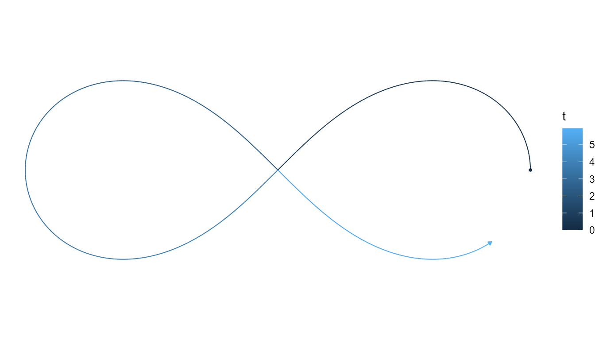

Lissajous figures with different frequency ratios:

``` r

lissajous <- function(t, a, b) c(sin(a * t), cos(b * t))

p1 <- ggplot() +
  geom_function_1d_2d(fun = lissajous, tlim = c(0, 2 * pi), args = list(a = 3, b = 2)) +
  coord_equal() + ggtitle("3:2") + theme_void()

p2 <- ggplot() +
  geom_function_1d_2d(fun = lissajous, tlim = c(0, 2 * pi), args = list(a = 5, b = 4)) +
  coord_equal() + ggtitle("5:4") + theme_void()

p3 <- ggplot() +
  geom_function_1d_2d(fun = lissajous, tlim = c(0, 2 * pi), args = list(a = 7, b = 6)) +
  coord_equal() + ggtitle("7:6") + theme_void()

p1 + p2 + p3
```

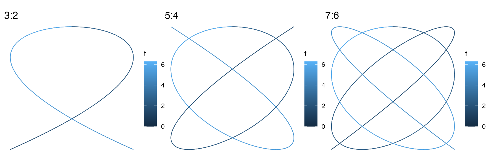

## Scalar fields

The same 2D function shown as a raster, contour lines, and filled
contours:

``` r

f_wave <- function(v) sin(2 * pi * v[1]) + sin(2 * pi * v[2])

p1 <- ggplot() +
  geom_function_2d_1d(fun = f_wave, xlim = c(-1, 1), ylim = c(-1, 1)) +
  ggtitle("Raster") + coord_equal()

p2 <- ggplot() +
  geom_function_2d_1d(fun = f_wave, xlim = c(-1, 1), ylim = c(-1, 1),
                       type = "contour") +
  ggtitle("Contour") + coord_equal()

p3 <- ggplot() +
  geom_function_2d_1d(fun = f_wave, xlim = c(-1, 1), ylim = c(-1, 1),
                       type = "contour_filled") +
  ggtitle("Filled contour") + coord_equal()

p1 + p2 + p3
```

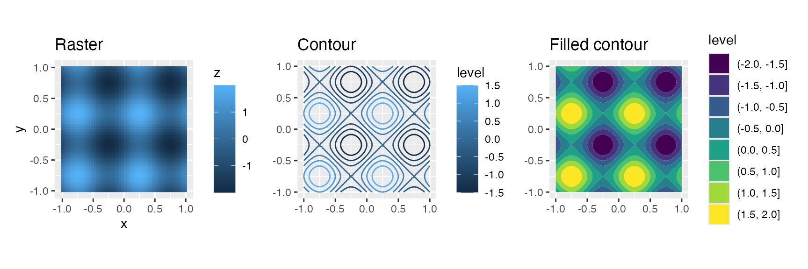

## Vector fields

A rotation field rendered as arrows and as streamlines:

``` r

f_rot <- function(u) c(-u[2], u[1])

p1 <- ggplot() +
  geom_function_2d_2d(fun = f_rot, xlim = c(-1, 1), ylim = c(-1, 1)) +
  coord_equal() + ggtitle("Arrows")

p2 <- ggplot() +
  geom_function_2d_2d(fun = f_rot, xlim = c(-1, 1), ylim = c(-1, 1),
                       type = "stream") +
  coord_equal() + ggtitle("Streamlines")

p1 + p2
```

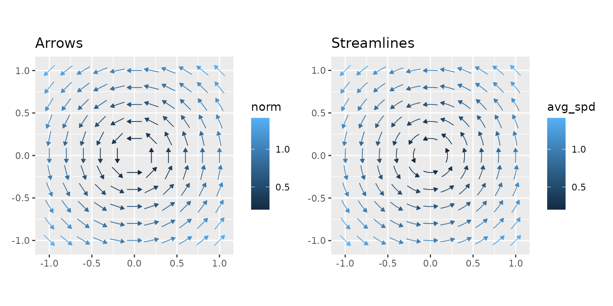

## Multimodal HDR

Highest density regions shine for multimodal distributions where
equal-tailed intervals would miss probability mass:

``` r

bimodal <- function(x) 0.4 * dnorm(x, -2, 0.8) + 0.6 * dnorm(x, 2, 1)

ggplot() +
  geom_pdf(fun = bimodal, xlim = c(-5, 6), shade_hdr = 0.8,
           fill = "orchid") +
  labs(title = "80% Highest Density Region", subtitle = "Bimodal mixture") +
  theme_minimal()
```

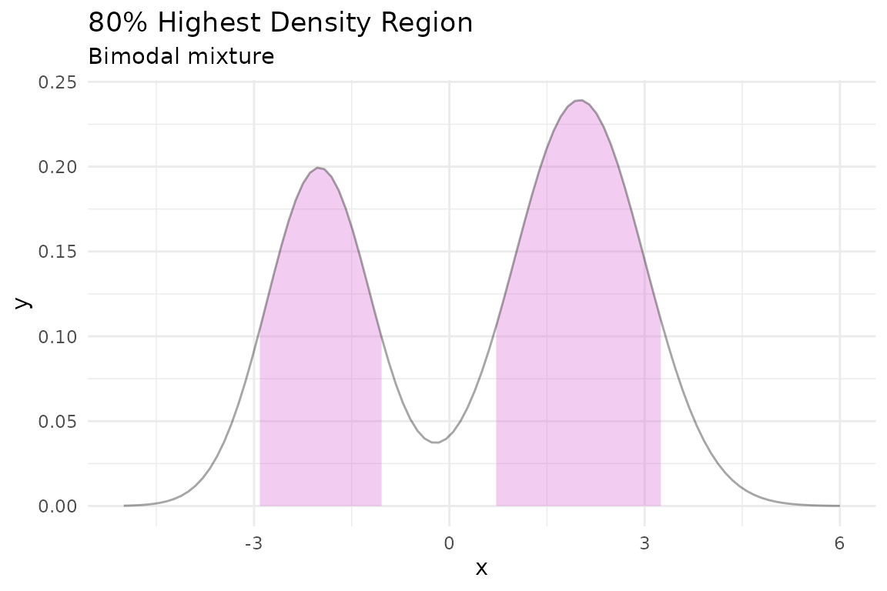

## Tail shading and rejection regions

Shade both tails simultaneously with `shade_outside = TRUE` — a natural
visual for hypothesis testing:

``` r

ggplot() +
  geom_pdf(
    fun = dnorm, xlim = c(-4, 4),
    p_lower = 0.025, p_upper = 0.975,
    shade_outside = TRUE, fill = "firebrick"
  ) +
  labs(title = expression(alpha == 0.05 ~ "two-sided rejection region")) +
  theme_minimal()
```

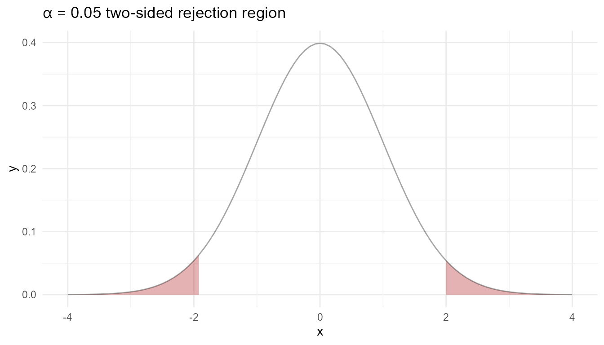

## Discrete step functions

CDF, quantile function, and survival function side-by-side for the same
Binomial(10, 0.3) distribution:

``` r

binom_args <- list(size = 10, prob = 0.3)

p1 <- ggplot() +
  geom_cdf_discrete(pmf_fun = dbinom, xlim = c(0, 10), args = binom_args) +
  ggtitle("CDF")

p2 <- ggplot() +
  geom_qf_discrete(pmf_fun = dbinom, xlim = c(0, 10), args = binom_args) +
  ggtitle("Quantile function")

p3 <- ggplot() +
  geom_survival_discrete(pmf_fun = dbinom, xlim = c(0, 10), args = binom_args) +
  ggtitle("Survival")

p1 + p2 + p3
```

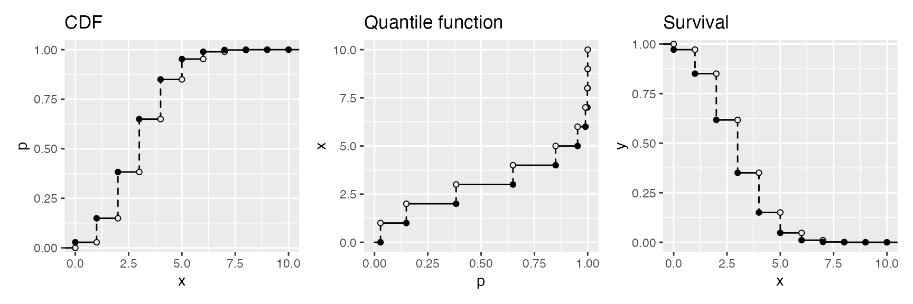

## Non-integer support

A PMF on a custom support — the distribution of the sample mean from a
discrete uniform on $`\{0, 0.5, 1\}`$ with $`n = 2`$:

``` r

mean_probs <- function(x) {
  vals <- c(0, 0.5, 1)
  grid <- expand.grid(x1 = vals, x2 = vals)
  means <- rowMeans(grid)
  tab <- table(means) / nrow(grid)
  ifelse(as.character(x) %in% names(tab), as.numeric(tab[as.character(x)]), 0)
}

ggplot() +
  geom_pmf(fun = Vectorize(mean_probs), xlim = c(0, 1),
           support = seq(0, 1, by = 0.25)) +
  labs(title = "Sample mean distribution (n = 2)") +
  theme_minimal()
```

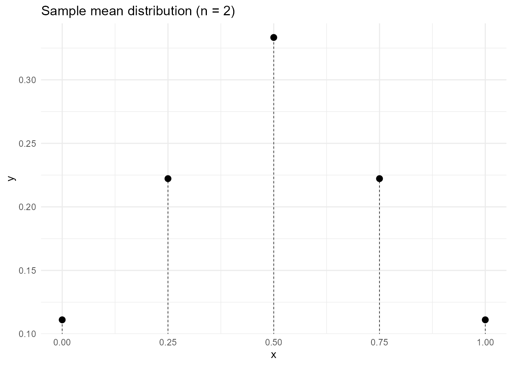

## Empirical vs. theoretical

Overlay an empirical quantile function with the theoretical quantile
function to visually assess goodness-of-fit:

``` r

set.seed(123)
df <- data.frame(x = rnorm(40))

ggplot(df, aes(x = x)) +
  geom_eqf(color = "steelblue") +
  geom_qf(fun = qnorm, args = list(mean = 0, sd = 1),
           color = "firebrick", linewidth = 0.8) +
  labs(title = "Empirical vs. theoretical quantile function",
       subtitle = "Blue = data with DKW band, Red = N(0, 1)") +
  theme_minimal()
```

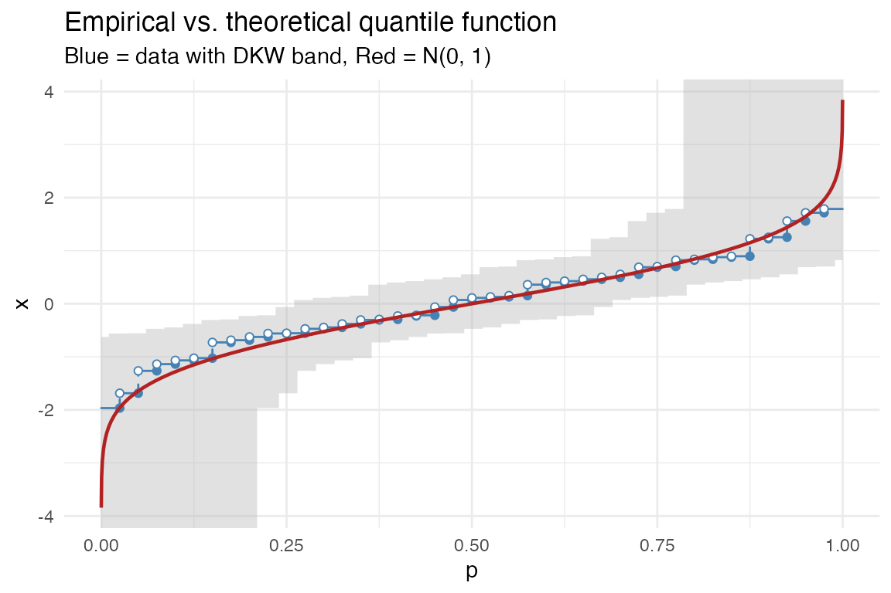

The same comparison can be made directly with PP and QQ diagnostic
plots:

``` r

pp <- ggplot(df, aes(x = x)) +
  geom_ppplot(fun = pnorm) +
  coord_equal() +
  labs(title = "PP plot")

qq <- ggplot(df, aes(x = x)) +
  geom_qqplot(fun = qnorm) +
  coord_equal() +
  labs(title = "QQ plot")

pp + qq
```

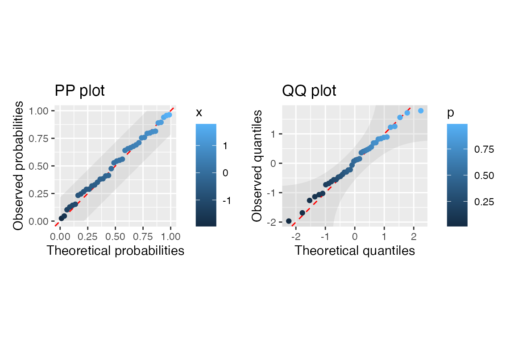

Use a fixed colour for black points, or add a spectral scale explicitly:

``` r

qq_black <- ggplot(df, aes(x = x)) +
  geom_qqplot(fun = qnorm, colour = "black") +
  coord_equal() +
  labs(title = "Black points")

qq_spectral <- ggplot(df, aes(x = x)) +
  geom_qqplot(fun = qnorm) +
  scale_colour_gradientn(
    colors = grDevices::rainbow(10),
    limits = c(0, 1),
    labels = function(x) paste0(round(100 * x), "%")
  ) +
  coord_equal() +
  labs(title = "Spectral scale")

qq_black + qq_spectral
```

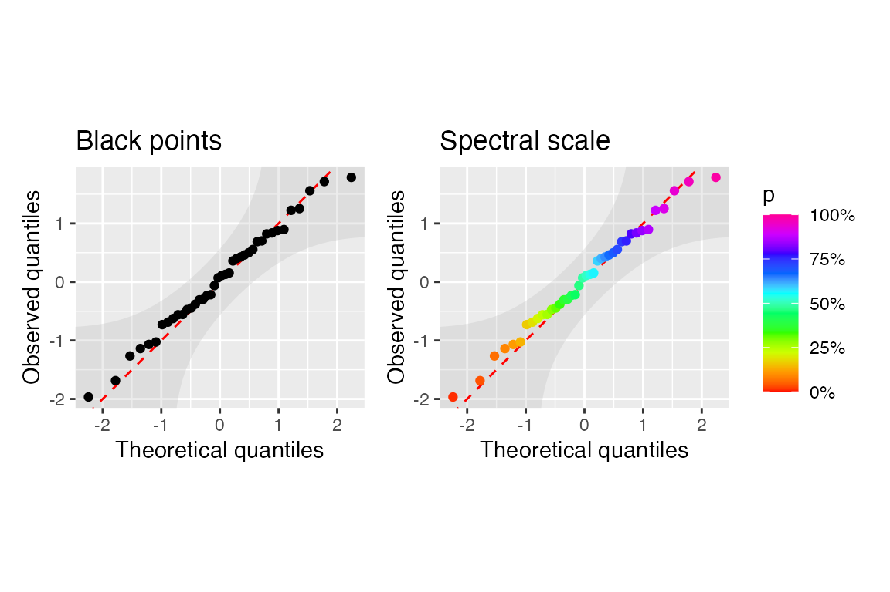
