# ggfunction

**ggfunction** extends [**ggplot2**](https://ggplot2.tidyverse.org/)
with geoms and stats for plotting mathematical functions and probability
distributions directly from function objects. Supply a function and a
domain; **ggfunction** handles evaluation, rendering, and shading.

## Overview

The package is organized around four families of geoms:

| Family | Geom | Maps | Description |
|----|----|----|----|
| **Dimensional** | [`geom_function_1d_1d()`](/reference/geom_function_1d_1d.md) | $`\mathbb{R} \to \mathbb{R}`$ | Scalar functions with optional interval shading |
|  | [`geom_function_1d_2d()`](/reference/geom_function_1d_2d.md) | $`\mathbb{R} \to \mathbb{R}^2`$ | Parametric curves |
|  | [`geom_function_2d_1d()`](/reference/geom_function_2d_1d.md) | $`\mathbb{R}^2 \to \mathbb{R}`$ | Scalar fields (raster, contour, filled contour) |
|  | [`geom_function_2d_2d()`](/reference/geom_function_2d_2d.md) | $`\mathbb{R}^2 \to \mathbb{R}^2`$ | Vector fields (arrows, streamlines) |
| **Probability** | [`geom_pdf()`](/reference/geom_pdf.md) |  | Probability density function |
|  | [`geom_pdf_2d()`](/reference/geom_pdf_2d.md) |  | Bivariate PDF highest density regions (via ggdensity) |
|  | [`geom_pmf()`](/reference/geom_pmf.md) |  | Probability mass function (lollipop) |
|  | [`geom_pmf_2d()`](/reference/geom_pmf_2d.md) |  | Bivariate PMF (balloon plot or tile heatmap) |
|  | [`geom_cdf()`](/reference/geom_cdf.md) |  | Cumulative distribution function |
|  | [`geom_cdf_discrete()`](/reference/geom_cdf_discrete.md) |  | Discrete CDF (step function) |
|  | [`geom_survival()`](/reference/geom_survival.md) |  | Survival function $`S(x) = 1 - F(x)`$ |
|  | [`geom_survival_discrete()`](/reference/geom_survival_discrete.md) |  | Discrete survival function (step function) |
|  | [`geom_qf()`](/reference/geom_qf.md) |  | Quantile function |
|  | [`geom_qf_discrete()`](/reference/geom_qf_discrete.md) |  | Discrete quantile function (step function) |
|  | [`geom_hf()`](/reference/geom_hf.md) |  | Hazard function $`h(x) = f(x)/S(x)`$ |
|  | [`geom_chf()`](/reference/geom_chf.md) |  | Cumulative hazard function $`H(x) = -\log S(x)`$ |
| **Data** | [`geom_ecdf()`](/reference/geom_ecdf.md) |  | Empirical CDF with DKW confidence ribbon |
|  | [`geom_eqf()`](/reference/geom_eqf.md) |  | Empirical quantile function with confidence ribbon |
|  | [`geom_ppplot()`](/reference/geom_ppplot.md) |  | PP diagnostic plot with DKW confidence ribbon |
|  | [`geom_qqplot()`](/reference/geom_ppplot.md) |  | QQ diagnostic plot with DKW confidence ribbon |
|  | [`geom_spplot()`](/reference/geom_ppplot.md) |  | Stabilized probability (SP) plot with DKW confidence ribbon |
|  | [`geom_epmf()`](/reference/geom_epmf.md) |  | Empirical PMF (lollipop) |
|  | [`geom_echf()`](/reference/geom_echf.md) |  | Empirical cumulative hazard with DKW confidence band |
| **Censored Data** | [`geom_ecdf_km()`](/reference/geom_ecdf_km.md) |  | Kaplan-Meier survival curve with Greenwood EP band |
|  | [`geom_echf_na()`](/reference/geom_echf_na.md) |  | Nelson-Aalen cumulative hazard with pointwise band |

## Dimensional Taxonomy

### Scalar functions: `geom_function_1d_1d()`

[`geom_function_1d_1d()`](/reference/geom_function_1d_1d.md) evaluates a
function $`f\colon \mathbb{R} \to \mathbb{R}`$ at `n` equally-spaced
points over `xlim` and draws it as a curve, extending
[`ggplot2::stat_function()`](https://ggplot2.tidyverse.org/reference/geom_function.html)
with built-in region shading. The following example plots the sine
function over one full period.

``` r

library("ggfunction")

ggplot() +
  geom_function_1d_1d(fun = sin, xlim = c(0, 2*pi))
```

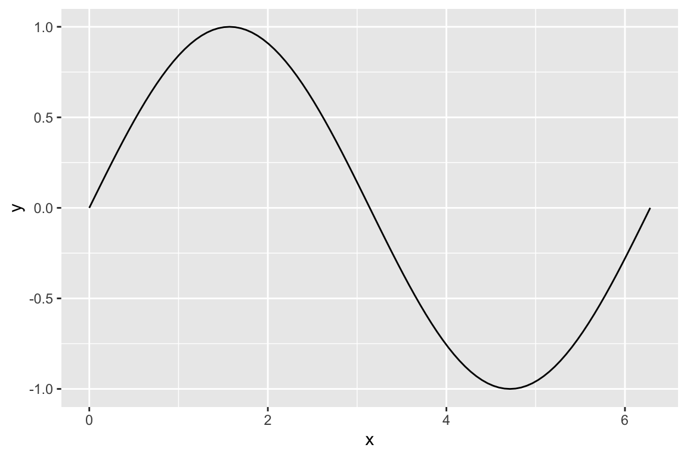

**Shading intervals.** The `shade_from` and `shade_to` parameters fill
the region between the curve and the $`x`$-axis over a specified
interval. Here we shade the sine function between $`-1`$ and $`1`$.

``` r

ggplot() +
  geom_function_1d_1d(fun = sin, xlim = c(-3, 3), shade_from = -1, shade_to = 1)
```

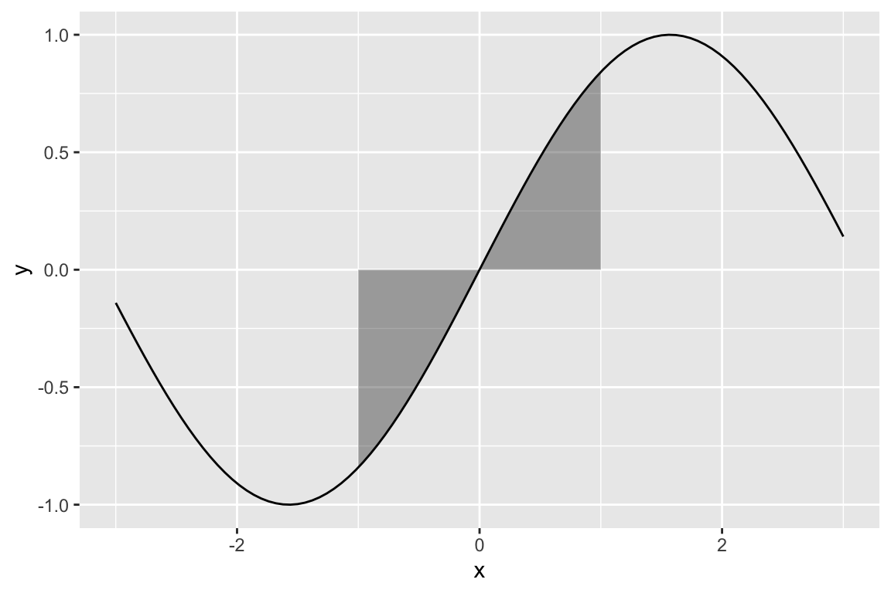

### Parametric curves: `geom_function_1d_2d()`

[`geom_function_1d_2d()`](/reference/geom_function_1d_2d.md) evaluates a
parametric curve $`\boldsymbol{\gamma}(t) = (x(t),\, y(t))`$ over the
range `tlim` with step size `dt`, coloring the path by the time
parameter by default. The following example traces the lemniscate of
Bernoulli – a figure-eight curve along which the product of distances to
the two foci is constant –
$`\boldsymbol{\gamma}(t) = \bigl(\cos t\,/\,(1 + \sin^2 t),\; \sin t\cos t\,/\,(1 + \sin^2 t)\bigr)`$.

``` r

lemniscate <- function(t) c(cos(t) / (1 + sin(t)^2), sin(t) * cos(t) / (1 + sin(t)^2))

ggplot() +
  geom_function_1d_2d(fun = lemniscate, tlim = c(0, 1.9 * pi))
```

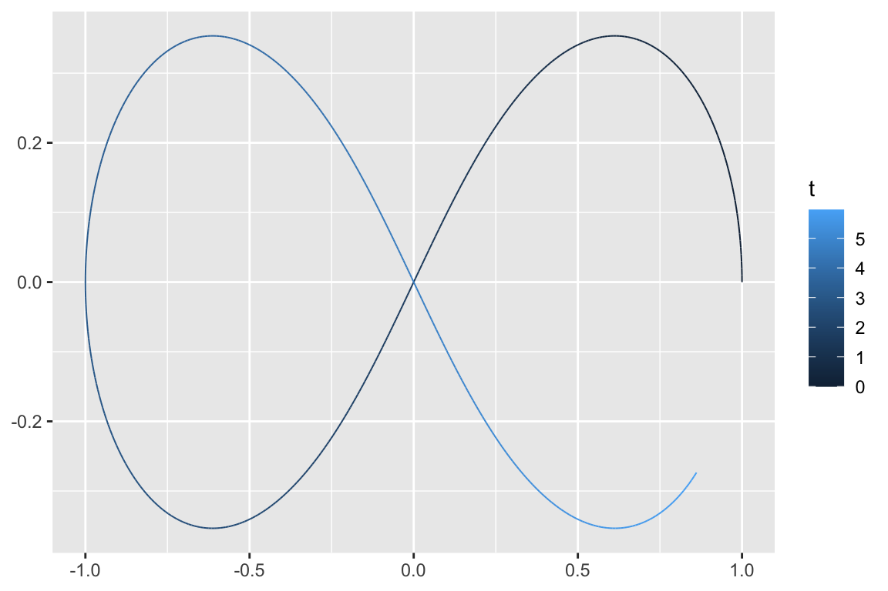

**Arrowheads and tail points.** Setting `tail_point = TRUE` and passing
[`grid::arrow()`](https://rdrr.io/r/grid/arrow.html) to `arrow` marks
the starting position of the curve with a point and the tail with an
arrowhead, respectively, useful for showing an initial condition and
direction of the curve.

``` r

ggplot() +
  geom_function_1d_2d(
    fun = lemniscate, tlim = c(0, 1.9 * pi), tail_point = TRUE,
    arrow = grid::arrow(angle = 30, length = grid::unit(0.02, "npc"), type = "closed")
  )
```


**Parameterized families.** Extra parameters for `fun` are passed via
`args`. The following example traces a Lissajous figure, a closed curve
that results when two sinusoids with a rational frequency ratio are
combined.

``` r

lissajous <- function(t, a = 3, b = 2, delta = pi/2) {
  c(sin(a * t + delta), sin(b * t))
}

ggplot() +
  geom_function_1d_2d(
    fun = lissajous, tlim = c(0, 1.9 * pi),
    args = list(a = 3, b = 2, delta = pi/2)
  )
```

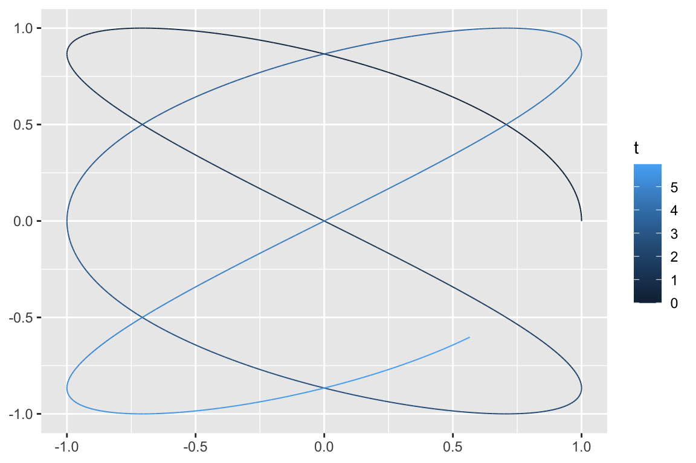

### Scalar fields: `geom_function_2d_1d()`

[`geom_function_2d_1d()`](/reference/geom_function_2d_1d.md) evaluates a
scalar field $`f\colon \mathbb{R}^2 \to \mathbb{R}`$ on an
$`n \times n`$ grid over `xlim` $`\times`$`ylim`. The function must
accept a numeric vector of length 2 and return a scalar; extracting
components with `x <- v[1]; y <- v[2]` is the recommended pattern. The
example below renders $`f(x,y) = \sin(2\pi x) + \sin(2\pi y)`$ as a
raster heatmap (the default `type`).

``` r

f <- function(v) {
  x <- v[1]; y <- v[2]
  sin(2*pi*x) + sin(2*pi*y)
}

ggplot() +
  geom_function_2d_1d(fun = f, xlim = c(-1, 1), ylim = c(-1, 1))
```

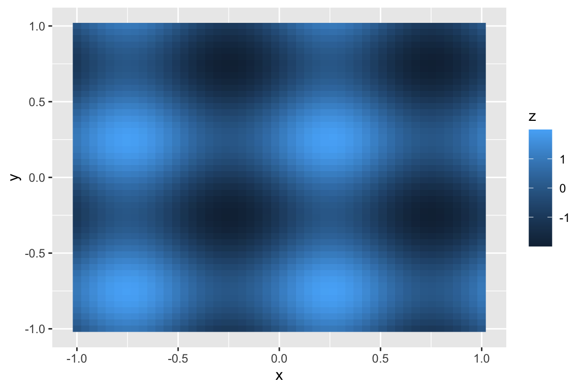

**Contour modes.** The `type` argument switches among three visual
encodings of the same field. `"contour"` draws iso-level curves colored
by level value; `"contour_filled"` draws filled regions between levels;
both respond to `bins`, `binwidth`, and `breaks`.

``` r

ggplot() +
  geom_function_2d_1d(fun = f, xlim = c(-1, 1), ylim = c(-1, 1), type = "contour")
```

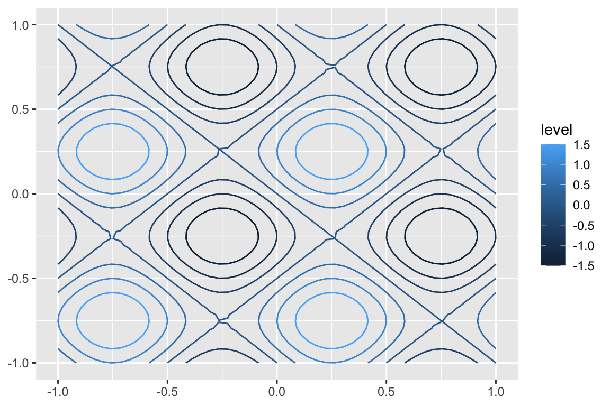

``` r

ggplot() +
  geom_function_2d_1d(fun = f, xlim = c(-1, 1), ylim = c(-1, 1), type = "contour_filled")
```

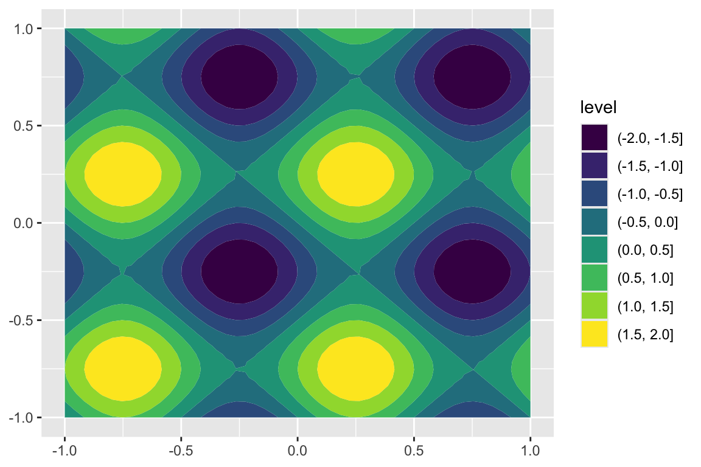

**Parameterized fields.** As with the other function geoms, extra
parameters for `fun` are passed via `args`.

``` r

g <- function(v, a = 1, b = 1) a * sin(v[1]) + b * cos(v[2])

ggplot() +
  geom_function_2d_1d(fun = g, xlim = c(-5, 5), ylim = c(-5, 5), args = list(a = 2, b = 0.5))
```

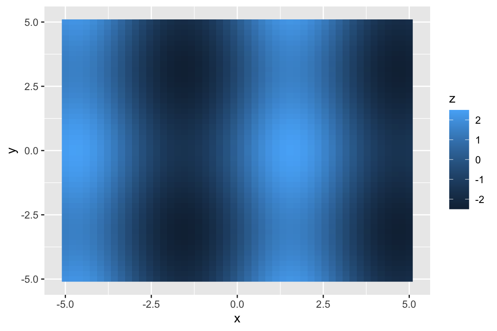

### Vector fields: `geom_function_2d_2d()`

[`geom_function_2d_2d()`](/reference/geom_function_2d_2d.md) visualizes
a vector field $`\mathbf{F}\colon \mathbb{R}^2 \to \mathbb{R}^2`$ via
[**ggvfields**](https://github.com/dusty-turner/ggvfields). The function
should accept a length-2 vector and return a length-2 vector. By default
(`type = "vector"`) it draws short arrows at each grid point colored by
field magnitude; `type = "stream"` switches to integral-curve
streamlines. The following example shows the rotation field
$`\mathbf{F}(x,y) = (-y,\, x)`$.

``` r

f <- function(u) {
  x <- u[1]; y <- u[2]
  c(-y, x)
}

ggplot() +
  geom_function_2d_2d(fun = f, xlim = c(-1, 1), ylim = c(-1, 1))
```

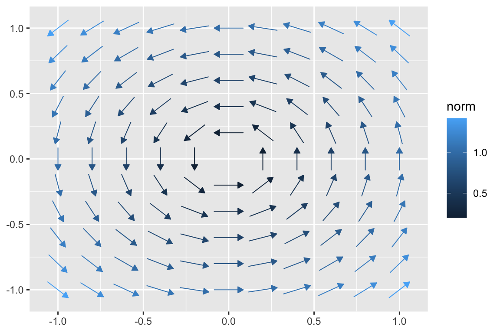

**Stream field.** Setting `type = "stream"` renders the field as
integral curves computed by numerical integration, colored by average
speed along each curve.

``` r

ggplot() +
  geom_function_2d_2d(fun = f, xlim = c(-1, 1), ylim = c(-1, 1), type = "stream")
```

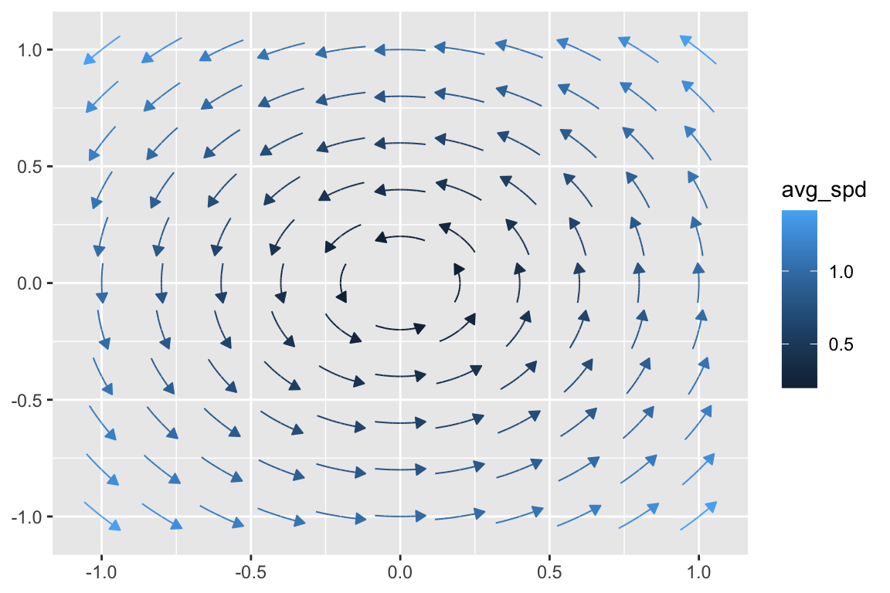

## Probability Distributions

The probability family provides a geom for each of the standard
functions associated with a distribution. Each accepts its native
function type via `fun` (e.g. `dnorm` for
[`geom_pdf()`](/reference/geom_pdf.md), `pnorm` for
[`geom_cdf()`](/reference/geom_cdf.md)), but most also accept alternate
function types that are converted internally—for example,
`geom_cdf(pdf_fun = dnorm)` derives the CDF by numerical integration,
and `geom_pdf(hf_fun = h)` derives the density from a hazard function.
Distribution parameters are passed via `args`; finite-support hazards
should pass their support origin with `hf_lower`.

### Cross-conversion

The following examples demonstrate this cross-conversion feature.

**CDF from a PDF.** Here we obtain the standard normal CDF from `dnorm`
alone—no call to `pnorm` required. The CDF is derived by numerical
integration.

``` r

ggplot() +
  geom_cdf(pdf_fun = dnorm, xlim = c(-3, 3))
```


**PDF from a hazard function.** Given a Weibull hazard function
$`h(x)`$, [`geom_pdf()`](/reference/geom_pdf.md) recovers the density
via the identity $`f(x) = h(x)\exp(-H(x))`$. Since the Weibull support
begins at 0, we pass `hf_lower = 0` so the cumulative hazard is
integrated from the support origin.

``` r

h_weibull <- function(x, shape, scale) {
  (shape / scale) * (x / scale)^(shape - 1)
}

ggplot() +
  geom_pdf(hf_fun = h_weibull, hf_lower = 0, xlim = c(0.01, 5), args = list(shape = 2, scale = 1))
```

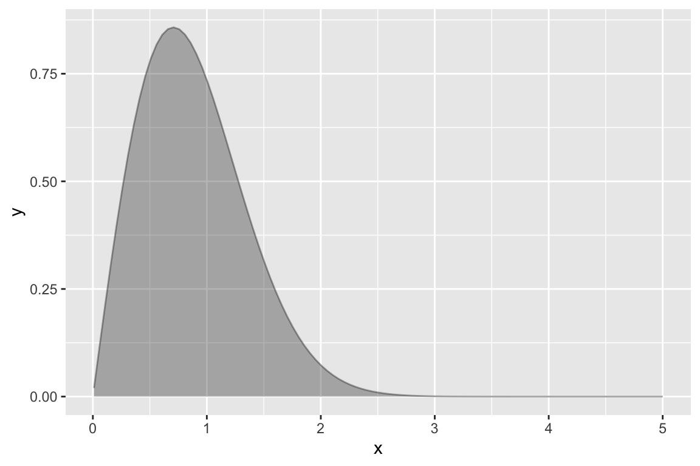

### PDF: `geom_pdf()`

[`geom_pdf()`](/reference/geom_pdf.md) draws a probability density
function as a filled area. It validates that the supplied function
integrates to 1 over `xlim`, warning via
[**cli**](https://cli.r-lib.org/) if it does not. The basic call draws
the full density with no shading.

``` r

ggplot() +
  geom_pdf(fun = dnorm, xlim = c(-3, 3))
```

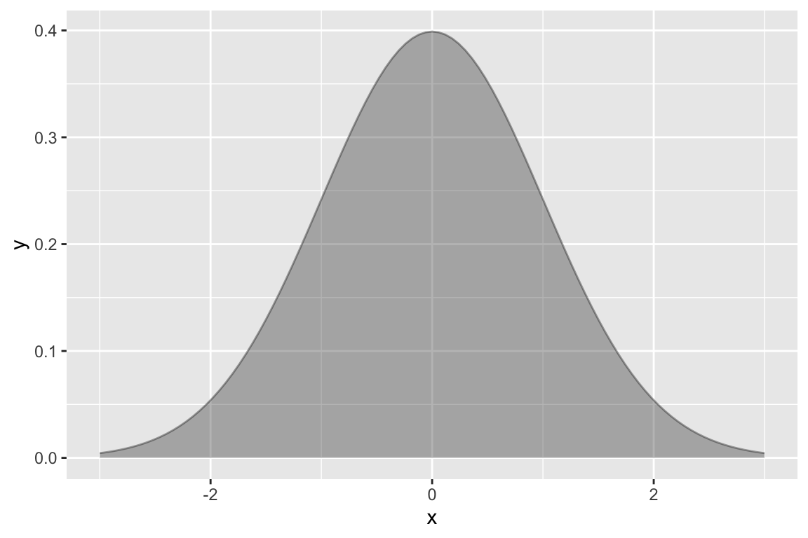

**Single threshold.** The `p` parameter shades from the left boundary up
to the $`p`$-quantile (`lower.tail = TRUE`, the default). Setting
`lower.tail = FALSE` shades the upper tail instead. Here we shade the
lower 97.5%.

``` r

ggplot() +
  geom_pdf(fun = dnorm, xlim = c(-3, 3), p = 0.975)
```

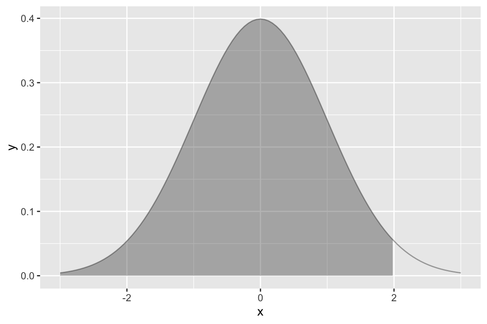

**Two-sided interval.** `p_lower` and `p_upper` together shade the
central region between two quantiles—the natural picture for a
confidence interval. The following example shades the central 95%.

``` r

ggplot() +
  geom_pdf(fun = dnorm, xlim = c(-3, 3), p_lower = 0.025, p_upper = 0.975)
```

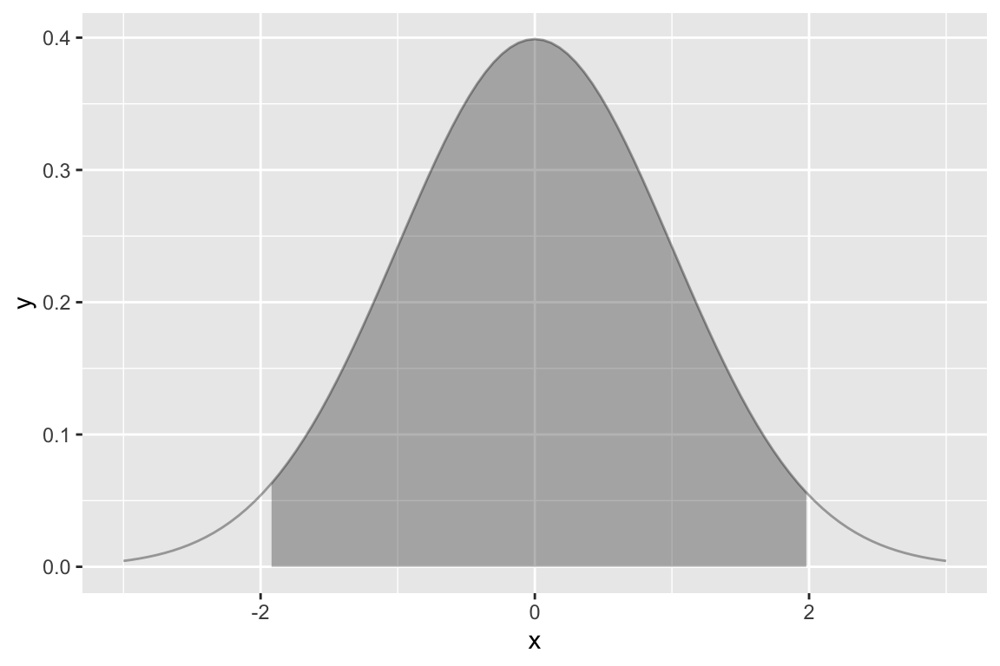

**Tail shading.** Setting `shade_outside = TRUE` inverts the two-sided
region, shading both tails. This is the rejection region of a two-sided
hypothesis test at level $`\alpha = 0.05`$.

``` r

ggplot() +
  geom_pdf(
    fun = dnorm, xlim = c(-3, 3),
    p_lower = 0.025, p_upper = 0.975, shade_outside = TRUE
  )
```

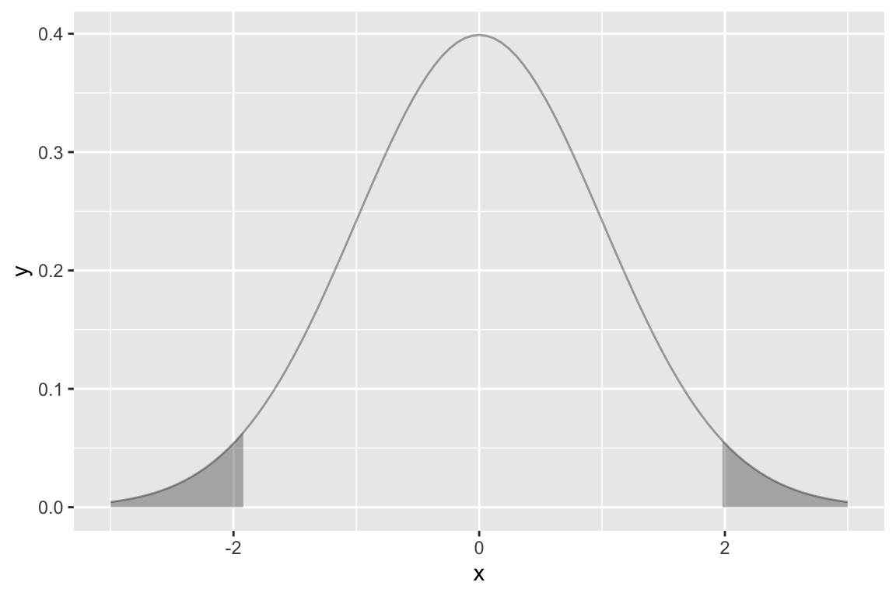

**Highest density region.** `shade_hdr` shades the smallest region of
the domain containing the specified probability mass—the [highest
density
region](https://en.wikipedia.org/wiki/Credible_interval#Highest_density_interval)
(HDR). For multimodal densities this region can be disconnected. The
following example uses an asymmetric mixture of two normals; the 80% HDR
captures both modes as two disjoint intervals, with more area allocated
to the taller, narrower component.

``` r

f_mix <- function(x) 0.6 * dnorm(x, mean = -2, sd = 0.6) + 0.4 * dnorm(x, mean = 2, sd = 1.2)
ggplot() +
  geom_pdf(fun = f_mix, xlim = c(-5, 6), shade_hdr = 0.8)
```

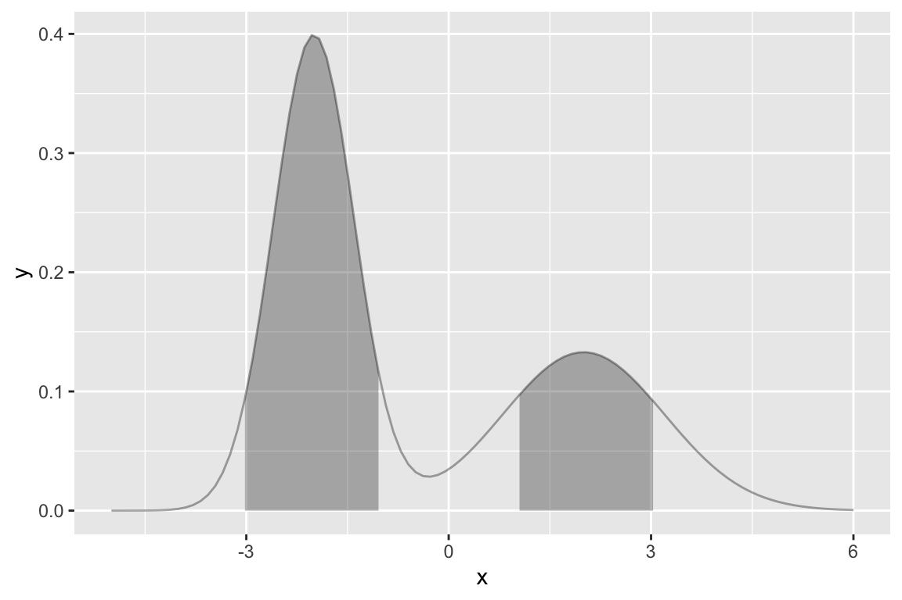

**Composing distributions.** Every **ggfunction** layer is a standard
**ggplot2** layer, so multiple distributions compose freely. Here we
overlay two normal densities with different means and spreads.

``` r

ggplot() +
  geom_pdf(fun = dnorm, xlim = c(-5, 8), alpha = 0.4) +
  geom_pdf(fun = dnorm, xlim = c(-5, 8),
    args = list(mean = 3, sd = 1.5), alpha = 0.4)
```

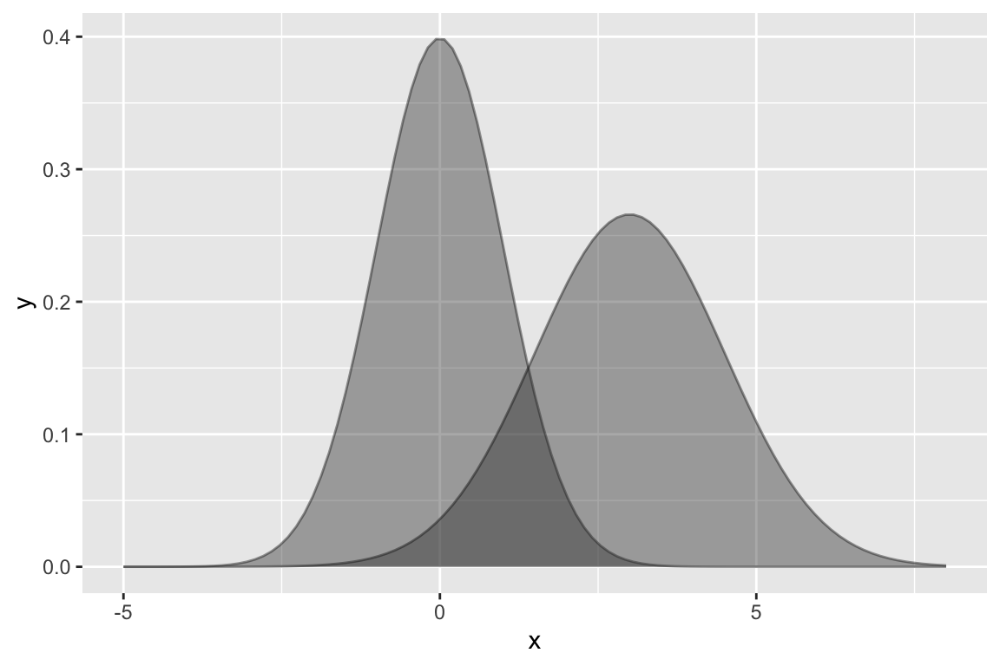

### Bivariate PDF: `geom_pdf_2d()`

[`geom_pdf_2d()`](/reference/geom_pdf_2d.md) visualizes a theoretical
bivariate density through its highest density regions. It is a thin
wrapper around
[**ggdensity**](https://jamesotto852.github.io/ggdensity/): the function
is supplied in **ggfunction**’s `fun(c(x, y))` convention and adapted
internally, while HDR computation, probability labels, and default
aesthetics are delegated to
[`ggdensity::geom_hdr_fun()`](https://jamesotto852.github.io/ggdensity/reference/geom_hdr_fun.html)
(filled regions, the default `type = "hdr"`) or
[`ggdensity::geom_hdr_lines_fun()`](https://jamesotto852.github.io/ggdensity/reference/geom_hdr_fun.html)
(`type = "hdr_lines"`). Parameters pass via `args` as usual.

``` r

dbvn <- function(v, mu = c(0, 0), Sigma = diag(2)) {
  x <- matrix(v - mu, ncol = 1)
  Sinv <- solve(Sigma)
  1 / (2 * pi * sqrt(det(Sigma))) * exp(-0.5 * as.numeric(t(x) %*% Sinv %*% x))
}

ggplot() +
  geom_pdf_2d(fun = dbvn, xlim = c(-3, 3), ylim = c(-3, 3), probs = c(0.5, 0.8, 0.95)) +
  coord_equal()
```

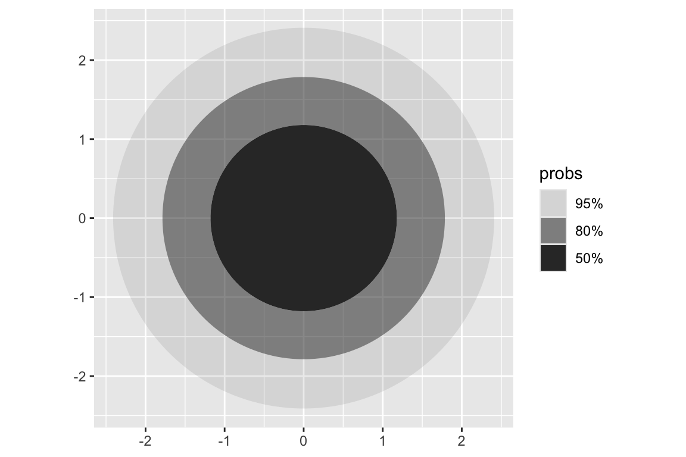

**HDR contour lines.** `type = "hdr_lines"` draws only the region
boundaries. Here a correlated covariance matrix is passed via `args`.

``` r

Sigma <- matrix(c(1, 0.6, 0.6, 1), 2, 2)

ggplot() +
  geom_pdf_2d(
    fun = dbvn, args = list(Sigma = Sigma),
    xlim = c(-3, 3), ylim = c(-3, 3),
    probs = c(0.5, 0.8, 0.95), type = "hdr_lines"
  ) +
  coord_equal()
```

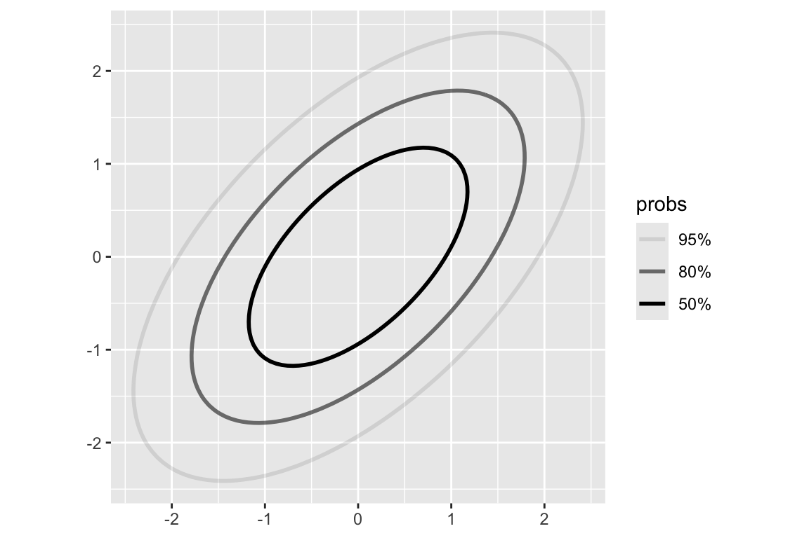

For raw density heatmaps or arbitrary iso-density contours not
calibrated to probability content, use
[`geom_function_2d_1d()`](/reference/geom_function_2d_1d.md) with
`type = "raster"`, `"contour"`, or `"contour_filled"`.

### PMF: `geom_pmf()`

[`geom_pmf()`](/reference/geom_pmf.md) evaluates a probability mass
function at each integer in `xlim` and renders the result as a lollipop
chart—vertical segments capped with points. Distribution parameters are
supplied via `args`. The following example plots a
$`\text{Binomial}(10, 0.3)`$ distribution.

``` r

ggplot() +
  geom_pmf(fun = dbinom, xlim = c(0, 10), args = list(size = 10, prob = 0.3))
```


**Single threshold.** The `p` parameter shades lollipops up to the
$`p`$-quantile (the unshaded region is rendered at reduced opacity).
Here we shade the lower 80% of a $`\text{Binomial}(10, 0.5)`$
distribution.

``` r

ggplot() +
  geom_pmf(fun = dbinom, xlim = c(0, 10), args = list(size = 10, prob = 0.5), p = 0.8)
```

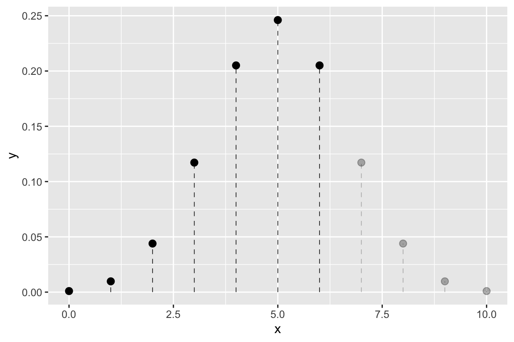

**Highest density regions.** `shade_hdr` accepts one or more coverage
levels and shades the smallest sets of support points whose total
probability mass meets or exceeds each target. Each support point’s
smallest containing HDR is mapped to `alpha` as an ordered factor with a
legend—the same convention as
[`geom_pmf_2d()`](/reference/geom_pmf_2d.md). For a symmetric unimodal
PMF these are central intervals; for a skewed distribution they are
asymmetric. Here the 50/80/95% HDRs of a $`\text{Binomial}(10, 0.3)`$
distribution are highlighted.

``` r

ggplot() +
  geom_pmf(fun = dbinom, xlim = c(0, 10), args = list(size = 10, prob = 0.3),
    shade_hdr = c(0.5, 0.8, 0.95))
```

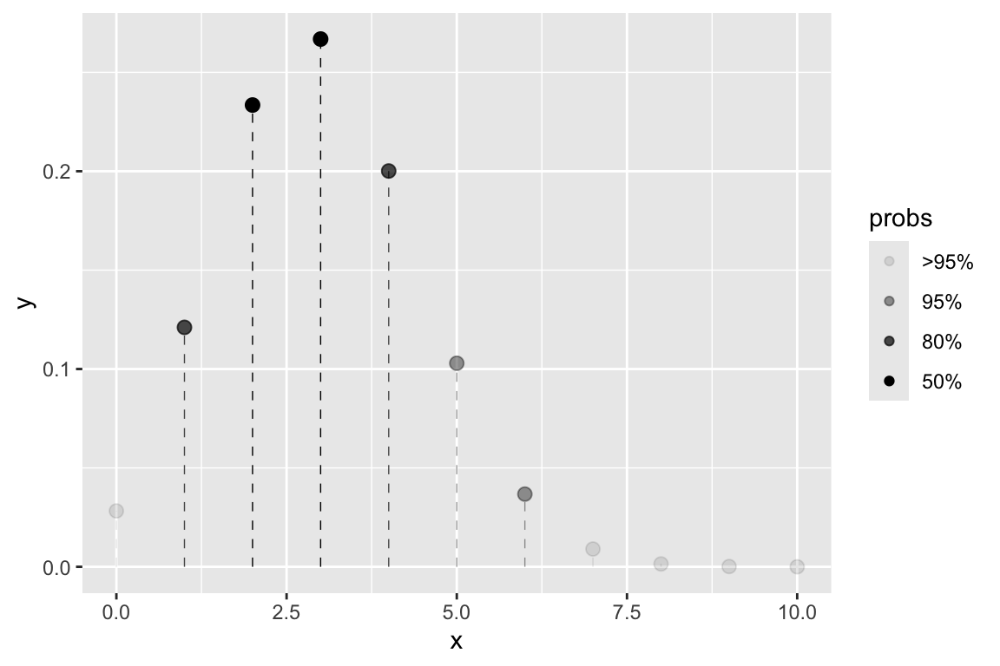

**Explicit support.** When the support is not a sequence of consecutive
integers, pass the exact support points via `support`. Here we plot the
distribution of the sample mean $`\bar X`$ of 10 iid
$`\text{Bernoulli}(0.3)`$ draws. The support is
$`\{0, 0.1, 0.2, \ldots, 1\}`$ and the PMF is binomial:
$`P(\bar X = k/10) = \binom{10}{k}0.3^k 0.7^{10-k}`$.

``` r

f_mean <- function(x, prob) dbinom(round(x * 10), size = 10, prob = prob)
ggplot() +
  geom_pmf(fun = f_mean, support = seq(0, 1, by = 0.1), args = list(prob = 0.3))
```

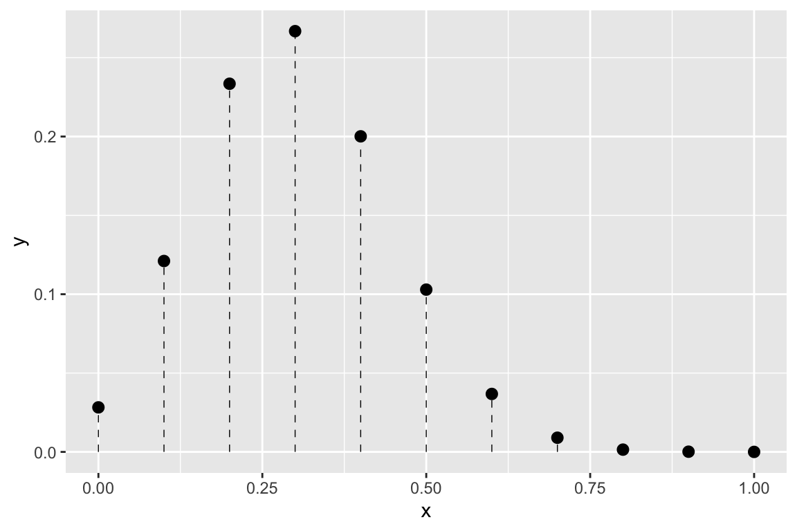

### Bivariate PMF: `geom_pmf_2d()`

[`geom_pmf_2d()`](/reference/geom_pmf_2d.md) evaluates a bivariate mass
function on a discrete lattice—integers spanning `xlim` $`\times`$`ylim`
by default, or exact values via `support_x`/`support_y`. The function
uses the same `fun(c(x, y))` convention as the other bivariate layers,
with parameters passed via `args`. The default `type = "point"` renders
a balloon plot with size encoding the probability mass;
[`scale_size_area()`](https://ggplot2.tidyverse.org/reference/scale_size.html)
makes area proportional to mass and zero mass vanish.

``` r

dbinom2 <- function(v, sizes = c(10, 10), probs = c(0.5, 0.5)) {
  dbinom(v[1], sizes[1], probs[1]) * dbinom(v[2], sizes[2], probs[2])
}

ggplot() +
  geom_pmf_2d(fun = dbinom2, xlim = c(0, 10), ylim = c(0, 10), args = list(probs = c(0.3, 0.7))) +
  scale_size_area()
```

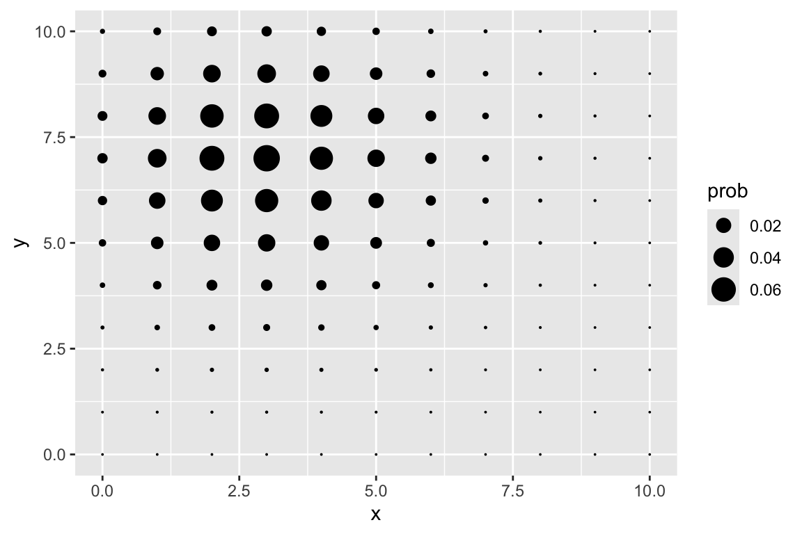

**Tile heatmap.** `type = "tile"` encodes mass by fill instead.

``` r

ggplot() +
  geom_pmf_2d(fun = dbinom2, xlim = c(0, 10), ylim = c(0, 10), args = list(probs = c(0.3, 0.7)),
    type = "tile")
```

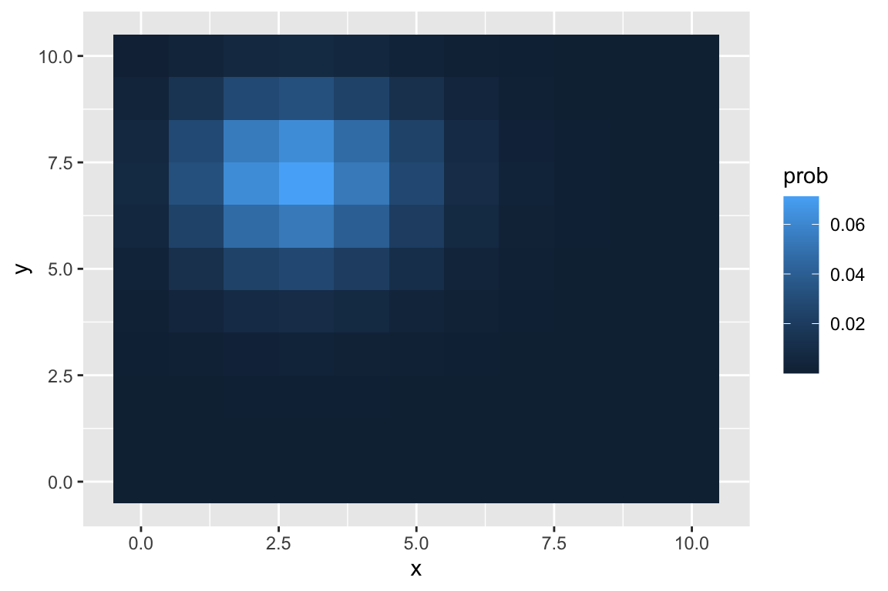

**Highest density regions.** `shade_hdr` accepts one or more coverage
levels. Each lattice point is assigned the smallest HDR that contains
it, and the assignment is mapped to `alpha` as an ordered factor—the
same legend convention as
[`geom_pdf_2d()`](/reference/geom_pdf_2d.md)—so points outside all
requested regions are nearly transparent. Exact coverages may not be
achievable for a discrete distribution, in which case the smallest HDRs
with at least the target coverages are used and a message reports the
actual coverages.

``` r

ggplot() +
  geom_pmf_2d(fun = dbinom2, xlim = c(0, 10), ylim = c(0, 10), shade_hdr = c(0.5, 0.8, 0.95)) +
  scale_size_area()
```

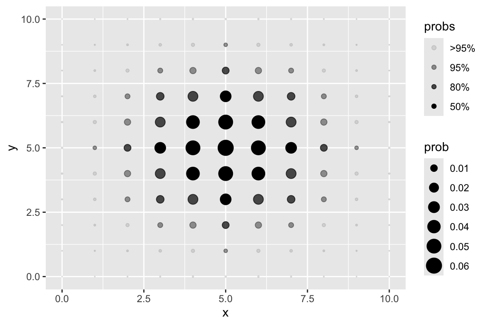

**Non-product support.** Distributions like the trinomial live on a
simplex rather than a full product lattice. Evaluate over a bounding
lattice, returning 0 off the support; zero-mass cells are dropped by
default (`drop_zeros = TRUE`).

``` r

dtrinom <- function(v, size = 8, prob = c(0.3, 0.3, 0.4)) {
  if (sum(v) > size) return(0)
  dmultinom(c(v, size - sum(v)), prob = prob)
}

ggplot() +
  geom_pmf_2d(fun = dtrinom, xlim = c(0, 8), ylim = c(0, 8)) +
  scale_size_area() +
  coord_equal()
```

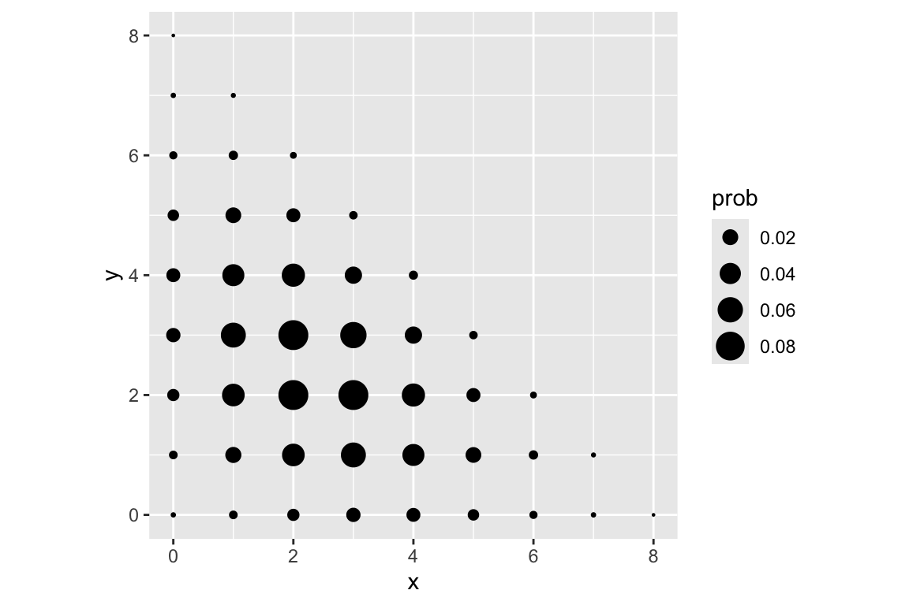

### CDF: `geom_cdf()` and `geom_cdf_discrete()`

The cumulative distribution function $`F(x) = P(X \le x)`$ is available
for both continuous and discrete distributions.

**Continuous ([`geom_cdf()`](/reference/geom_cdf.md)).** Draws the CDF
as a line. Here we plot the standard normal CDF.

``` r

ggplot() +
  geom_cdf(fun = pnorm, xlim = c(-3, 3))
```

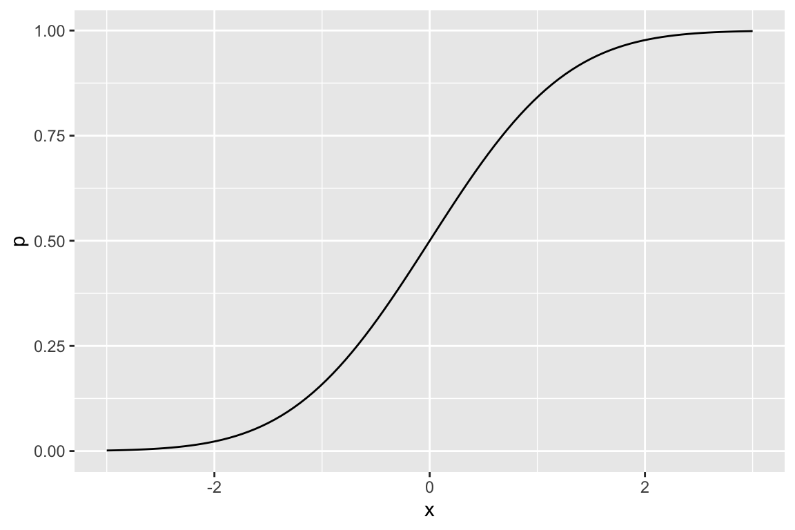

**Shading.** Like [`geom_pdf()`](/reference/geom_pdf.md),
[`geom_cdf()`](/reference/geom_cdf.md) accepts `p` for a single
threshold, `p_lower`/`p_upper` for a two-sided interval, and
`lower.tail` for tail direction. Here we shade up to the 90th
percentile.

``` r

ggplot() +
  geom_cdf(fun = pnorm, xlim = c(-3, 3), p = 0.9)
```

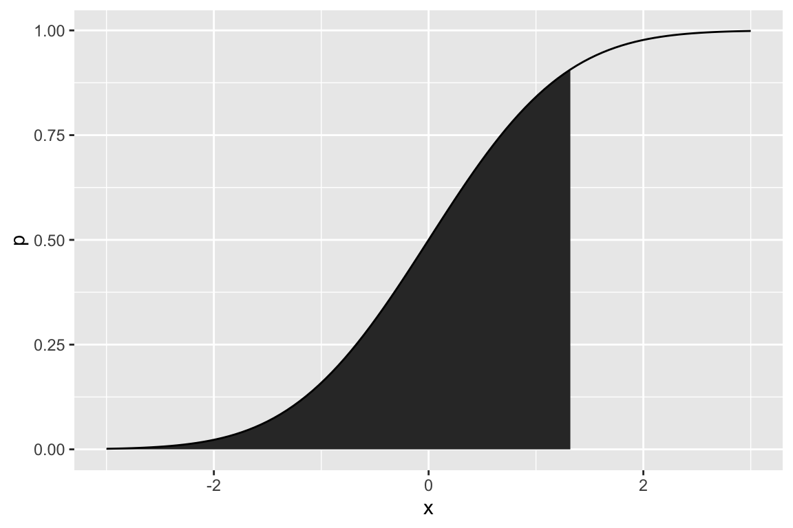

**Discrete ([`geom_cdf_discrete()`](/reference/geom_cdf_discrete.md)).**
Takes a PMF, accumulates it into the right-continuous step-function CDF,
and renders it with horizontal segments, dashed vertical jumps, open
circles at the lower limit of each jump, and closed circles at the
achieved value. For PMF-derived CDFs, `support` is the full
computational support and `xlim` only filters the displayed range. The
following example plots the $`\text{Poisson}(5)`$ CDF.

``` r

ggplot() +
  geom_cdf_discrete(pmf_fun = dpois, xlim = c(0, 15), args = list(lambda = 5))
```

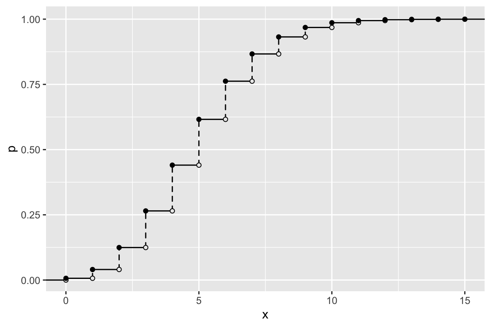

**Hiding points and lines.** `show_points = FALSE` and
`show_vert = FALSE` remove the endpoint circles and vertical jump
segments, leaving only the horizontal staircase. By default, points and
vertical jump segments are shown only when there are 50 or fewer support
points; for larger supports they are hidden automatically.

``` r

ggplot() +
  geom_cdf_discrete(pmf_fun = dbinom, xlim = c(0, 10), args = list(size = 10, prob = 0.5),
    show_points = FALSE, show_vert = FALSE)
```

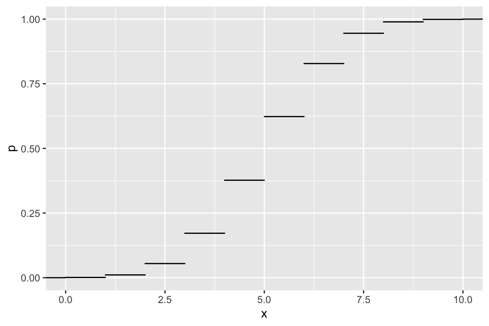

**Explicit support.** Pass the full set of non-integer support points
directly via `support`. Here we plot the CDF of the sample mean of 10
iid $`\text{Bernoulli}(0.3)`$ draws.

``` r

f_mean <- function(x, prob) dbinom(round(x * 10), size = 10, prob = prob)
ggplot() +
  geom_cdf_discrete(pmf_fun = f_mean, support = seq(0, 1, by = 0.1), args = list(prob = 0.3))
```

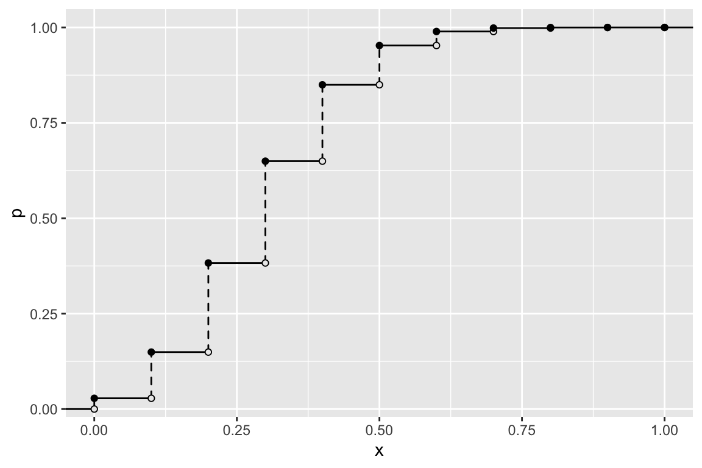

### Survival function: `geom_survival()` and `geom_survival_discrete()`

The survival function $`S(x) = 1 - F(x) = P(X > x)`$ gives the
probability of surviving past $`x`$.

**Continuous ([`geom_survival()`](/reference/geom_survival.md)).**
Accepts a survival function directly via `fun`, or derives $`S`$ from a
CDF via `cdf_fun`, a PDF via `pdf_fun`, or a quantile function via
`qf_fun`. The following example shows the survival function of an
$`\text{Exponential}(0.5)`$ distribution, which decays as
$`S(x) = e^{-0.5x}`$.

``` r

ggplot() +
  geom_survival(cdf_fun = pexp, xlim = c(0, 10), args = list(rate = 0.5))
```

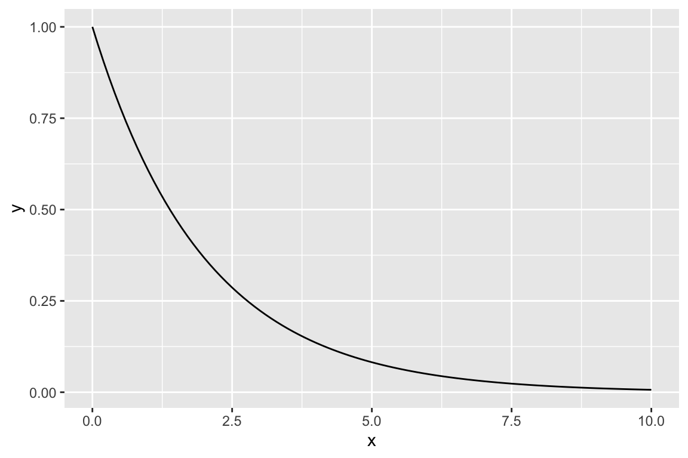

**Discrete
([`geom_survival_discrete()`](/reference/geom_survival_discrete.md)).**
Takes a PMF and renders $`S(x) = 1 - F(x)`$ as a right-continuous step
function using the same visual conventions as
[`geom_cdf_discrete()`](/reference/geom_cdf_discrete.md). As with the
discrete CDF, PMF-derived survival curves require the full computational
support. The following example plots the $`\text{Binomial}(10, 0.5)`$
survival function.

``` r

ggplot() +
  geom_survival_discrete(pmf_fun = dbinom, xlim = c(0, 10), args = list(size = 10, prob = 0.5))
```

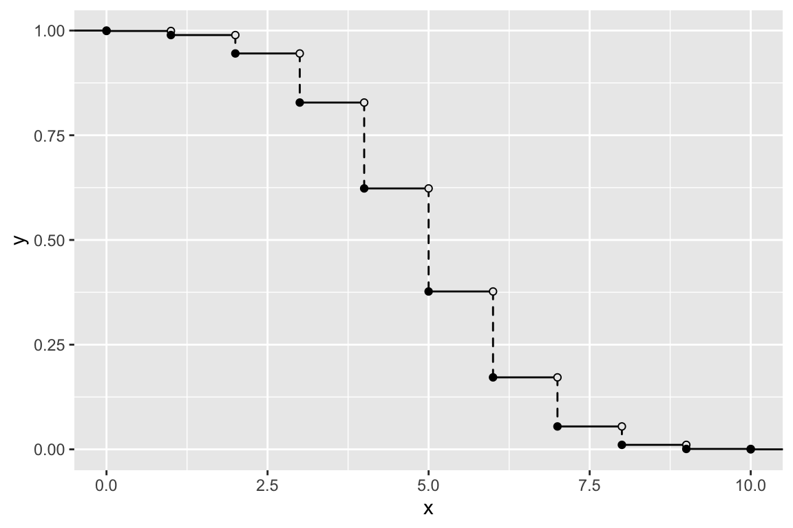

**Hiding points.** Setting `show_points = FALSE` removes the endpoint
circles.

``` r

ggplot() +
  geom_survival_discrete(pmf_fun = dbinom, xlim = c(0, 10), args = list(size = 10, prob = 0.5),
    show_points = FALSE)
```

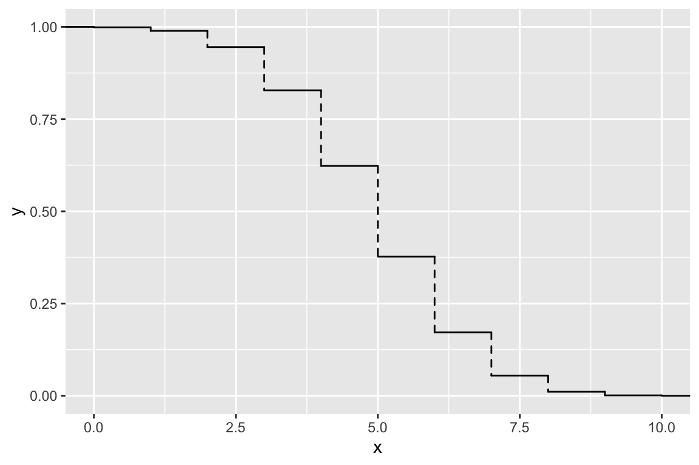

**Explicit support.** The survival function of the sample mean of 10 iid
$`\text{Bernoulli}(0.3)`$ draws.

``` r

f_mean <- function(x, prob) dbinom(round(x * 10), size = 10, prob = prob)
ggplot() +
  geom_survival_discrete(pmf_fun = f_mean, support = seq(0, 1, by = 0.1), args = list(prob = 0.3))
```

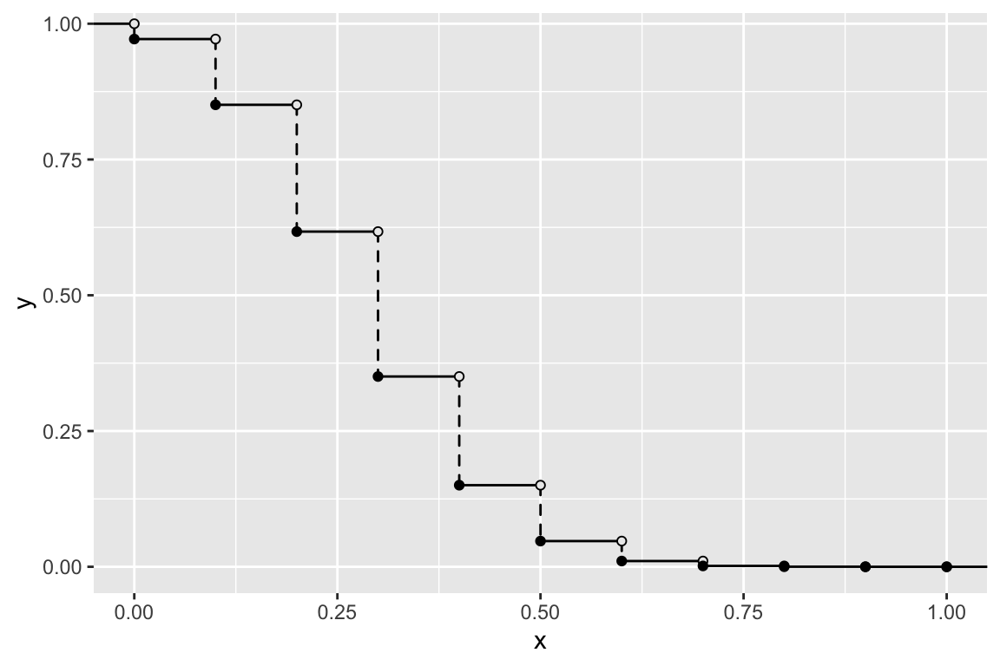

### Quantile function: `geom_qf()` and `geom_qf_discrete()`

The quantile function $`Q(p) = \inf\{x : F(x) \ge p\}`$ inverts the CDF.

**Continuous ([`geom_qf()`](/reference/geom_qf.md)).** Evaluates a
quantile function over the unit interval $`(0, 1)`$ and draws it as a
curve. The following example plots the standard normal quantile
function.

``` r

ggplot() +
  geom_qf(fun = qnorm)
```

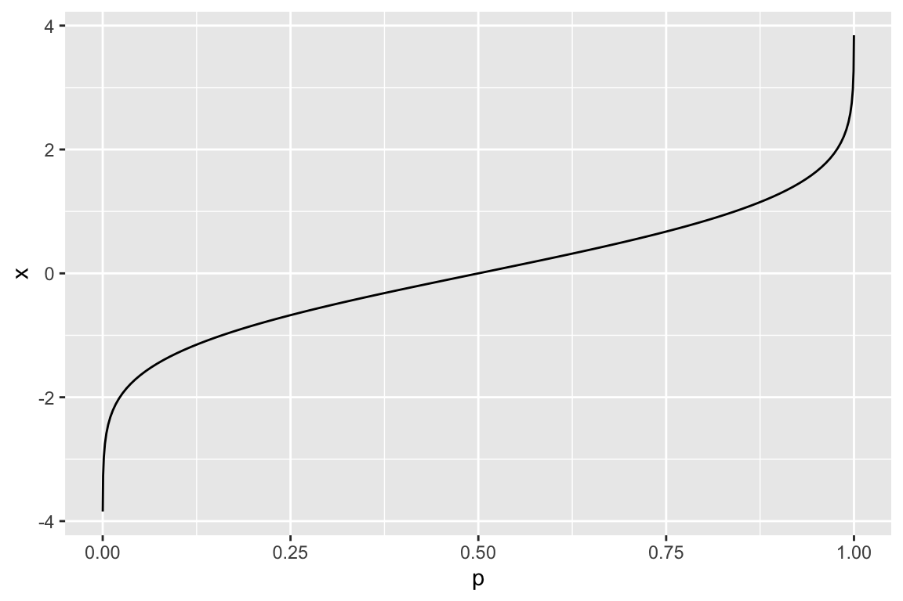

**Discrete ([`geom_qf_discrete()`](/reference/geom_qf_discrete.md)).**
Takes a PMF and renders the quantile function as a left-continuous step
function on the unit interval, with closed circles at the bottom of each
jump (the value is achieved) and open circles at the top (the next value
is not yet reached). PMF-derived quantile functions are inverted after
the CDF is computed on the full support. The following example plots the
$`\text{Binomial}(10, 0.5)`$ quantile function.

``` r

ggplot() +
  geom_qf_discrete(pmf_fun = dbinom, xlim = c(0, 10), args = list(size = 10, prob = 0.5))
```

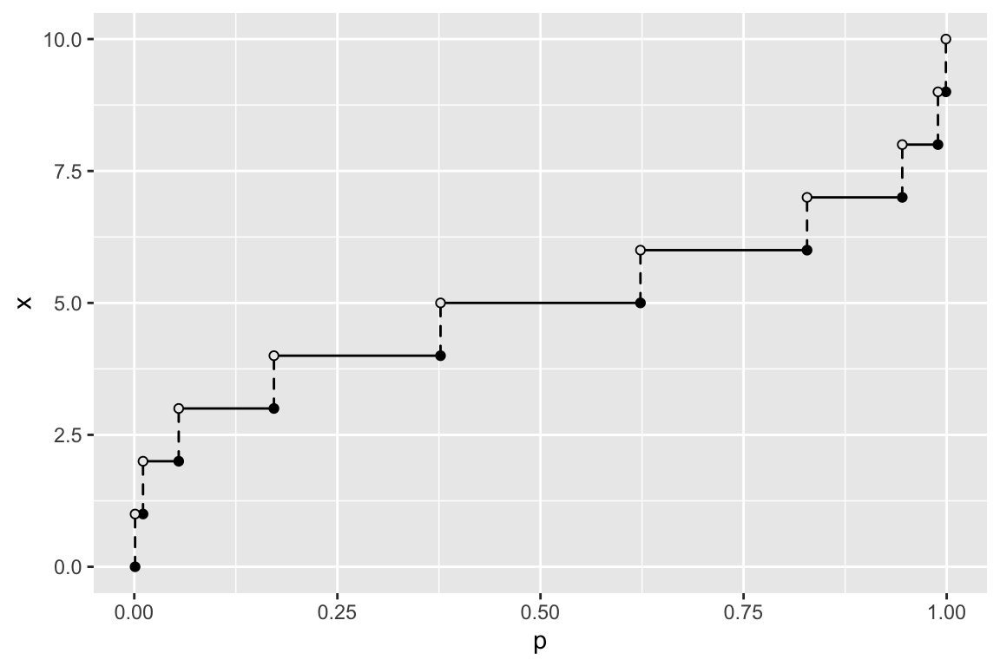

**Parameterized families.** Here we plot a $`\text{Poisson}(5)`$
discrete quantile function.

``` r

ggplot() +
  geom_qf_discrete(pmf_fun = dpois, xlim = c(0, 15), args = list(lambda = 5))
```

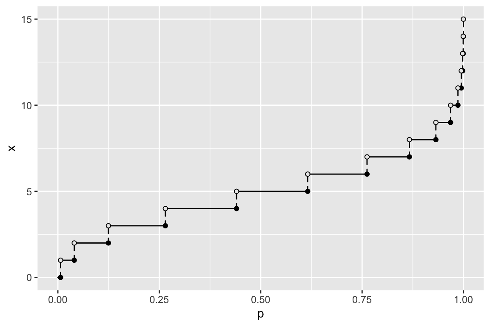

**Hiding points.** Setting `show_points = FALSE` removes the endpoint
circles, leaving only the horizontal and vertical lines.

``` r

ggplot() +
  geom_qf_discrete(pmf_fun = dbinom, xlim = c(0, 10), args = list(size = 10, prob = 0.5),
    show_points = FALSE)
```


**Hiding vertical lines.** Setting `show_vert = FALSE` removes the
dashed vertical jump segments, leaving only the horizontal steps and
endpoint circles.

``` r

ggplot() +
  geom_qf_discrete(pmf_fun = dbinom, xlim = c(0, 10), args = list(size = 10, prob = 0.5),
    show_vert = FALSE)
```

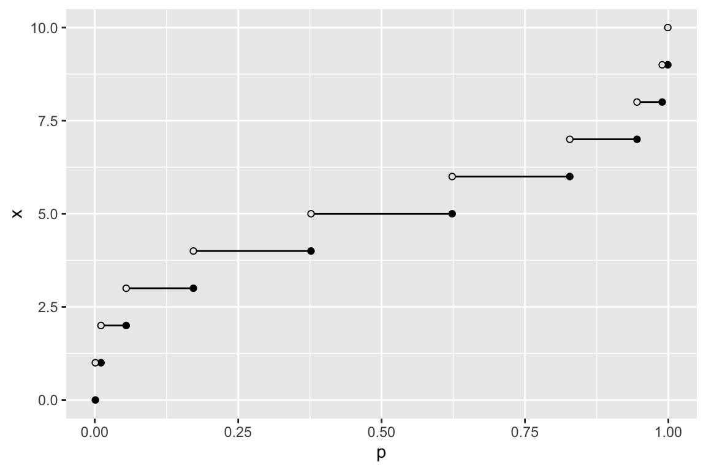

**Explicit support.** The quantile function of the sample mean of 10 iid
$`\text{Bernoulli}(0.3)`$ draws.

``` r

f_mean <- function(x, prob) dbinom(round(x * 10), size = 10, prob = prob)
ggplot() +
  geom_qf_discrete(pmf_fun = f_mean, support = seq(0, 1, by = 0.1), args = list(prob = 0.3))
```

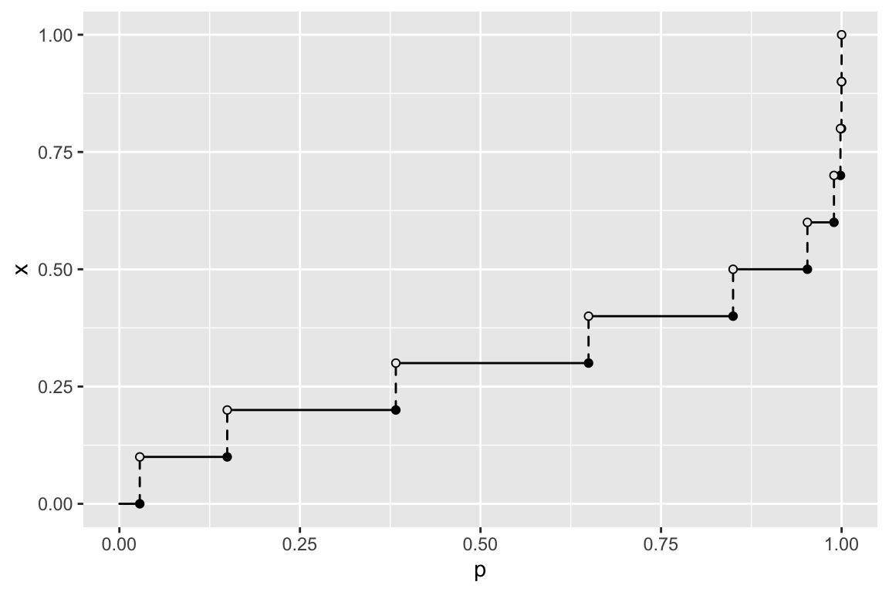

### Hazard function: `geom_hf()`

[`geom_hf()`](/reference/geom_hf.md) plots the hazard function
$`h(x) = f(x) / S(x)`$, the instantaneous rate of failure at time $`x`$
conditional on survival to that point. It accepts a hazard function
directly via `fun`, or derives $`h`$ from `pdf_fun` and/or `cdf_fun`
(when only one is provided, the other is derived numerically). Shared
parameters go in `args`; use `pdf_args` and `cdf_args` for overrides
when the two functions have different parameterizations. The exponential
distribution’s constant hazard confirms the memoryless property.

``` r

ggplot() +
  geom_hf(pdf_fun = dexp, cdf_fun = pexp, xlim = c(0.01, 10), args = list(rate = 0.5))
```

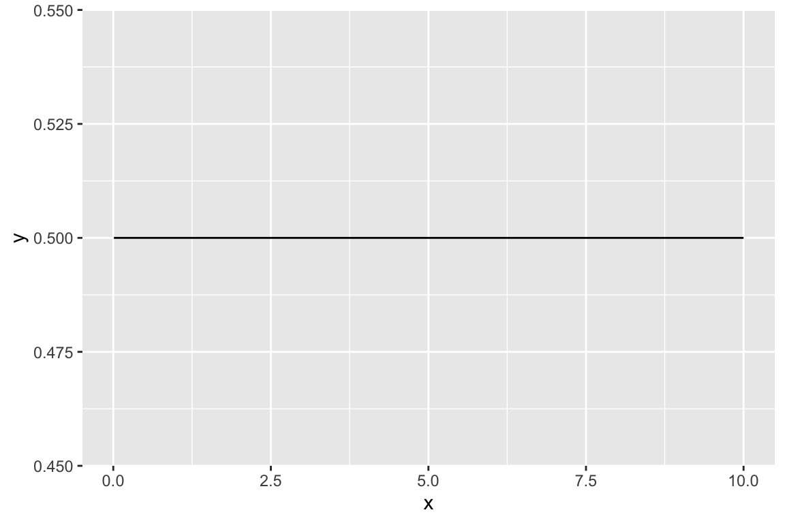

**Canonical hazard shapes.** Three canonical shapes arise in reliability
modeling: decreasing (infant mortality), constant (memoryless), and
increasing (wear-out). The Weibull distribution with `shape < 1` gives a
decreasing hazard; the normal distribution’s hazard is eventually
increasing.

``` r

library(patchwork)

p_decr <- ggplot() +
  geom_hf(pdf_fun = dweibull, cdf_fun = pweibull,
    xlim = c(0.01, 5), args = list(shape = 0.5, scale = 2)) +
  ggtitle("Decreasing (Weibull)")

p_incr <- ggplot() +
  geom_hf(pdf_fun = dnorm, cdf_fun = pnorm,
    xlim = c(-3, 3)) +
  ggtitle("Increasing (Normal)")

p_decr | p_incr
```

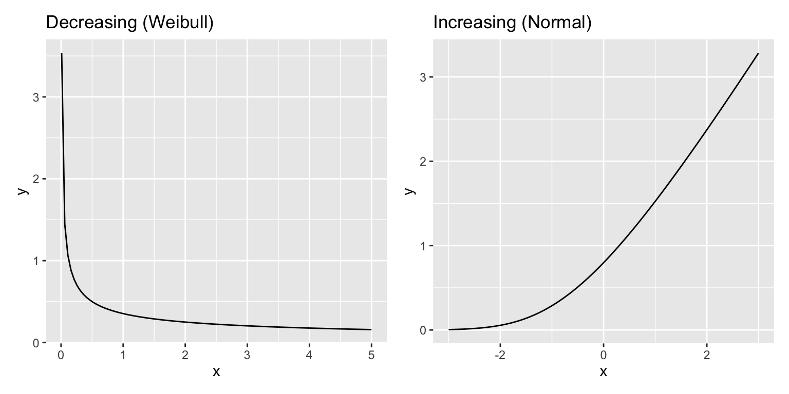

### Cumulative hazard function: `geom_chf()`

[`geom_chf()`](/reference/geom_chf.md) plots the cumulative hazard
function $`H(x) = -\log S(x)`$, which accumulates the instantaneous
hazard over time. It accepts a cumulative hazard function directly via
`fun`, or derives $`H`$ from any other characterization: `hf_fun`
(integrated numerically), `cdf_fun` ($`H = -\log(1 - F)`$),
`survival_fun` ($`H = -\log S`$), `pdf_fun` (integrated to CDF then
transformed), or `qf_fun` (interpolated to CDF then transformed). The
exponential distribution’s cumulative hazard is linear, confirming its
constant hazard rate.

``` r

ggplot() +
  geom_chf(cdf_fun = pexp, xlim = c(0, 10), args = list(rate = 0.5))
```

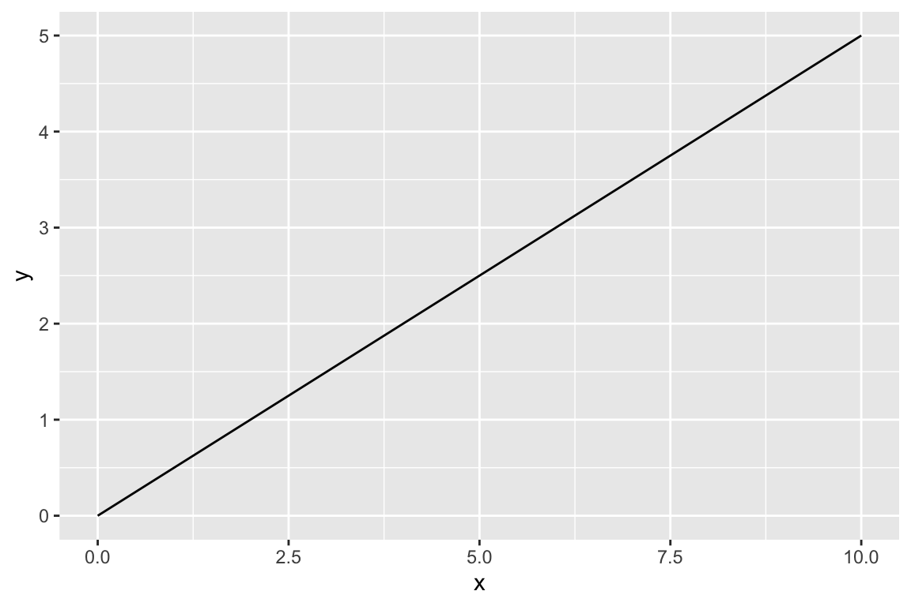

## Data Functions

The data family works with an observed numeric sample rather than a
function object. Supply a vector of data via `aes(x = ...)` and the geom
handles the rest. All four geoms use the same visual language as their
theoretical counterparts in the Probability section.

``` r

set.seed(1)
df_single <- data.frame(x = rnorm(80))
df_two <- data.frame(
  x     = c(rnorm(60), rnorm(60, mean = 2)),
  group = rep(c("A", "B"), each = 60)
)
```

### Empirical CDF: `geom_ecdf()`

[`geom_ecdf()`](/reference/geom_ecdf.md) plots the empirical cumulative
distribution function of a sample as a right-continuous step function,
using the same visual conventions as
[`geom_cdf_discrete()`](/reference/geom_cdf_discrete.md). A 95%
simultaneous DKW/Massart confidence ribbon is drawn by default; set
`conf_int = FALSE` to suppress it.

``` r

ggplot(df_single, aes(x = x)) +
  geom_ecdf()
```

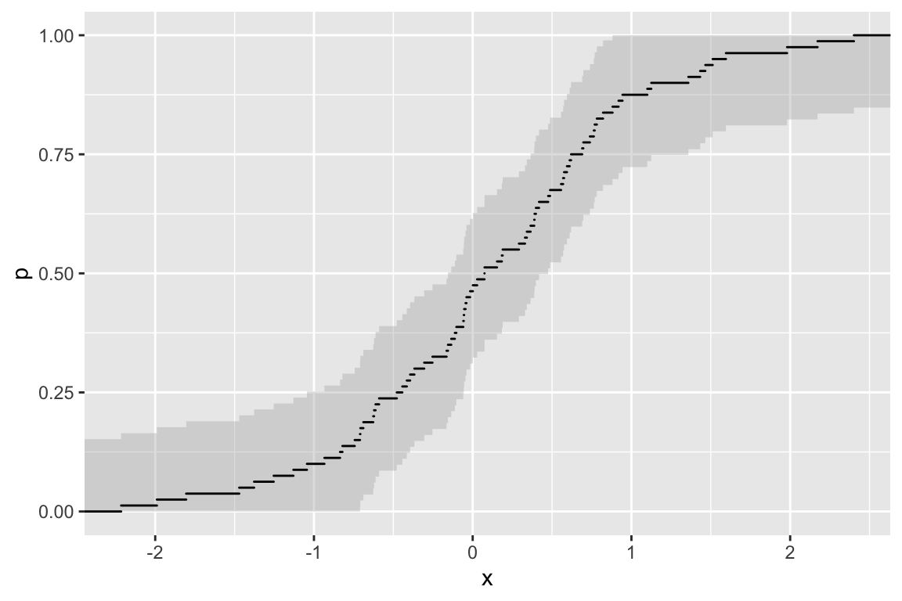

**Multiple groups.** Map `color` to a grouping variable to overlay ECDFs
for several groups. Each group gets its own confidence ribbon, computed
from that group’s sample size.

``` r

ggplot(df_two, aes(x = x, color = group)) +
  geom_ecdf()
```

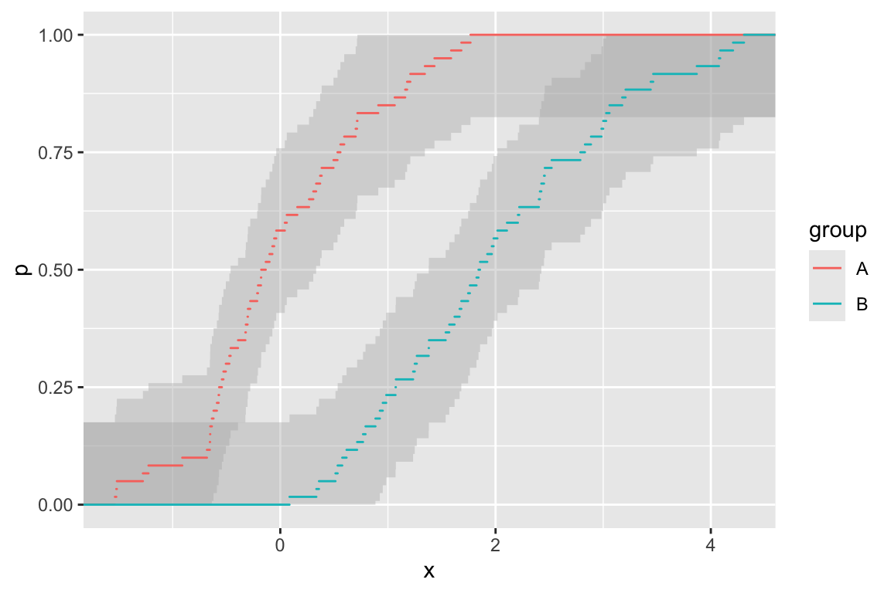

**Controlling the band.** Use `level` to change the confidence level and
`conf_alpha` to adjust ribbon transparency.

``` r

ggplot(df_single, aes(x = x)) +
  geom_ecdf(level = 0.99, conf_alpha = 0.15)
```

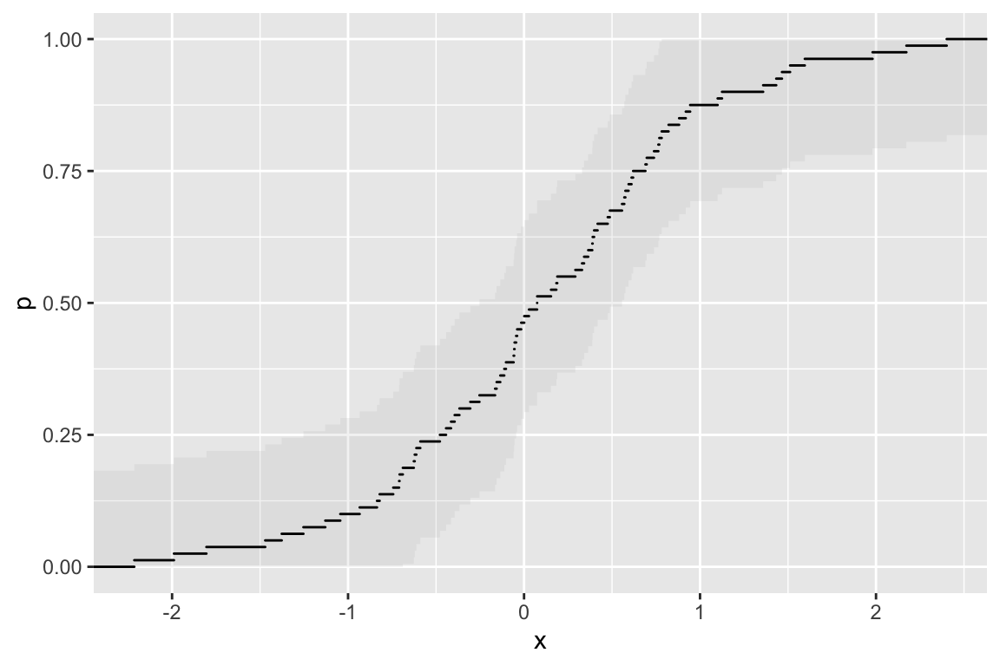

### Empirical quantile function: `geom_eqf()`

[`geom_eqf()`](/reference/geom_eqf.md) plots the empirical quantile
function $`Q_n(p) = \inf\{x : \hat{F}_n(x) \ge p\}`$ as a
left-continuous step function on $`[0, 1]`$, using the same visual
conventions as [`geom_qf_discrete()`](/reference/geom_qf_discrete.md).
The confidence ribbon inverts the DKW/Massart ECDF band: at probability
$`p`$ the band spans $`[Q_n(p - \varepsilon), Q_n(p + \varepsilon)]`$.

``` r

ggplot(df_single, aes(x = x)) +
  geom_eqf()
```

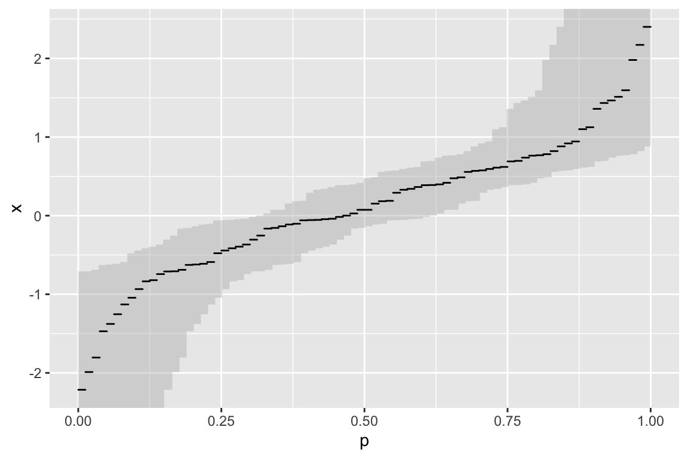

**Multiple groups.**

``` r

ggplot(df_two, aes(x = x, color = group)) +
  geom_eqf()
```

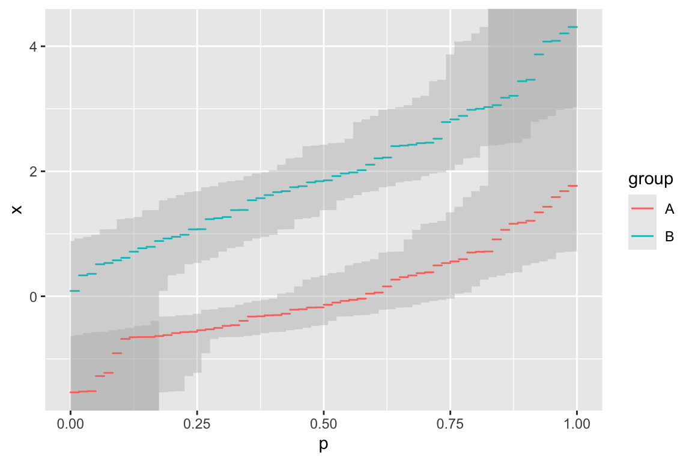

### PP and QQ diagnostic plots: `geom_ppplot()` and `geom_qqplot()`

[`geom_ppplot()`](/reference/geom_ppplot.md) and
[`geom_qqplot()`](/reference/geom_ppplot.md) compare sample order
statistics to a fully specified null distribution. Both draw 95%
DKW/Massart confidence bands by default, add a dashed identity line, and
map point color to the sample value (PP) or plotting position (QQ). They
use ggplot2’s default continuous color scale unless you add your own.

``` r

ggplot(df_single, aes(x = x)) +
  geom_ppplot(fun = pnorm)
```

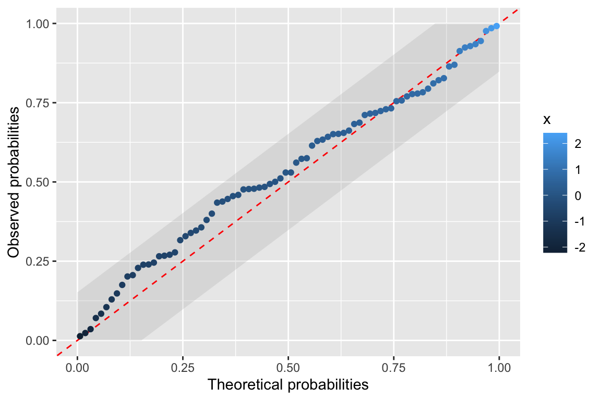

``` r

ggplot(df_single, aes(x = x)) +
  geom_qqplot(fun = qnorm)
```

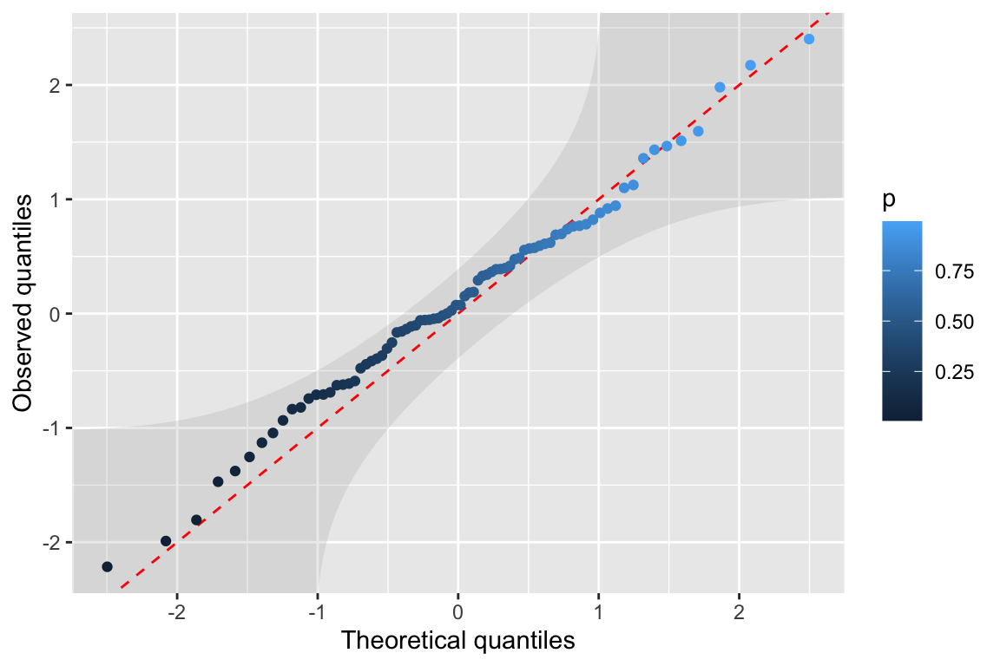

**Black points.** Set a fixed color when you want an uncolored
diagnostic plot.

``` r

ggplot(df_single, aes(x = x)) +
  geom_qqplot(fun = qnorm, color = "black")
```

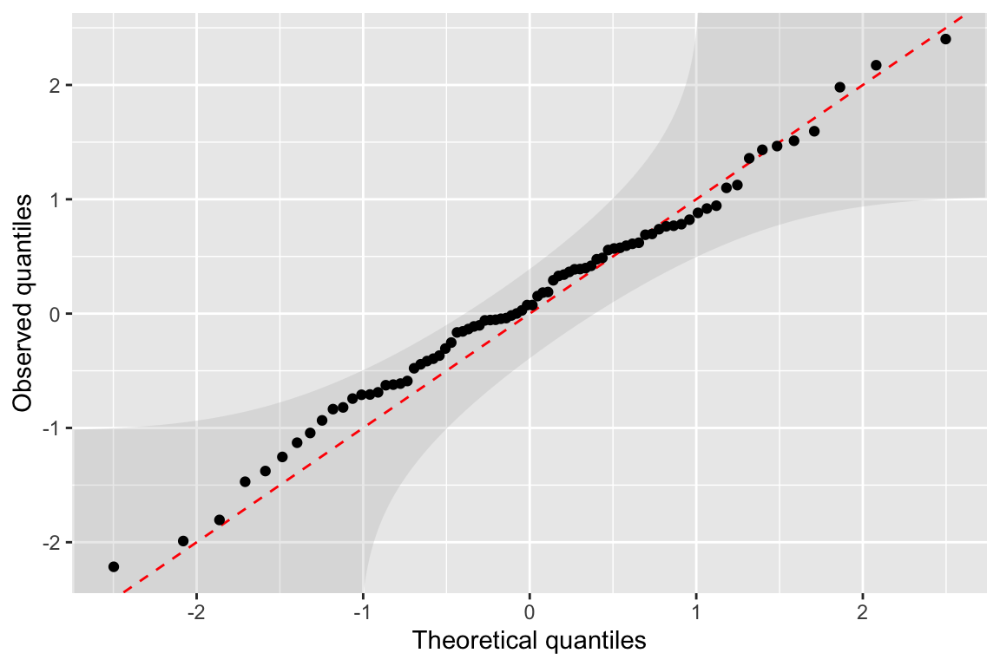

**Spectral scale.** A rainbow palette can help viewers with typical
color vision distinguish variation in the computed variable (`x` in PP
plots or `p` in QQ plots) across the points.

``` r

pp <- ggplot(df_single, aes(x = x)) +
  geom_ppplot(fun = pnorm, shape = 21, color = "black", aes(fill = after_stat(sample))) +
  scale_fill_gradientn(colors = rainbow(10))
  
qq <- ggplot(df_single, aes(x = x)) +
  geom_qqplot(fun = qnorm, shape = 21, color = "black", aes(fill = after_stat(p))) +
  scale_fill_gradientn(colors = rainbow(10), limits = c(0, 1))

pp + qq
```

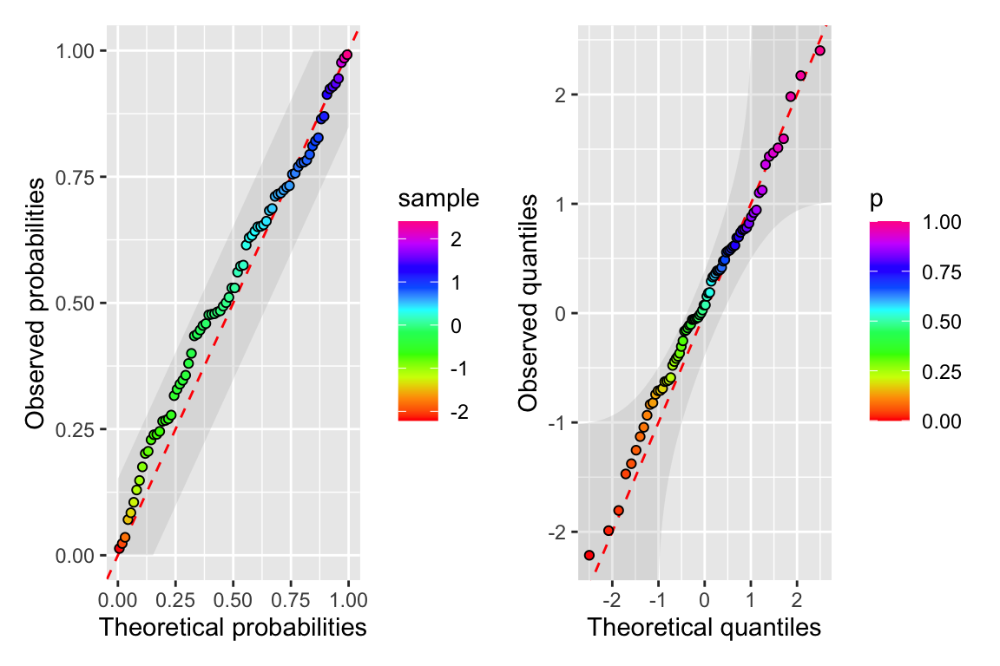

### Stabilized probability plot: `geom_spplot()`

[`geom_spplot()`](/reference/geom_ppplot.md) draws Michael’s (1983)
stabilized probability (SP) plot: a PP plot with both coordinates passed
through the arcsine-square-root variance-stabilizing transform
$`g(p) = \tfrac{2}{\pi} \arcsin \sqrt{p}`$. Under the null the
transformed points have approximately equal variance across the whole
unit interval, so departures in the tails are as visible as departures
in the middle. The interface matches
[`geom_ppplot()`](/reference/geom_ppplot.md): supply a CDF via `fun`
(parameters via `args`); the 95% DKW/Massart band is carried to the
stabilized scale.

``` r

ggplot(df_single, aes(x = x)) +
  geom_spplot(fun = pnorm)
```

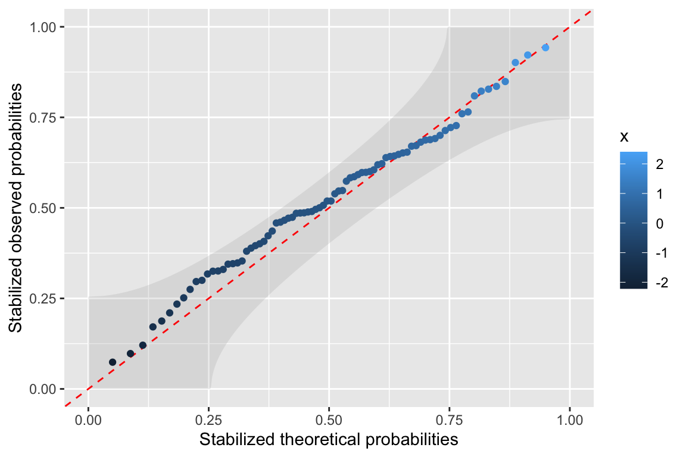

### Empirical PMF: `geom_epmf()`

[`geom_epmf()`](/reference/geom_epmf.md) tabulates the empirical
probability mass function—placing mass $`c_k / n`$ at each distinct
observed value $`x_k`$—and renders it as a lollipop chart using the same
visual conventions as [`geom_pmf()`](/reference/geom_pmf.md).

``` r

ggplot(df_single, aes(x = x)) +
  geom_epmf()
```

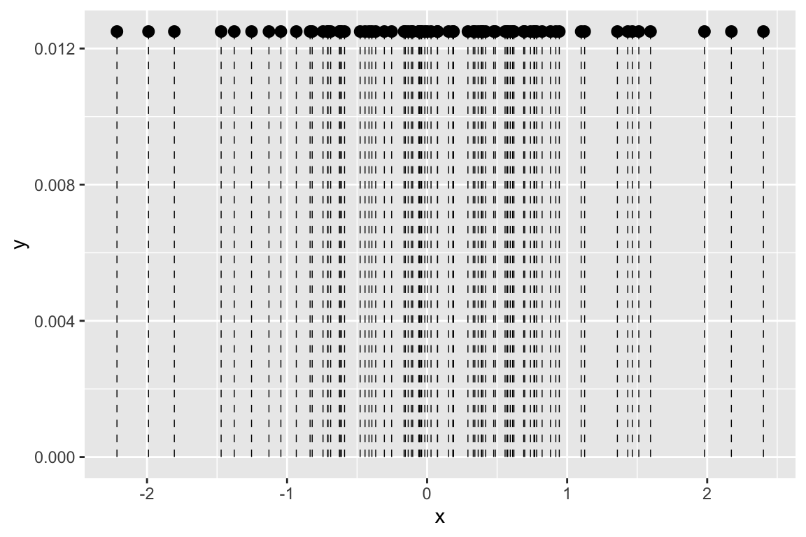

**Multiple groups.**

``` r

ggplot(df_two, aes(x = x, color = group)) +
  geom_epmf()
```

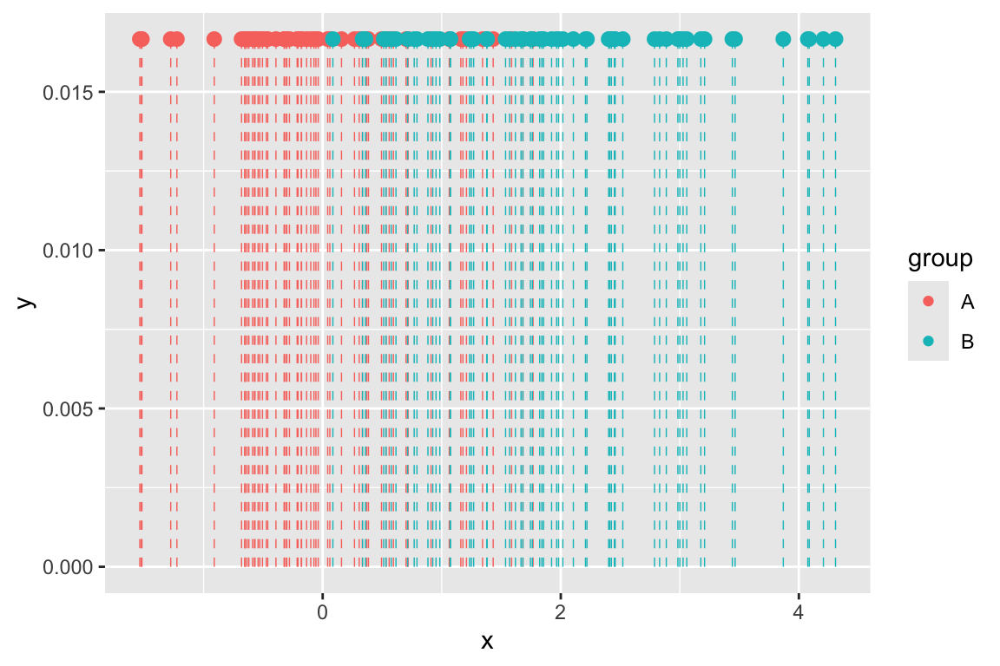

### Empirical cumulative hazard: `geom_echf()`

[`geom_echf()`](/reference/geom_echf.md) computes the empirical
cumulative hazard function $`\hat{H}_n(x) = -\log(1 - \hat{F}_n(x))`$
and renders it as a right-continuous step function. A 95% simultaneous
confidence band is drawn by default, derived by transforming the DKW
bounds on the CDF to the cumulative hazard scale.

``` r

ggplot(df_single, aes(x = x)) +
  geom_echf()
```

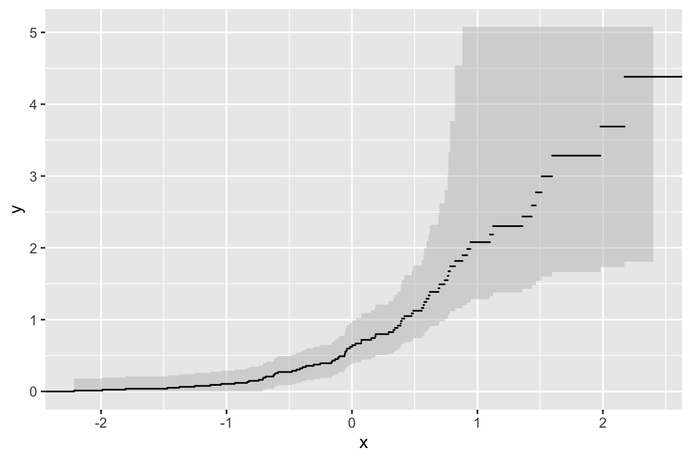

**Multiple groups.**

``` r

ggplot(df_two, aes(x = x, color = group)) +
  geom_echf()
```

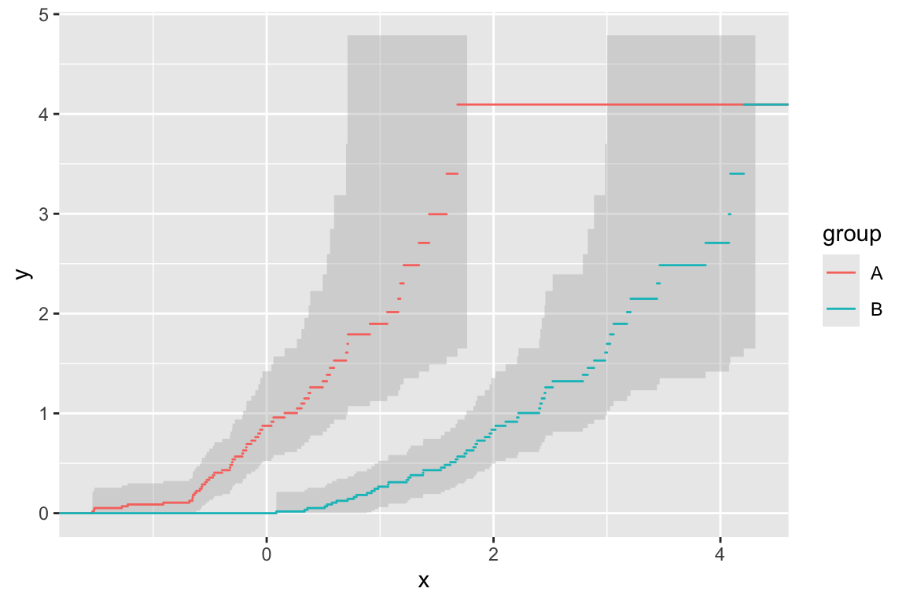

**Goodness-of-fit check.** Overlaying
[`geom_chf()`](/reference/geom_chf.md) on
[`geom_echf()`](/reference/geom_echf.md) provides a visual test: if the
theoretical cumulative hazard lies within the confidence band, the data
are consistent with the model.

``` r

ggplot(df_single, aes(x = x)) +
  geom_echf(show_points = FALSE, show_vert = FALSE) +
  geom_chf(cdf_fun = pnorm, xlim = range(df_single$x),
           args = list(mean = mean(df_single$x), sd = sd(df_single$x)),
           color = "red")
```

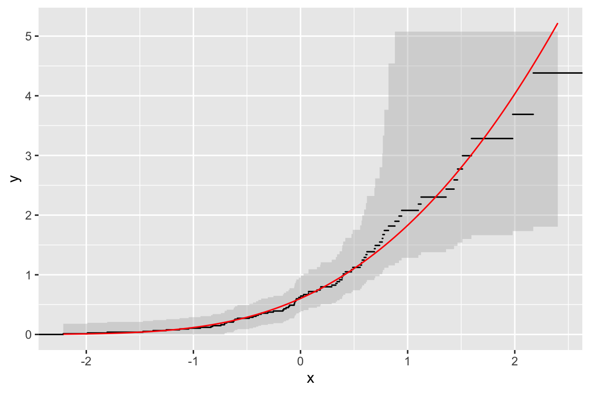

## Censored Data Functions

When survival data are right-censored (some event times unobserved),
classical empirical estimators break down. The censored data family
provides Kaplan-Meier and Nelson-Aalen estimators that correctly account
for censoring.

``` r

set.seed(42)
n_cens <- 60
true_time <- rexp(n_cens, rate = 0.5)
cens_time <- rexp(n_cens, rate = 0.2)
df_cens <- data.frame(
  time   = pmin(true_time, cens_time),
  status = as.integer(true_time <= cens_time)
)
```

### Kaplan-Meier survival curve: `geom_ecdf_km()`

[`geom_ecdf_km()`](/reference/geom_ecdf_km.md) computes the Kaplan-Meier
product-limit estimator from right-censored data and renders it as a
decreasing step function. The `status` aesthetic indicates whether each
observation is an event (1) or censored (0). A simultaneous
equal-precision Greenwood confidence band and censoring marks are drawn
by default.

``` r

ggplot(df_cens, aes(x = time, status = status)) +
  geom_ecdf_km()
```

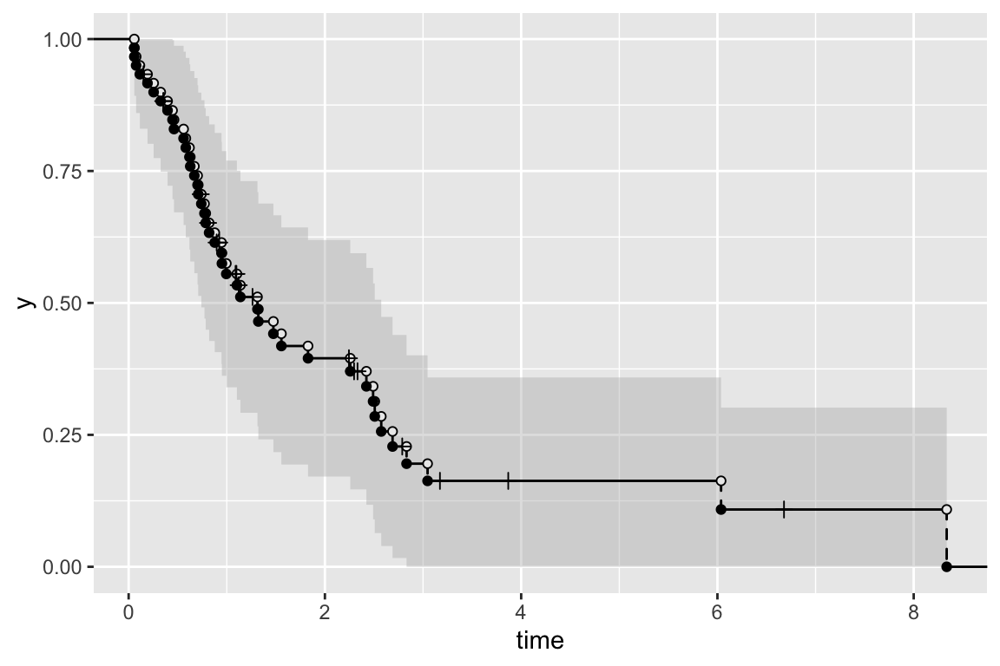

**Goodness-of-fit overlay.** Overlaying the theoretical survival curve
on the Kaplan-Meier estimate provides a visual check: if the curve lies
within the Greenwood EP confidence band, the data are consistent with
the model. Here we overlay the true $`\text{Exp}(0.5)`$ survival
function.

``` r

ggplot(df_cens, aes(x = time, status = status)) +
  geom_ecdf_km(show_points = FALSE, show_vert = FALSE) +
  geom_survival(cdf_fun = pexp, xlim = c(0, max(df_cens$time)),
    args = list(rate = 0.5), color = "red")
```

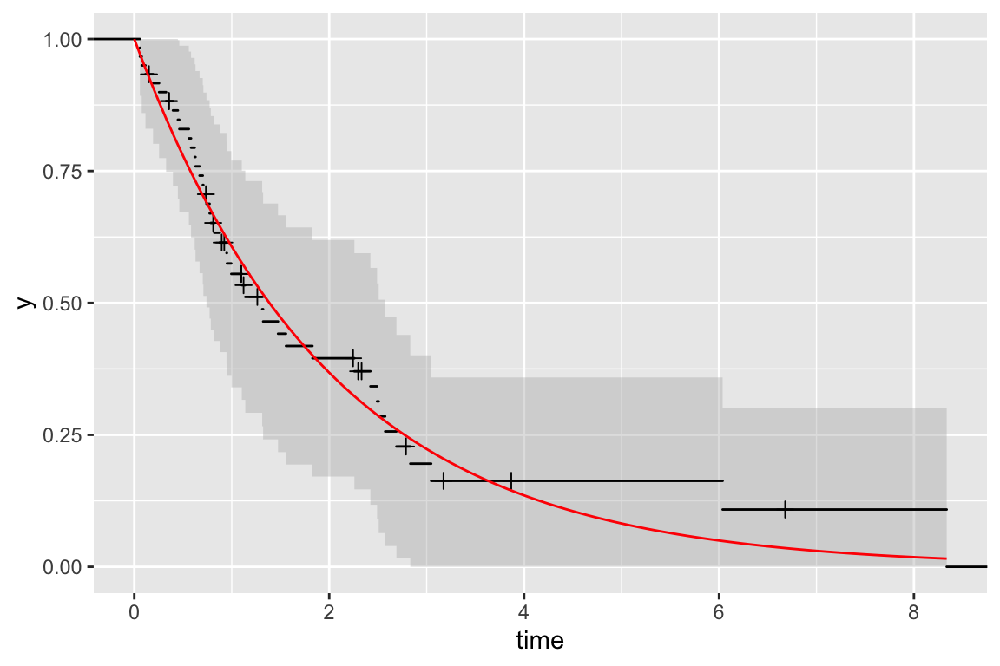

### Nelson-Aalen cumulative hazard: `geom_echf_na()`

[`geom_echf_na()`](/reference/geom_echf_na.md) computes the Nelson-Aalen
cumulative hazard estimator from right-censored data and renders it as
an increasing step function with a pointwise normal confidence band.

``` r

ggplot(df_cens, aes(x = time, status = status)) +
  geom_echf_na()
```

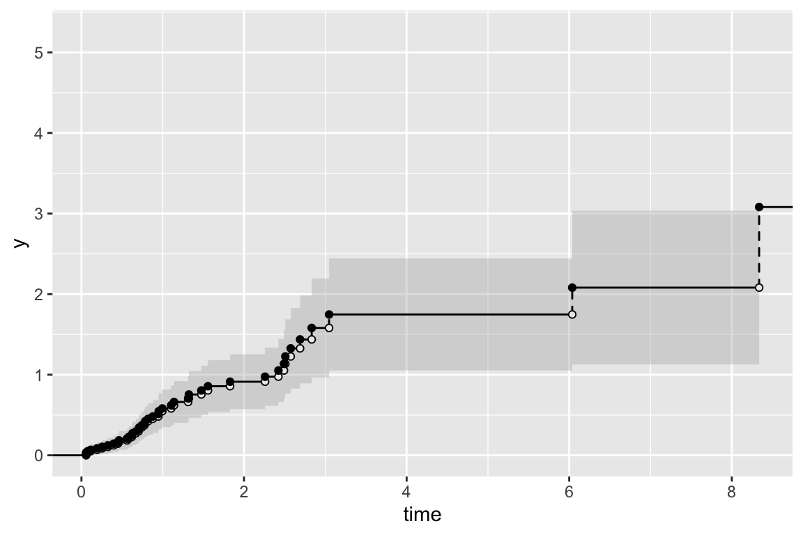

## Getting help

- Browse the [vignette](/vignettes/ggfunction.Rmd) for a guided
  walkthrough
- File bugs or feature requests at
  <https://github.com/dusty-turner/ggfunction/issues>

## Installation

``` r

# install.packages("pak")
pak::pak("dusty-turner/ggfunction")
```
