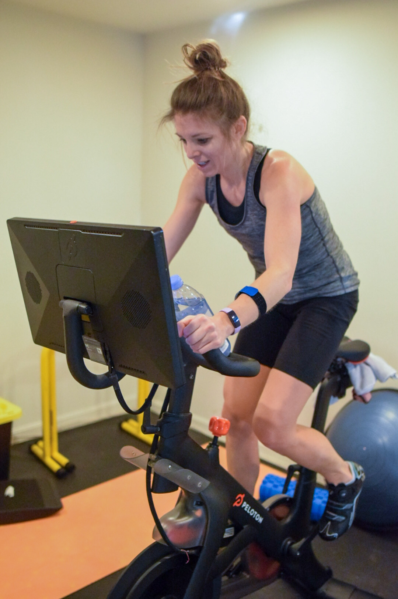

```{r setup, include=FALSE}
knitr::opts_chunk$set(echo = TRUE,warning = F,message = F)
devtools::install_github("lgellis/pelotonR")
```

 
# Peloton R

In [part 1](https://www.dustysturner.com/post/the-peloton-api-part-1/) of my Peloton API post, I explored the [`pelotonR`](https://github.com/bweiher/pelotonR) created by [Ben Weiher's](https://github.com/bweiher/).  It's a great package for accessing your Peloton data and I recommend it.  

In part 2, I'll explore a different `pelotonR` package from [Laura Ellis](https://twitter.com/littlemissdata).  She provides a great [tutorial](https://lgellis.github.io/pelotonR/) to display the functionality.  I recommend this one too!

## Objectives

The objectives for this post are to...

1. Show how awesome my wife is.
2. Highlight the functionality of Laura's pelotonR package.
3. Create visualizations from my wife and my Peloton data to show how awesome she is.

Speaking of visualizations, here's another picture of my wife crushing a Peloton ride


<center>
{width=30%}
[Jill Working Hard As Always!]
</center> 

In order to use this post as a teaching tool, I'll also include my code.  This also allows me to receive feedback from the community to improve my techniques.

## Inspiration

I developed many of these plots because I was curious about the data, but I also used [this page](https://www.instagram.com/pelotondataviz/?hl=en) and [this page](https://www.qlik.com/blog/peloton-and-qlik-the-analytics-of-it-all) as inspiration.

Enough!  On with the analysis!

# Get the data

Lets start with how to access your peloton data.

If you haven't already, install the `pelotonR` library from github.

```{r, eval=F, include=T}
devtools::install_github("lgellis/pelotonR", force = T)
```

## Authenticate

Since I'm going to be pulling data for both my wife and I, I'll authenticate both our accounts.  Our passwords are saved in our `.RProfile` in a function I have saved there.  If you'd like to do the same, this [stack overflow post](https://stackoverflow.com/questions/46819684/how-to-access-and-edit-rprofile) is very helpful.

```{r}
library(tidyverse)
library(lubridate)
library(pelotonR)

me_auth_response <- pelotonR::authenticate(username = "dusty.s.turner@gmail.com", password = Sys.getenv("my_passowrd"))
wife_auth_response <- pelotonR::authenticate(username = Sys.getenv("wife_username"), password = Sys.getenv("wife_passowrd"))
```

To access our personal data, I need to extract our user IDs from our authentication. 

```{r}
me_user_id <- me_auth_response %>% jsonlite::parse_json() %>% .$user_id

wife_user_id <- wife_auth_response %>% jsonlite::parse_json() %>% .$user_id
```

Use the user id to request your data from the API.

```{r}
my_workout_df <- pelotonR::get_workouts_and_instructors_df(user_id = me_user_id) %>% as_tibble()
wife_workout_df <- pelotonR::get_workouts_and_instructors_df(user_id = wife_user_id) %>% as_tibble()
```

## Collect and organize data

The package helps retrieve a TON of data about your workouts.  The first number is the workout count, but the second number is the number of columns returned about your data.

```{r}
my_workout_df %>% dim()
```

As we join and organize our data, I'm only going to select the columns that I end up using later on in the analysis.  If you dig through the data frame, you might find more interesting information to use. 

```{r}
interesting <-
  list(Dusty = my_workout_df,
       Jill = wife_workout_df) %>%
  bind_rows(.id = "Person") %>%
  rename_with(.fn = ~ str_remove(., pattern = "workout.")) %>%
  mutate(Length = peloton.ride.duration/60, KJ = total_work/1000) %>%  
  mutate(start_time = lubridate::as_datetime(start_time, tz = "EST")) %>% 
  mutate(peloton.ride.scheduled_start_time = lubridate::as_datetime(peloton.ride.scheduled_start_time, tz = "EST")) %>% 
  select(Person, start_date, Length, KJ, fitness_discipline, is_total_work_personal_record, start_time, workout_type, 
         peloton.ride.difficulty_rating_avg, peloton.ride.is_explicit, peloton.ride.overall_estimate, peloton.ride.rating, 
         peloton.ride.total_workouts, peloton.ride.difficulty_estimate, peloton.ride.scheduled_start_time,instructor.name) 
```

You'll notice that I did several pre-processing steps.  

1. I removed the word `workout` from all column names.

2. I converted the ride duration from seconds to minutes.  Minutes are a more familiar workout length than seconds for Peloton riders.

3. I converted the `total_work` from Joules to Kilojoules.  A Kilojoule, or 1000 Joules, is the familiar measurement of work that Peloton riders know.  As a quick aside, riders produce wattage with their bike.  If you sustain 1000 watts for 1 second you do 1 KJ of work.  Okay, enough physics for today....

# Dig into the data!

As you can see, riding the peloton is not the only thing we do on the bike.

```{r}
interesting %>% 
  count(Person, fitness_discipline) %>% 
  pivot_wider(names_from = Person, values_from = n, values_fill = 0)
```

I'd like to limit most of the future exploration to only cycling classes.  I'd like to also have the option of only looking at rides lasting 20 minutes or longer.  To support this filter that I'll need to do over and over, I'll set up a function that does the following:

1. Selects only cycling classes
2. Renames `NA` instructors as `unknown`
3. Creates a ride number  column ID
4. Has an option to keep classes < 20 minutes
5. Has an option to remove unknown instructors

```{r}

standard_filter <- function(data, only_long_classes = FALSE, remove_unknown_instructors = FALSE){
  out <-
    data %>% 
    filter(fitness_discipline == "cycling") %>% 
    filter(workout_type == "class") %>% 
    mutate(instructor.name = if_else(is.na(instructor.name), "Unknown", instructor.name)) %>% 
    select(-c(fitness_discipline, workout_type)) %>%
    arrange(start_time) %>% 
    group_by(Person) %>% 
    mutate(ride_number = row_number()) %>% 
    ungroup() 
  
  if(remove_unknown_instructors){
    out <-
      out %>% 
      filter(instructor.name != "Unknown")
  }
  
  if(only_long_classes){
    out <-
      out %>% 
      filter(Length >= 20)
  }
  
  return(out)
}
```

I also learned that there were several early classes of 'bootcamp' that my wife did which Peloton labeled 'cycling'.  Bootcamps have a much lower KJ output since cycling isn't the main focus in these rides.  This function filters those out when we look at specific charts.

```{r}

remove_bootcamps <- function(data){
  remove_these <-
     tibble(Person = "Jill", start_date = ymd(20201006), instructor.name = "Jess Sims", Length = 30) %>% 
    add_row(Person = "Jill", start_date = ymd(20200918), instructor.name =  "Robin Arzón", Length = 30) %>% 
    add_row(Person = "Jill", start_date = ymd(20200306), instructor.name =  "Cody Rigsby", Length = 30) %>% 
    add_row(Person = "Jill", start_date = ymd(20201001), instructor.name =  "Cody Rigsby", Length = 45) %>% 
    add_row(Person = "Jill", start_date = ymd(20201008), instructor.name =  "Cody Rigsby", Length = 45) %>% 
    add_row(Person = "Jill", start_date = ymd(20200922), instructor.name =  "Jess Sims", Length = 45) %>% 
    add_row(Person = "Jill", start_date = ymd(20200929), instructor.name =  "Jess Sims", Length = 45) 
  
  # interesting %>% standard_filter() %>% 
    # filter(Person == "Jill", Length == 45) %>% 
    # arrange(KJ) %>% select(start_date, instructor.name, KJ, Length)
  
  out <-
  data %>% 
    anti_join(remove_these)  
  return(out)
}


```


Lets take a few different looks at our data.  The first question I'd like to dig into is, "Who are out favorite instructors?"

## Instructor analysis

### Favorite instructors

```{r}
interesting %>%
  standard_filter(remove_unknown_instructors = T) %>% 
  count(Person, instructor.name) %>% 
  mutate(n = ifelse(Person == "Dusty", n * -1, n)) %>% 
  group_by(instructor.name) %>% 
  mutate(order_by = max(ifelse(Person=="Jill", n, 0))) %>% 
  ungroup() %>% 
  mutate(instructor.name = fct_reorder(instructor.name, order_by)) %>% 
  ggplot(aes(x= instructor.name, y = n, fill = Person)) +
  geom_col() +
  coord_flip() +
  scale_y_continuous(breaks = c(-100,-50,0,50,100,150,200), labels = c("100", "50", "0", "50", "100", "150", "200")) +
  scale_fill_manual(values = c("#FF7105","#236AB9")) +
  labs(y = "Number of Rides", x = "") 
```

First things is first.  Jill rides WAY more than me.  But also, we can see a difference in rider preferences.  She prefers Ally Love, Emma Lovewell, and Hannah Corbin, while I prefer Jess King, Kendall Toole, and Alex Toussaint.  

### How our favorite instructors change over time

What I'd like to do is determine which instructor is our favorite by month.  I'll find out the instructor (or instructors in the event of a tie) that we proportionally have the most rides with each month - then see how that changes over time.  

```{r}
interesting %>% 
  standard_filter(only_long_classes = T) %>% 
  mutate(month = month(start_time), year = year(start_time)) %>% 
  group_by(Person,month,year) %>% 
  filter(n()>=5) %>% 
  ungroup() %>% 
  count(Person, instructor.name,month, year) %>% 
  mutate(date = lubridate::ym(str_c(year," ",month))) %>% 
  group_by(Person,date) %>% arrange(Person, date) %>% 
  mutate(instructor.name = if_else(n == max(n), instructor.name, "Other")) %>% 
  group_by(Person, instructor.name,date) %>% 
  summarise(n = sum(n)) %>% 
  arrange(Person, date) %>% 
  group_by(Person,date) %>% 
  mutate(percent = n / sum(n)) %>% 
  ungroup() %>% 
  ggplot(aes(x = date, y = percent, fill = instructor.name)) +
  geom_col() +
  facet_wrap(~Person, scales = "free") +
  coord_flip() +
  labs(title = "Most popular instructor each month", subtitle = "How instructor preference changes over time",
       x = "Percent of Monthly Rides", y = "", fill = "Instructor")
```

For Jill, she started as an Ally Love fan but has spread that love to other such as Emma Lovewell, Matt Wilpers, and Cody Rigsby.

Me, on the the other hand, started as a Jess King fan, but recently I'm riding more with Kendall Toole.  

You can tell, from this, however, that my wife spreads around her rides more than I do.  She has a lot larger purple 'other' bar than I do each month.  


### Do we prefer different instructors for different class lengths?

This makes me wonder -- might we prefer to ride with different instructors if our ride will be longer (or shorter)?

```{r}
interesting %>% 
  standard_filter(remove_unknown_instructors = T) %>% 
  count(Person,instructor.name,Length) %>% 
  complete(Person,instructor.name,Length) %>% 
  mutate(Length = as.factor(Length)) %>% 
  group_by(instructor.name) %>% mutate(order_by = sum(n,na.rm = T)) %>%
  group_by(Person, Length) %>% mutate(max_time_slot = rank(n,na.last = F)) %>% 
  mutate(most = if_else(max(max_time_slot)== max_time_slot, "MAX", "Not MAX")) %>% 
  mutate(most = if_else(is.na(n), "NA", most)) %>% 
  ggplot(aes(x = Length, y = fct_reorder(instructor.name,order_by))) +
  geom_tile(aes(fill = most),show.legend = F) +
  geom_text(aes(label = n), show.legend = F) +
  scale_fill_manual(values = c("#AE0D7A","#F7EDD4", "#448D76")) +
  facet_wrap(~Person) +
  labs(y = "Instructor", title = "Preferred Instructors for each ride length") 

```

The answer is, well... kind of. 

I tend to ride more with Jess King at any distance and the same is true for my wife with Ally Love.

Some of the less frequented durations, like 5, 10, and 60 minutes show some unique results.  

### Who are the more difficult instructors?

Based off the rides we have selected, which instructor's rides are rated most difficult by the community.  

We'll consider instructors we've selected for at least 10 rides of 20 minutes or more.  

```{r}
interesting %>% 
  standard_filter(only_long_classes = T) %>% 
  mutate(instructor.name = fct_lump_min(instructor.name, min = 10)) %>%
  group_by(instructor.name) %>% 
  mutate(max_difficulty = max(peloton.ride.difficulty_estimate, na.rm = T)) %>% 
  mutate(min_difficulty = min(peloton.ride.difficulty_estimate, na.rm = T)) %>% 
  group_by(instructor.name) %>% 
  mutate(median_diff = median(peloton.ride.difficulty_estimate)) %>% 
  ungroup() %>% 
  mutate(instructor.name = fct_reorder(instructor.name, median_diff)) %>%
  ggplot(aes(x = peloton.ride.difficulty_estimate, y = instructor.name)) +
  geom_segment(aes(x = min_difficulty, xend = max_difficulty, yend = instructor.name), color = "grey") +
  geom_point(color = "black") +
  geom_point(aes(x = median_diff), color = "#B32134", size = 4) +
  geom_point(aes(x = max_difficulty), color = "green", size = 4) +
  geom_point(aes(x = min_difficulty), color = "green", size = 4) +
  scale_x_continuous(breaks = 3:10, limits = c(3,10)) +
  labs(x = "Ride Difficulty Rating", y = "Instructor", title = "Difficulty Ratings of our most population instructors",
       subtitle = "Sorted by median ride difficulty \nIncludes instructors with at least 10 rides \nRides 20 minutes or longer", 
       caption = "Green dots represent maximum and minimum difficulty of rides between my wife and I")

```

Three of my favorite instructors (Jess King, Kendall Tool, and Alex Toussaint) are in the top 4.  Either this means I pick difficult rides or those of us who selected these rides are week and think they are hard :).

### Instructor Race

I'd really like to know the distance I've gone with each instructor over time.  Kind of like an instructor race.  However, I can't find any distance data from this package so I'll use KJ as a proxy. 

**Note** This is a perfect opportunity to use the `gghighlight` package.  I doesn't quite work yet with faceted plots, so I am rendering two plots.  To do that, I'll write a function with a `name` argument. 

```{r}
library(gghighlight)

instructor_race <- function(name = "Jill"){
  if(name == "Dusty") {
    limit <-  5000
    color_scale <- c("#FDAC53", "#9BB7D4", "#A0DAA9", "#E9897E", "#0072B5")
  } else{
    limit <- 10000
    color_scale <-  c("#FDAC53","#9BB7D4","#A0DAA9","#E9897E","#0072B5", "#0702B5") 
  }

interesting %>% 
standard_filter() %>% 
  group_by(Person, instructor.name) %>% 
  arrange(start_time) %>% 
  mutate(Total_KJ = cumsum(KJ)) %>% 
  ungroup() %>% 
  filter(Person == name) %>%
  ggplot(aes(x = start_time, y = Total_KJ, color = instructor.name)) +
  geom_line() +
  scale_y_continuous(labels = scales::comma) +
  gghighlight(max(Total_KJ) > limit, unhighlighted_params = list(color = "grey")) +
  scale_color_manual(values = color_scale) +
  labs(x = "", y = "Total KJ", subtitle = str_c(name,"'s Instructor Race"), title = "KJ output by instructor over time")
}
```

```{r}
instructor_race(name = "Dusty")
```

As expected, Jess King is off to a great start, but Kendall Tool is catching up ground!

```{r}
instructor_race(name = "Jill")
```

For Jill, All Love and Emma Lovewell (lots of love going on here) are setting the pace!

## When do we like to ride?

I already know this answer.  Pretty much every morning, when I wake up, my wife is crushing it in the basement on the Peloton.  But a picture is worth 1000 KJ so lets explore this visually.


```{r}
weekday <- tibble(weekday_name = weekdays(x=as.Date(seq(7), origin="1950-01-01")),
       weekday = c(2:7,1))

interesting %>% 
  standard_filter() %>%
  select(Person, start_time) %>% 
  mutate(hour = as.factor(hour(start_time))) %>% 
  mutate(weekday = wday(start_time)) %>% 
  left_join(weekday) %>%
  mutate(weekday_name = fct_reorder(weekday_name, weekday)) %>% 
  count(Person, hour, weekday_name) %>% 
  complete(Person,hour,weekday_name) %>% 
  ggplot(aes(x = weekday_name, y = hour, fill = n))+
  geom_tile(show.legend = F) +
  facet_wrap(~Person) +
  scale_x_discrete(labels = c("1" = "Sunday")) +
  scale_fill_gradient2(na.value = "white", low = "white", high = "#5932a8", mid = "grey", midpoint = 10) +
  geom_text(aes(label = n)) +
  labs(x = "Weekday", y = "Hour")
```

It is clear that my wife is a motivated morning rider while I'm more likely to ride in the evening.  On weekends our workouts are more spread out as we are getting a workout in when we can find space.  

### What weekday do we like and how well do we perform?

I'd like to know which weekday we bike the most in and if there is a specific day that we perform better?

This plot may get a little confusing, but here's what I'm doing...

1) Plot the proportion of rides by day.  
2) Color the bars by minutes biked.  
3) Label the bars by average KJ expended per minute for each day. 

```{r}
interesting %>% 
  standard_filter() %>% 
  mutate(weekday = lubridate::wday(start_time)) %>% 
  left_join(weekday)  %>% 
  group_by(Person,weekday_name, weekday) %>% 
  summarise(num_rides = n(), Tot_KJ = sum(KJ), Tot_mins = sum(Length)) %>% 
  mutate(ave_KJ_per_min = round(Tot_KJ / Tot_mins, 1)) %>% 
  group_by(Person) %>% 
  mutate(prop_rides = num_rides/sum(num_rides)) %>% 
  ungroup() %>% 
  mutate(weekday_name = fct_reorder(weekday_name,weekday, .desc = T)) %>% 
  mutate(max_dusty = max(ifelse(Person == "Dusty", Tot_mins,0))) %>% 
  ggplot(aes(y = weekday_name, x = prop_rides, fill = Tot_mins)) +
  geom_col() +
  geom_text(aes(label = ave_KJ_per_min)) +
  scale_fill_gradientn(breaks = c(0,1100,2500,5000), colors = c("grey","green","red")) +
  facet_wrap(~Person) +
  labs(x = "Proportion of Total Rides",  y = "", fill = "Total Minutes",
       title = "Proportion of Rides on Each Day \nColored by Total Minutes Spent Riding",
       subtitle = "Label is Average KJ / Min on that day")
```

Wednesdays seem to be the days we conduct most of our rides, but I seem to perform better on Tuesdays.  Our performance seems to dip on the weekends.  Maybe we take it easy then to recover from our hard weeks.  

## Improvement over time

One of the marks of fitness is improvement.  Lets look at a few metrics of improvement. 

### KJs per ride

Lets see how many KJs per ride we reach for different ride durations. 

```{r}

interesting %>% 
  standard_filter(remove_unknown_instructors = F) %>%
  remove_bootcamps() %>% 
  ggplot(aes(x = start_time, y = KJ)) +
  geom_point() +
  geom_smooth(method = "lm", se = F) +
  scale_x_datetime(date_breaks = "14 months", date_labels = "%b %y") +
  facet_grid(Person~Length) +
  labs(x = "Date", y = "JK")

```

It looks like we generally have improved our KJ ride over time.  The shorter rides do not show much improvement but that's largely because its hard to improve on a short ride, and we also use them as warm up rides.  

## Personal Records Over Time

Another metric of improvement is how much you can increase your max output over time.  

```{r}
interesting %>% 
  standard_filter(only_long_classes = T) %>% 
  remove_bootcamps() %>% 
  group_by(Person, Length) %>% 
  mutate(ride_number = row_number()) %>% mutate(is_max = cummax(KJ)) %>%   
  mutate(max = ifelse(is_max == lag(is_max), "NO", "YES")) %>% 
  mutate(max = replace_na(max, "NO")) %>% 
  ungroup() %>% 
  mutate(date = date(start_time)) %>% 
  mutate(date_label = ifelse(max,as.character(date),"")) %>% 
  group_by(Person, Length) %>% 
  mutate(max = if_else(KJ == max(KJ), "SUPER MAX", max)) %>% 
  ungroup() %>% 
  ggplot(aes(x = ride_number, y = KJ)) +
  geom_line() +
  geom_smooth(method = "lm") +
  geom_point(aes(size = max, color = max), show.legend = F) +
  scale_color_manual(values = c("black", "orange", "blue")) +
  scale_size_manual(values = c(.1,5,2)) +
  facet_grid(Length~Person, scales = "free") +
  labs(x = "Ride Number", y = "Output: KJ", 
       title = "Personal Record Improvement Over Time", subtitle = "Of the most common ride durations")
```

The blue dots above show personal records we set and the orange dots show the current max output for that duration.

It looks like we've improved over time.  And it looks like I need to do more 60 minute rides.  

### KJ burned per minute rolling average

One might assume that trends and max rides might not be the best metric of improvement because we often do recovery rides and such.  This might throw off the results.  Lets look at a rolling average of KJ ride.

```{r}
interesting %>% 
  standard_filter(only_long_classes = T) %>% 
  remove_bootcamps() %>% 
  mutate(KJ_per_min = KJ/Length) %>% 
  group_by(Person) %>% 
  mutate(roll_avg = zoo::rollmean(x = KJ_per_min,k = 5, fill = 0, align = "right")) %>% 
  arrange(start_time) %>% 
  mutate(ride_number = row_number()) %>% 
  ungroup() %>%
  filter(roll_avg != 0) %>% 
  ggplot(aes(x = start_time, y = roll_avg)) +
  geom_line() +
  geom_point(aes(y = KJ_per_min, color = as.factor(Length)), alpha = .3, show.legend = T) +
  scale_y_continuous(breaks = seq(5,14,1), minor_breaks = seq(5,14,.5)) +
  facet_wrap(~Person, scales = "free_x") +
  # facet_grid(Length~Person)
  labs(y = "KJ per Minute", y = "Ride Date", color = "Ride Length",
       title = "5 Ride Rolling KJ per Minute Average")

```

It looks like I've improved over time while Jill has held steady. 


## Chasing My Wife's Greatness

I'm interested in comparing my wife and I's progression of number of rides, total KJs, and total minutes biked.  She started using the Peloton before I did, so will I ever catch her in these metrics?

```{r}

interesting %>% 
  standard_filter(remove_unknown_instructors = F) %>% 
  group_by(Person) %>% 
  mutate(`Total KJ` = cumsum(KJ), `Total Minutes Biked` = cumsum(Length)) %>% 
  rename(`Ride Number` = ride_number) %>% 
  pivot_longer(c(`Total KJ`,`Total Minutes Biked`, `Ride Number`)) %>% 
  ggplot(aes(x=start_date, y = value, color = Person)) +
  geom_line() +
  scale_color_manual(values = c("#FF7105","#236AB9")) +
  scale_y_continuous(labels = scales::comma) +
  scale_x_date(breaks = "9 months", date_labels = "%b %y") +
  facet_wrap(~name, scales = "free_y") +
  labs(y = "", x = "")

```

For a little while, I was catching up with my wife in all aspects - or at least keeping pace.  But over the summer I spent more time working out outside (and less time on the bike).  Then my wife started riding the bike double time - and left me in the dust!

### Net difference in metrics

Similar to the last look, I am interested in seeing how this looks in 'net' metrics.  So, if you find the differences between our performance every day - how do we compare?

```{r}
totals <-
interesting %>% 
  standard_filter() %>% 
  group_by(Person) %>% 
  arrange(Person,start_time) %>% 
  mutate(day = lubridate::date(start_time)) %>%
  mutate(ride_number = 1)  %>% 
  mutate(across(.cols = c(Length, KJ, ride_number), .fns = ~cumsum(.))) %>% 
  select(Person, ride_number, KJ, minutes = Length) %>% 
  ungroup() %>% 
  mutate(minutes = minutes / 60)


full_join(
  totals %>% filter(Person == "Dusty"),
  totals %>% filter(Person == "Jill"),
  by = "ride_number", suffix = c("_Dusty", "_Jill")
  )  %>% 
  arrange(ride_number) %>% 
  mutate(dusty_max_ride_number = max(KJ_Dusty, na.rm = T)) %>% 
  mutate(dusty_max_ride_number = max(if_else(dusty_max_ride_number == KJ_Dusty, ride_number, 0),na.rm = T)) %>% 
  fill(everything()) %>%
  mutate(`Difference in KJ` = KJ_Jill - KJ_Dusty,
         `Difference in Minutes` = minutes_Jill - minutes_Dusty) %>% 
  pivot_longer(cols = contains("difference"))  %>% 
  mutate(dusty_plus = value < 0)  %>% 
  ggplot(aes(x = ride_number, y = value,color = dusty_plus)) +
  geom_path(aes(group = 1),show.legend = F) +
  geom_vline(aes(xintercept = dusty_max_ride_number)) +
  scale_color_manual(values = c("#FF7105","#236AB9")) +
  scale_y_continuous(labels = scales::comma) +
  facet_wrap(~name, scales = "free") +
  labs(y = "", x = "Ride Number") 
```

I drew a black horizontal line at my most recent ride.  It looks like I am continuously extending my lead in KJs, but my wife is kicking my tail in minutes exercised.  

```{r}
library(ggforce)

full_join(
  totals %>% filter(Person == "Dusty"),
  totals %>% filter(Person == "Jill"),
  by = "ride_number", suffix = c("_Dusty", "_Jill")
  )  %>% 
  arrange(ride_number) %>% 
  mutate(dusty_max_ride_number = max(KJ_Dusty, na.rm = T)) %>% 
  mutate(dusty_max_ride_number = max(if_else(dusty_max_ride_number == KJ_Dusty, ride_number, 0),na.rm = T)) %>% 
  fill(everything())   %>%
  mutate(`Difference in KJ` = KJ_Jill - KJ_Dusty,
         `Difference in Minutes` = minutes_Jill - minutes_Dusty) %>% 
  mutate(dusty_plus = `Difference in KJ` < 0)  %>% 
  ggplot(aes(x = ride_number, y = `Difference in KJ`,color = dusty_plus)) +
  geom_path(aes(group = 1),show.legend = F) +
  geom_vline(aes(xintercept = dusty_max_ride_number)) +
  scale_color_manual(values = c("#FF7105","#236AB9")) +
  scale_y_continuous(labels = scales::comma) +
  labs(y = "", x = "Ride Number") +
  facet_zoom(ylim = c(-17000,0000), xlim = c(0,350))
```

Zooming in on the net KJs, you can see I jumped out to a big lead through about 100 rides, then there is a lot of back and forth.  I look forward to the day where I do enough rides to get the net KJs to 0.  

## Ride difficulty

Lastly, I'd like to take a look at the difficulty of the rides we choose.   

```{r}
interesting %>% 
  standard_filter(only_long_classes = T) %>% 
  group_by(Person) %>% 
  mutate(max_difficulty = max(peloton.ride.difficulty_estimate, na.rm = T)) %>% 
  mutate(min_difficulty = min(peloton.ride.difficulty_estimate, na.rm = T)) %>% 
  mutate(median_difficulty = median(peloton.ride.difficulty_estimate, na.rm = T)) %>% 
  ggplot(aes(x = peloton.ride.difficulty_estimate, y = Person)) +
  geom_segment(aes(x = min_difficulty, xend = max_difficulty, yend = Person)) +
  geom_point() +
  geom_point(aes(x = median_difficulty), color = "#B32134", size = 4) +
  geom_point(aes(x = max_difficulty), color = "green", size = 4) +
  geom_point(aes(x = min_difficulty), color = "green", size = 4) +
  scale_x_continuous(breaks = c(4:10)) +
  labs(x = "Ride Difficulty Rating", y = "", title = "Difficulty ratings for each rider",
       subtitle = "Green: max and min difficulty \nRed: median difficulty")

```

It appears my wife has a completed a couple of easy low rides, but also owns a few of the most difficult rides.  I'll boast that I have the higher median ride - but I need to figure out what ride Jill took for such a hard ride. :)


```{r}
interesting %>% 
  standard_filter(only_long_classes = T) %>% 
  group_by(Person) %>% 
  filter(peloton.ride.difficulty_estimate == max(peloton.ride.difficulty_estimate, na.rm = T)) %>% 
  ungroup() %>% 
  select(Person, peloton.ride.difficulty_estimate, instructor.name, start_date, peloton.ride.scheduled_start_time)
```

I'm going to have to find this ride - I can't be left behind!