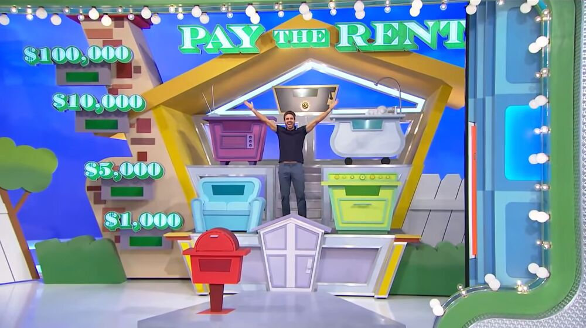
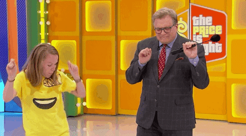

 

```{r setup, include=FALSE}
knitr::opts_chunk$set(echo = TRUE,message = F,warning = F)
```

As I mentioned in a [previous blog post](https://www.dustysturner.com/post/wheel-spin-strategy-on-the-price-is-right), my family and I have found different activities to do as all our other activities are on hold due to the COVID-19 lockdown. 

In that post, I looked at first player's strategy when spinning the big wheel prior to the showcase showdown.

In this post, I'll explore the rarely won game, Pay the Rent

<center>

<figcaption>[Pay The Rent](https://priceisright.fandom.com/wiki/Pay_the_Rent?file=PTR552020_2.jpg)</figcaption>
</center> 


# Pay The Rent

Pay The Rent is a challenging game.  Essentially, given 6 products, you must estimate the prices of all the products, and place them in 4 tiers.  The four tiers are the mailbox (1 product), first floor (2 products), second floor (2 products), and the attic (1 product).  The total price of all the products on each floor must cost more than the products on the floor below it.  

After arranging the items, the player must opt in to look at the prices for each floor.  The mailbox is a given 1000 because its the first selection.  For each additional floor the player opts in, they win a successive 5000, 10,000, and potentially 100,000.  However, if the player opts in and loses, they lose everything. More specific and thorough rules can be found at [The Price Is Right Fandom](https://priceisright.fandom.com/wiki/Pay_the_Rent#Trivia).

The typical strategy for a player is to choose the cheapest product for the bottom floor, but this strategy is rarely successful because that player needs this cheaper product to offset the cost of a more expensive product on a higher level.  One can quickly see the challenge of picking which price to put on the bottom level to maximize the chance of winning \$100,000.

Because of this challenge, the game has only been won 5 times out of the 85 times its been played.  The Price Is Right has changed up the spread of the prices of the items on several occasions to make the game more likely to win (thus having more than 1 correct solution).  Details about these games are [here](https://priceisright.fandom.com/wiki/Pay_the_Rent/Solutions).

To gain a better understanding of how to play, here is one of the few winning contestants playing the game.  


```{r, eval=TRUE, echo=F}
blogdown::shortcode("youtube", "QXh8szLAG00")
```

# What We'll Do

To Analyze this game, we'll... 

- Scrape all the prices from historical games
- Specify an integer program to solve one of these games
- Find the optimal solution using R
- Functionalize this process and solve all games

# Scrape the data

Since the point of this post is not to talk through web scraping, I'll summarize how I do this.

First, download the raw data.  More specifics on how to scrap data can be found [here](https://blog.rstudio.com/2014/11/24/rvest-easy-web-scraping-with-r/) using `rvest`.

```{r}
library(tidyverse)
library(rvest)
library(strex)
tpir <- read_html("https://priceisright.fandom.com/wiki/Pay_the_Rent/Solutions#September_20.2C_2010_.28.235231K.29")

tpir_text <- tpir %>% 
  html_nodes("td") %>%
  html_text() 
tpir_text %>%  head
```

Second, identify which prizes to go which games, delete duplicate rows, and extract dollar values from the text string.

```{r}
cleaning <- 
tpir_text %>% 
  as_tibble() %>% 
  mutate(value = str_replace(string = value,pattern = "\\(2-pack\\)",replacement = "2-pack"))   %>% 
  mutate(game = row_number()) %>% 
  mutate(group = if_else(str_length(value)<6 & !str_detect(string = value,pattern = "Same"),"New","")) %>% 
  mutate(group_id = if_else(group == "New", str_c(group, "_", game), NULL)) %>% 
  fill(group_id) %>% 
  group_by(group_id) %>% 
  filter(n()==5) %>% 
  ungroup() %>% 
  mutate(group_number = lag(floor(1:nrow(.)/5),1)) %>% 
  mutate(really_new = if_else(group=="New", str_sub(string = value,start = 1,1),NULL)) %>% 
  fill(really_new) %>% 
  filter(really_new == 1) %>% 
  mutate(group_number = replace_na(group_number,0))  %>% 
  mutate(dollars = as_tibble(str_extract_all(string = value,pattern = "\\([^()]+\\)",simplify = TRUE))) %>% 
  mutate(dollars1 = dollars$V1, dollars2 = dollars$V2) %>% 
  select(-c(dollars,game,group,really_new,-group_id)) %>%
  rename(text = value) %>% 
  pivot_longer(cols = contains("dollars")) %>% 
  mutate(string_num = row_number()) 

cleaning
```

Finally, to complete the dollar value extraction, we use `str_extract_currencies` and join it back into the data frame.  Lastly, we convert it into 'wide' format.

Admittedly, this is a little 'hacky' so I'd be happy for any feedback to improve this process.  

```{r}
final_data <-
  cleaning %>%
  left_join(str_extract_currencies(cleaning$value)) %>%
  mutate(amount = if_else(curr_sym == "(", amount / 100, amount)) %>%
  filter(!is.na(amount)) %>%
  group_by(group_number) %>%
  filter(n() == 6) %>%
  mutate(product_order = row_number()) %>%
  select(group_number, product_order, amount) %>%
  mutate(product_order = str_c("product_", product_order)) %>%
  pivot_wider(names_from = product_order, values_from = amount) %>%
  janitor::clean_names() %>%
  ungroup()

final_data
```

# Specify the Integer Program

Since the point of this blog is to talk about the solution, I'll go into more details here.

## Integer Program

To solve this program, we'll need to set up a linear program.

We'll define the objective equation as such:

Max 

$price_1 x_{1m} + price_2 x_{2m} + price_3 x_{3m} + price_4 x_{4m} + price_5 x_{5m} + price_6 x_{6m} + price_1 x_{1f} + ... + price_4 x_{4a}$

Where 

$price_n$ is the price of prize '$n$'

$x_{ny}$ is 1 if prize $n$ is selected on row $y$ or 0 otherwise.

$y \in \{m = mailbox, f = first floor, s = second floor, a = attic \}$

Subject to;

Floor capacity constraints:

$x_{1a} + x_{2a} + x_{3a} + x_{4a} + x_{5a} + x_{6a} = 1$

$x_{1s} + x_{2s} + x_{3s} + x_{4s} + x_{5s} + x_{6s} = 2$ 

$x_{1f} + x_{2f} + x_{3f} + x_{4f} + x_{5f} + x_{6f} = 2$ 

$x_{1m} + x_{2m} + x_{3m} + x_{4m} + x_{5m} + x_{6m} = 1$

A price can only be selected once:

$x_{1m} + x_{1f} + x_{1s} + x_{1a} = 1$

$x_{2m} + x_{2f} + x_{2s} + x_{2a} = 1$

$x_{3m} + x_{3f} + x_{3s} + x_{3a} = 1$

$x_{4m} + x_{4f} + x_{4s} + x_{4a} = 1$

$x_{5m} + x_{5f} + x_{5s} + x_{5a} = 1$

$x_{6m} + x_{6f} + x_{6s} + x_{6a} = 1$

The sum of the prices on each floor must cost more than the floor under it:

$\sum_{n = 1}^6 price_n x_{na} - \sum_{n = 1}^6 price_n x_{ns} > 0$

$\sum_{n = 1}^6 price_n x_{ns} - \sum_{n = 1}^6 price_n x_{nf} > 0$

$\sum_{n = 1}^6 price_n x_{nf} - \sum_{n = 1}^6 price_n x_{nm} > 0$

# Coding the Solution

This solution relies on the `lpSolve` library.  

```{r}
library(lpSolve)
```

We'll begin by defining our objective equation.

To create the objective equation, we'll use the prices from the first time this game was played.

It is a vector of all the prices.

```{r}
prices <- as.numeric(final_data[1,2:7])
f_obj <- rep(prices,4)
f_obj
```

We input the constraints via matrix form where the rows correspond to individual constraints and the columns correspond to elements of the objective function.

`lpSolve` assumes non-negativity constraints 

```{r}
f_con <- matrix(c(1, 1, 1, 1, 1, 1, 0, 0, 0, 0, 0, 0, 0, 0, 0, 0, 0, 0, 0, 0, 0, 0, 0, 0, ## attic gets 1 
                  0, 0, 0, 0, 0, 0, 1, 1, 1, 1, 1, 1, 0, 0, 0, 0, 0, 0, 0, 0, 0, 0, 0, 0, ## 2nd floor gets 2
                  0, 0, 0, 0, 0, 0, 0, 0, 0, 0, 0, 0, 1, 1, 1, 1, 1, 1, 0, 0, 0, 0, 0, 0, ## 1st floor gets 2
                  0, 0, 0, 0, 0, 0, 0, 0, 0, 0, 0, 0, 0, 0, 0, 0, 0, 0, 1, 1, 1, 1, 1, 1, ## basement gets 1
                  1, 0, 0, 0, 0, 0, 1, 0, 0, 0, 0, 0, 1, 0, 0, 0, 0, 0, 1, 0, 0, 0, 0, 0, ## a selected once
                  0, 1, 0, 0, 0, 0, 0, 1, 0, 0, 0, 0, 0, 1, 0, 0, 0, 0, 0, 1, 0, 0, 0, 0, ## b selected once
                  0, 0, 1, 0, 0, 0, 0, 0, 1, 0, 0, 0, 0, 0, 1, 0, 0, 0, 0, 0, 1, 0, 0, 0, ## c selected once
                  0, 0, 0, 1, 0, 0, 0, 0, 0, 1, 0, 0, 0, 0, 0, 1, 0, 0, 0, 0, 0, 1, 0, 0, ## d selected once
                  0, 0, 0, 0, 1, 0, 0, 0, 0, 0, 1, 0, 0, 0, 0, 0, 1, 0, 0, 0, 0, 0, 1, 0, ## e selected once
                  0, 0, 0, 0, 0, 1, 0, 0, 0, 0, 0, 1, 0, 0, 0, 0, 0, 1, 0, 0, 0, 0, 0, 1, ## f selected once
                  prices,-prices, 0, 0, 0, 0, 0, 0, 0, 0, 0, 0, 0, 0, ## attic more than 2nd floor
                  0, 0, 0, 0, 0, 0, prices,-prices, 0, 0, 0, 0, 0, 0, ## 2nd floor more than 1st floor
                  0, 0, 0, 0, 0, 0, 0, 0, 0, 0, 0, 0, prices,-prices ## 1st floor more than mailbox
), nrow = 13, byrow = TRUE)
```

Next, we code the equality signs for each constraint.


```{r}
f_dir <- c("=", ## attic gets 1
           "=", ## 2nd floor gets 2
           "=", ## 1st floor gets 2
           "=", ## basement gets 1
           "=", ## a selected once
           "=", ## b selected once
           "=", ## c selected once
           "=", ## d selected once
           "=", ## e selected once
           "=", ## f selected once
           ">", ## attic more than 2nd floor
           ">", ## 2nd floor more than 1st
           ">")  ## 1st floor more than mailbox
 
f_dir
```

Next, we set values for the right hand side of the constraint matrix.

```{r}
f_rhs <- c(1, ## attic gets 1
           2, ## 2nd floor gets 2
           2, ## 1st floor gets 1
           1, ## attic gets 1
           1, ## a selected 1
           1, ## b selected 1
           1, ## c selected 1
           1, ## d selected 1
           1, ## e selected 1
           1, ## f selected 1
           0, ## attic - 2nd floor > 0
           0, ## 2nd floor - 1st floor > 0
           0  ## 1st floor - mailbox > 0
)
```

Now, we can solve the problem.


```{r}
lp(
  direction = "max",
  objective.in =  f_obj,
  const.mat =  f_con,
  const.dir =  f_dir,
  const.rhs =  f_rhs, 
  all.bin = TRUE
  )
```

You can see this only provides the solution to the objective equation.  This isn't interesting, because it should be the sum of all the prizes since our constrains limit us to selecting each prize once.  

What we need is the location of each prize

```{r}
lp(
  direction = "max",
  objective.in = f_obj,
  const.mat = f_con,
  const.dir = f_dir,
  const.rhs = f_rhs,
  all.bin = TRUE
)$solution
```

This provides the solution vector with 1s for the location of each prize in the objective equation.  With a little massaging, we can understand this better

```{r}
tibble(prize = rep(c("a","b","c","d","e","f"),4),
       row = sort(rep(c("1.attic","2.second","3.first","4.mailbox"),6)),
       selected = lp("max", f_obj, f_con, f_dir, f_rhs, all.bin = TRUE)$solution,
       prices = rep(f_obj,1)
       ) %>%
  filter(selected == 1) %>% 
  group_by(row) %>% 
  mutate(floor_sum = sum(prices))
```

We can see that this solution meets our constraints for the game.  Nice!

<center>
<!--  -->

<figcaption>[Celebration!](https://giphy.com/gifs/cbs-dance-excited-the-price-is-right-kEEoiaBM3jCr6Sb95E)
</center> 
 

## Functionalize and solve all games

Lastly, lets set up a function to solve all the games.

This function will take a price data frame, and from the optimal solution, output the location of each products that satisfies the constraints.  

```{r}
solution_getter <- function(floor = 25, data){
  
  prices <- as.numeric(data[floor,2:7])
  f.obj <- rep(prices,4)

solution <-
tibble(prize = rep(c("a","b","c","d","e","f"),4),
       floor = sort(rep(c("1.attic","2.second","3.first","4.mailbox"),6)),
       selected = lp("max", f_obj, f_con, f_dir, f_rhs, all.bin = TRUE)$solution,
       prices = rep(f.obj,1)) %>% 
  filter(selected == 1) %>% 
  group_by(floor) %>% mutate(floor_sum = sum(prices)) %>%  ungroup() %>% 
  select(-selected)
return(solution)
}
```

Given this function, we can find the solution for any game.

Solution to game 1:

```{r}
solution_getter(floor = 1, data = final_data)
```

Solution to game 50:

```{r}
solution_getter(floor = 50,data = final_data)
```

## Solve all games

With the help of the magical `purrr` family of functions, we can map this function over all the data.

```{r}
purrr::map_dfr(1:(nrow(final_data)), ~solution_getter(floor = .x, data = final_data),.id = "Game_ID") %>% 
  DT::datatable(options = list(pageLength = 6))
```

